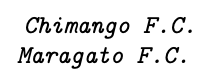

# Estatística Descritiva {#estatistica-descritiva}

A *Estatística Descritiva* está diretamente ligada à organização e descrição dos dados. É utilizada para avaliar como as observações se distribuem, onde estão posicionadas e como se apresentam em termos de dispersão e associação. Neste capítulo serão introduzidos conceitos e métodos descritivos, ponto de partida da *análise exploratória de dados*, passo fundamental para análises estatísticas mais avançadas.

## Variáveis
Variável é uma característica medida nos universos ou amostras. As *variáveis qualitativas* ou *atributos* avaliam características não numéricas no conjunto de interesse, como gênereo, time de futebol e nível de escolaridade. As *variáveis quantitativas* medem características numéricas, como número de alunos prestando atenção ou tempo de uma música em segundos. Podem ser classificadas conforme a Figura a seguir.

<center>

</center>

### Variável qualitativa nominal {#variavel-qualitativa-nominal}
Variáveis *qualitativas nominais* possuem o menor grau de informação dentre os quatro tipos propostos, permitindo apenas a avaliação de frequências e ordenações arbitrárias. Aplicam-se em avaliações de grupos não ordenados, tais como 'gênero', 'religião', 'raça', 'cor preferida', 'bairro onde reside', 'time de futebol do coração', etc. 

```{example, var-nominal}
(Time de futebol do coração) Suponha um lugar onde tudo seja tratado de maneira dicotômica\footnote{\textit{Dicotomia} é o ato de segmentar um conjunto em dois subconjuntos mutuamente excludentes, i.e., um elemento pode pertencer somente a um dos subconjuntos.}. Como exercício, no primeiro dia de aula de Estatística as pessoas são questionadas quanto ao 'time de futebol do coração' através do voto secreto em uma cédula, onde estão listados os dois times locais. Não existe  informação prévia que obrigue a dispor na listagem qualquer time antes ou depois de outro. Por este motivo optou-se pela ordenação alfabética -- apesar do princípio de tumulto --, resultando na lista  

<center>

</center>
  
Os mais tradicionalistas gritavam palavras de ordem, preferindo a grafia  

<center>

</center>
```

### Variável qualitativa ordinal {#variavel-qualitativa-ordinal}
Variáveis *qualitativas ordinais* possuem grau de informação maior em relação às nominais pois são dotadas de uma ordenação prévia, permitindo comparações entre as observações. As variáveis de natureza ordinal são utilizadas quando avaliam-se medidas tais como 'colocação em um torneio esportivo', 'grau de escolaridade', 'classificação de um restaurante quanto à qualidade da comida', etc. 

```{example, var-ordinal1}
(Colocação no vestibular) A variável 'colocação geral no vestibular' é classificada como qualitativa ordinal pois indica a ordenação do vestibulando em comparação aos demais, mesmo que não se conheça a nota final de cada candidato. $\\$
```

```{example, var-ordinal2}
(Escala de Likert) Quando deseja-se medir o grau de satisfação em relação a algum bem ou serviço, pode-se utilizar a Escala de Likert de $k$ níveis. Uma vantagem de utilizar $k$ par é que obriga-se o respondente a se posicionar a favor/contra, acima/abaixo. Se um empresário utilizar $k=4$, pode fazer 1: Ruim, 2: Regular, 3: Bom, 4: Ótimo. Se $k=5$, pode-se considerar 1: Péssimo, 2: Ruim, 3: Regular, 4: Bom, 5: Ótimo.  $\\$
```

```{example, var-ordinal3}
Corrida maluca) Suponha uma corrida disputada em Imaginationland[^ima], na qual Rubinho Barrichello tenha chegado na primeira colocação e Ayrton Senna na décima nona. As únicas informações de que dispomos apontam que i) Barrichello chegou antes de Senna, ii) ninguém chegou antes de Barrichello, iii) há 17 intermediários e iv) de fato, tudo aconteceu em Imaginationland. $\\$
```

[^ima]: http://www.imdb.com/title/tt0995577

### Variável quantitativa discreta {#variavel-quantitativa-discreta}
Uma variável *quantitativa discreta* assume apenas valores inteiros, i.e., discretos. Tecnicamente as variáveis discretas são caracterizadas por conjuntos enumeráveis[^enum] finitos ou infinitos.

[^enum]: Um conjunto \textit{enumerável} é aquele em que se pode listar e contar os elementos.


```{example, var-discr1}
(Número de filhos) Suponha que deseja-se observar o número de filhos de mulheres atendidas em um hospital. Para cada mulher entrevistada, o conjunto de possíveis respostas para a pergunta 'quantos filhos a senhora tem?' é $F = \lbrace 0, 1, 2, \ldots, k \rbrace$, onde $k$ é o número máximo de filhos que uma mulher possa ter ao longo de sua vida. O recorde mundial é $k=69$, atribuído à russa Valentina Vassilyeva. Este é um conjunto enumerável finito. $\\$
```

```{example, var-discr2}
(Pontos em um dado lançado $k$ vezes) Suponha $k$ lançamentos de um dado. Em cada lançamento é anotada a face resultante, somada aos valores obtidos nos $k-1$ lançamentos anteriores. O conjunto de possíveis resultados deste experimento é $S = \lbrace k, k+1, \ldots, 6k \rbrace$. Este é um conjunto enumerável finito. Como exercício, faça $k=4$ e releia a sentença anterior substituindo os valores. $\\$
```

```{example, var-discr3}
(Consumo de uma engrenagem moto-contínua) Suponha uma engrenagem eterna, com consumo medido em PAB[^pab]. O conjunto do número possível de passos é $S = \lbrace 1, 2, \ldots \rbrace$. Este é um conjunto enumerável infinito. $\\$
```

[^pab]: Passos Até a Bufunfa.

```{example, var-discr4}
(Pilcher's Squad) Norman Pilcher foi o criador da Drug Squad, e ganhou notoriedade nos anos 60 por prender artistas como Mick Jagger e John Lennon. O conjunto de artistas que o Sargento Pilcher poderia prender é $A = \lbrace a_{1}, a_{2}, \ldots, a_{k} \rbrace$, onde $k$ representa o número de artistas disponíveis para serem presos. Este é um conjunto enumerável finito. $\\$
```

### Variável quantitativa contínua {#variavel-quantitativa-continua}
A classe de variáveis *quantitativas contínuas* é caracterizada por permitir a observação de qualquer subconjunto dos números reais como resultado, i.e., permite resultados não inteiros. É utilizada para avaliar tempo, distâncias, áreas, volumes ou qualquer outra grandeza numérica de caráter não enumerável[^naoenum]. Tal como nas variáveis discretas, é possível avaliar relações matemáticas entre os valores observados.

[^naoenum]: Um conjunto *não enumerável* possui infinitos elementos, sendo impossível listá-los segundo alguma regra.


```{example, var-cont1}
(Proporção de bulímicas) Suponha que um grupo de pesquisadores está interessado em avaliar a 'proporção de mulheres bulímicas no Rio Grande do Sul'. Este valor está obrigatoriamente entre 0 e 1 (ou 0\% e 100\%), podendo ser representado pelo conjunto não enumerável $\Omega = \lbrace b \in \mathbb{R} : 0 \le b\le 1 \rbrace$. $\\$
```

```{example, var-cont2}
(Idade) A variável 'idade' é classificada como quantitativa contínua por representar uma noção temporal. Caso haja interesse, pode-se dizer que em certo instante do tempo João apresentou $31.990192013071629871269817323644$ anos de idade.  Na prática, porém, geralmente as idades são truncadas, sendo que João provavelmente afirmaria ter 31 anos de idade mesmo um dia antes do seu 32\textordmasculine aniversário. Na melhor das situações as idades são observadas com precisão de dias, calculando-se a idade do indivíduo pela diferença entre o dia de hoje e o seu dia de nascimento, convertendo o valor para anos. O conjunto dos possíveis tempos de vida de um ser humano é dado por $\Omega = \lbrace t \in \mathbb{R} : 0 < t \le T \rbrace$, onde $T$ é a idade máxima em anos que um ser humano pode atingir. Segundo o \textit{Guiness World Records}, $T=122.44931506849315$, alcançado pela francesa Jeanne Louise Calment. $\Omega$ é dito não enumerável visto não ser possível contabilizar o seu número de elementos. $\\$
```

```{example, var-cont3}
(Descendo o nível) Suponha que um grupo de pessoas foi avaliado em relação à variável 'idade' medida em anos, considerando-se a hora e minuto do nascimento. É possível transformá-la na variável 'idade discreta' simplesmente truncando os valores observados. Da mesma forma, pode-se tranformá-la na variável 'idade ordinal', classificando-a de acordo com a tabela a seguir.

| i | Faixa etária   | Classificação    |
|:-:|:--------------:|:----------------:|
| 1 | Até 10 anos    | Criança          |
| 2 | 10 $\vdash$ 13 | Pré\-adolescente |
| 3 | 13 $\vdash$ 18 | Adolescente      |
| 4 | 18 $\vdash$ 35 | Adulto jovem     |
| 5 | 35 $\vdash$ 45 | Adulto           |
| 6 | 45 $\vdash$ 65 | Adulto maduro    |
| 7 | 65 $\vdash$ 75 | Idoso jovem      |
| 8 | 75 \+          | Idoso            |

Note que se uma pessoa tem 31.990192013071629871269817323644 anos de idade (contínua), pode-se considerar a idade truncada de 31 anos (discreta) e classificá-la como um 'adulto jovem' (ordinal). Porém, dado que uma pessoa é classificada como adulto jovem, é possível apenas afirmar que ela tem idade entre 18 anos (completos) e 35 anos (incompletos) segundo a classificação proposta. $\\$
```

Cada tipo de variável apresenta um nível de informação que deve ser respeitado. É possível ir de um nível maior de classificação para um nível menor, mas jamais ao contrário. É válido lembrar que perde-se informação ao descer o nível de classificação da variável. É bastante comum, porém, encontrar trabalhos utilizando níveis de classificação inapropriados, conduzindo a técnicas não adequadas que implicam em conclusões equivocadas.

```{exercise, class-var}
Classifique as variáveis abaixo (qualitativa nominal/ordinal, quantitativa discreta/contínua).
  
a. Número de geladeiras em casa
b. Temperaturas da água da piscina em um dia de verão
c. Número de suicídios em uma cidade no decorrer do ano passado
d. Concentração de chumbo em uma amostra de água
e. Lista de editoras de livros
f. Grau de satisfação dos clientes que frequentam uma rinha de galo
g. Marcas de amaciantes para roupas
h. Tempo que um paciente sobrevive após determinado diagnóstico
i. Participação de mercado (*market share*) 
j. Classificação em uma corrida de banheiras
k. Tempo final de cada corredor
l. Lista dos nomes das banheiras participantes, tal como 'Dick Vigarista' e 'Trollface'
m. Distância de Estambul ao Rio de Janeiro  

```


## Distribuição de Frequência {#distribuicao-de-frequencia}

### Dados brutos, Rol e Estatísticas de Ordem {#db-rol-eo}
Quando observa-se alguma variável de interesse, em geral anotam-se os resultados na ordem em que aparecem. Esta lista de dados não ordenada é conhecida como *lista de dados brutos*. Quando ordenam-se estes dados -- em ordem crescente ou decrescente -- obtém-se um *rol*, dando origem às *estatísticas de ordem*. Em uma distribuição de $n$ elementos $x_{1}$, $x_{2}$, $\ldots$, $x_{n}$ observados sequencialmente, denotam-se os dados ordenados de forma crescente por $x_{(1)}$, $x_{(2)}$, $\ldots$, $x_{(n)}$ e, analogamente, $x_{(n)}$, $x_{(n-1)}$, $\ldots$, $x_{(1)}$ para a ordenação decrescente.


```{example, rol1}
(Rol) Se ordenarmos os dados observados da variável $X$:'número de passos até a lixiera mais próxima', obtemos o rol conforme tabela a seguir. O menor número de passos caminhados foi sete, representado por $x_{(1)}=7$, e o maior foi quatrocentos e dois, representado por $x_{(6)}=402$. 
  
|$x_{(1)}$|$x_{(2)}$|$x_{(3)}$|$x_{(4)}$|$x_{(5)}$|$x_{(6)}$|
|:-------:|:-------:|:-------:|:-------:|:-------:|:-------:|
|    7    |    20   |   124   |   186   |   191   |   402   |

```
```{r}
(x <- c(186,402,191,20,7,124))  # Criando e apresentando o vetor original de dados brutos
sort(x)                         # Apresentando o rol, ou vetor ordenado. Teste ?order
sort(x, decreasing = T)         # Ordem decrescente, onde T indica TRUE (padrão: FALSE)
```

Em um primeiro momento estas definições podem parecer ultrapassadas, mas são de grande importância na construção de métodos avançados de análise de dados. Como atualmente trabalham-se com bases de dados em formato eletrônico, em geral é fácil realizar a ordenação de grandes volumes de dados. É importante ressaltar, porém, que em certos casos é necessário muito poder de processamento para executar tais ordenações, podendo se tornarem impraticáveis pelo alto custo computacional.

```{exercise, rol2}
Considere o conjunto de dados $10,-4,5,7,1,3,9$.
  
a. Obtenha o rol.
b. Indique e interprete $x_{(4)}$.

```

```{exercise}
Utilizando a função `sort`, encontre o rol das colunas `filhos` e `altura` disponíveis em http://filipezabala.com/data/hospital.txt.

```


### Tabela de frequência univariada discreta {#tab-freq-univ-discr}
Listas muito longas, ainda que ordenadas, não costumam ser de fácil compreensão. Assim, a *tabela de frequência univariada discreta* é uma boa maneira de consolidar os dados de uma variável que assuma, como regra-de-bolso, até 10 diferentes valores. Esta tabela deve apresentar pelo menos uma coluna descrevendo a variável de interesse e uma coluna com a *frequência (da classe)*, i.e., o número de observações contempladas em cada categoria. Sugere-se também a apresentação de uma coluna indicando a classe, denotada por $i$ conforme Tabela a seguir.


| $i$      | $x_{i}$   | $f_{i}$   | $f_{r_{i}}$ | $F_{i}$                   | $F_{r_{i}}$ | $\Finv_{i}$                       | $\Finv_{r_{i}}$ |
|:--------:|:---------:|:---------:|:-----------:|:-------------------------:|:-----------:|:---------------------------------:|:---------------:|
| 1        | $x_{1}$   | $f_{1}$   | $f_{1}/n$   | $F_{1}=f_{1}$             | $F_{1}/n$   | $\Finv_{1}=\Finv_{2}+f_{1}=n$     | $\Finv_{1}/n=1$ |
| 2        | $x_{2}$   | $f_{2}$   | $f_{2}/n$   | $F_{2}=F_{1}+f_{2}$       | $F_{2}/n$   | $\Finv_{2}=\Finv_{3}+f_{2}$       | $\Finv_{2}/n$   |
| 3        | $x_{3}$   | $f_{3}$   | $f_{3}/n$   | $F_{3}=F_{2}+f_{3}$       | $F_{3}/n$   | $\Finv_{3}=\Finv_{4}+f_{3}$       | $\Finv_{3}/n$   |
| $\vdots$ | $\vdots$  | $\vdots$  | $\vdots$    | $\vdots$                  | $\vdots$    | $\vdots$                          | $\vdots$        |
| $k-2$    | $x_{k-2}$ | $f_{k-2}$ | $f_{k-2}/n$ | $F_{k-2}=F_{k-3}+f_{k-2}$ | $F_{k-2}/n$ | $\Finv_{k-2}=\Finv_{k-1}+f_{k-2}$ | $\Finv_{k-2}/n$ |
| $k-1$    | $x_{k-1}$ | $f_{k-1}$ | $f_{k-1}/n$ | $F_{k-1}=F_{k-2}+f_{k-1}$ | $F_{k-1}/n$ | $\Finv_{k-1}=\Finv_{k}+f_{k-1}$   | $\Finv_{k-1}/n$ |
| $k$      | $x_{k}$   | $f_{k}$   | $f_{k}/n$   | $F_{k}=F_{k-1}+f_{k}=n$   | $F_{k}/n=1$ | $\Finv_{k}=f_{k}$                 | $\Finv_{k}/n$   |
| Total    | -         | $n$       | 1           | -                         | -           | -                                 | -               |


Para a classe genérica $i$ são calculadas as seguintes frequências:  
- $f_{i}$: Frequência (simples/absoluta)  
- $f_{r_{i}}$: Frequência relativa  
- $F_{i}$: Frequência acumulada  
- $F_{r_{i}}$: Frequência acumulada relativa  
- $\Finv_{i}$: Frequência acumulada inversa  
- $\Finv_{r_{i}}$: Frequência acumulada inversa relativa  


```{example, filhos}
(Número de filhos revisitado) Do Exemplo \@ref(exm:var-discr1) observou-se a variável 

> $X$: 'número de filhos de mulheres atendidas em um hospital de Porto Alegre em 2019'.
    
A Tabela a seguir apresenta os dados na ordem em que foram observados. Este tipo de apresentação é bastante completo, mas dificulta a extração de informações relevantes. Como exercício, indique o número máximo de filhos observados na amostra.

| $i$ | $x_{i}$ | $i$ | $x_{i}$ | $i$ | $x_{i}$ | $i$ | $x_{i}$ | $i$ | $x_{i}$ |
|:---:|:-------:|:---:|:-------:|:---:|:-------:|:---:|:-------:|:---:|:-------:|
| 1   | 2       | 21  | 2       | 41  | 1       | 61  | 3       | 81  | 0       |
| 2   | 0       | 22  | 3       | 42  | 1       | 62  | 0       | 82  | 1       |
| 3   | 1       | 23  | 1       | 43  | 4       | 63  | 2       | 83  | 2       |
| 4   | 2       | 24  | 2       | 44  | 1       | 64  | 0       | 84  | 2       |
| 5   | 4       | 25  | 2       | 45  | 1       | 65  | 2       | 85  | 2       |
| 6   | 2       | 26  | 1       | 46  | 3       | 66  | 2       | 86  | 2       |
| 7   | 1       | 27  | 4       | 47  | 1       | 67  | 2       | 87  | 2       |
| 8   | 4       | 28  | 0       | 48  | 1       | 68  | 1       | 88  | 4       |
| 9   | 2       | 29  | 1       | 49  | 4       | 69  | 2       | 89  | 0       |
| 10  | 3       | 30  | 6       | 50  | 2       | 70  | 3       | 90  | 2       |
| 11  | 3       | 31  | 1       | 51  | 2       | 71  | 1       | 91  | 1       |
| 12  | 2       | 32  | 1       | 52  | 4       | 72  | 3       | 92  | 3       |
| 13  | 3       | 33  | 1       | 53  | 1       | 73  | 1       | 93  | 3       |
| 14  | 2       | 34  | 1       | 54  | 3       | 74  | 3       | 94  | 4       |
| 15  | 1       | 35  | 0       | 55  | 1       | 75  | 3       | 95  | 5       |
| 16  | 4       | 36  | 2       | 56  | 2       | 76  | 4       | 96  | 1       |
| 17  | 2       | 37  | 3       | 57  | 0       | 77  | 2       | 97  | 0       |
| 18  | 0       | 38  | 3       | 58  | 2       | 78  | 1       | 98  | 0       |
| 19  | 1       | 39  | 1       | 59  | 3       | 79  | 2       | 99  | 3       |
| 20  | 4       | 40  | 2       | 60  | 3       | 80  | 3       | 100 | 2       |

```

A Tabela a seguir apresenta o número de filhos ordenados, fornecendo ainda algumas frequências que auxiliam o entendimento da distribuição. Com a apresentação neste formato, facilmente observa-se o máximo de 6 filhos na amostra, ao contrário da tabela de dados brutos. Perde-se apenas a ordem na qual os dados foram observados, o que em geral não é do interesse do pesquisador.

| $i$   | $x_{i}$ | $f_{i}$ | $f_{r_{i}}$   | $F_{i}$    | $F_{r_{i}}$   | $\Finv_{i}$ | $\Finv_{r_{i}}$ |
|:-----:|:-------:|:-------:|:-------------:|:----------:|:-------------:|:-----------:|:---------------:|
| 1     | 0       | 11      | $11/100=0.11$ | 11         | $11/100=0.11$ | $89+11=100$ | $100/100=1$     |
| 2     | 1       | 27      | $27/100=0.27$ | $11+27=38$ | $38/100=0.38$ | $62+27=89$  | $89/100=0.89$   |
| 3     | 2       | 30      | $30/100=0.30$ | $38+30=68$ | $68/100=0.68$ | $32+30=62$  | $62/100=0.62$   |
| 4     | 3       | 19      | $19/100=0.19$ | $68+19=87$ | $87/100=0.87$ | $13+19=32$  | $32/100=0.32$   |
| 5     | 4       | 11      | $11/100=0.11$ | $87+11=98$ | $98/100=0.98$ | $2+11=13$   | $13/100=0.13$   |
| 6     | 5       | 1       | $1/100=0.01$  | $98+1=99$  | $99/100=0.99$ | $1+1=2$     | $2/100=0.02$    |
| 7     | 6       | 1       | $1/100=0.01$  | $99+1=100$ | $100/100=1$   | 1           | $1/100=0.01$    |
| Total | -       | 100     | 1             | -          | -             | -           | -               |


Note que a coluna $i$ da Tabela acima indica a ordem da mulher entrevistada, enquanto na Tabela de dados brutos $i$ indica a classe. Por exemplo, $i=4$ indica a quarta mulher entrevistada, que no caso informou ter $x_{4}=2$ filhos. Na Tabela acima, $i=4$ indica a quarta classe onde $x_{4}=3$, i.e., a classe das mulheres que possuem 3 filhos.  

As únicas colunas que exigem a leitura dos dados brutos são a da variável $x_i$ e a da frequência $f_i$; as demais são calculadas a partir de $f_i$. A seguir estão alguns exemplos de interpretação das frequências apresentadas na Tabela acima.  
- $f_{5}=11$, i.e., 11 mulheres possuem 4 filhos  
- $f_{r_{5}}=0.11=11\%$, i.e., 11\% das mulheres possuem 4 filhos  
- $F_{4}=87$, i.e., 87 mulheres possuem até 3 filhos (ou 'de zero a 3 filhos', mas esta alternativa é menos elegante)   
- $F_{r_{3}}=0.68=68\%$, i.e., 68\% das mulheres possuem até 2 filhos  
- $\Finv_{3}=62$, i.e., 62 mulheres têm pelo menos 2 filhos  
- $\Finv_{r_{2}}=0.89=89\%$, i.e., 89\% das mulheres têm pelo menos 1 filho  

```{example, filhos-r}
(Número de filhos R-visitado) Exemplo \@ref(exm:filhos) utilizando R/RStudio.
```
```{r}
hosp <- read.table('http://www.filipezabala.com/data/hospital.txt', head = T)
dim(hosp)       # Dimensão: 100 linhas por 2 colunas
head(hosp)      # Apresenta as 6 primeiras linhas do objeto 'hosp'; teste tail(hosp, 10)
attach(hosp, warn=F)                      # Para deixar as colunas de 'hosp' disponíveis
(tab <- table(filhos))                    # Frequência (simples/absoluta)
prop.table(tab)                           # Frequência relativa
cumsum(tab)                               # Frequência acumulada
round(cumsum(tab)/length(filhos),2)       # Frequência acumulada relativa
cumsum(rev(tab))                          # Frequência acumulada inversa
round(cumsum(rev(tab))/length(filhos),2)  # Frequência acumulada inversa relativa
```


```{exercise, ex-tab-fr1}
Em uma fábrica retirou-se uma amostra de 50 peças de um lote de certo material e contou-se o número de defeitos em cada peça, apresentados na tabela a seguir.

|   $i$  | \# defeitos | $f_i$ | $fr_i$ | $F_i$ | $Fr_i$ | $\Finv_{i}$ | $\Finv_{r_{i}}$ |
|:------:|:-----------:|:-----:|:------:|:-----:|:------:|:-----------:|:---------------:|
| 1      | 0           | 17    |        |       |        |             |                 |
| 2      | 1           | 10    |        |       |        |             |                 |
| 3      | 2           |       |        |       |        |             |                 |
| 4      | 3           | 8     |        |       |        |             |                 |
| 5      | 4           | 5     |        |       |        |             |                 |
| 6      | 5           | 1     |        |       |        |             |                 |
| Total  | -           | 50    |        |       |        |             |                 |

a. Classifique a variável 'número de defeitos'.  
b. Qual a frequência absoluta da classe 3? Interprete.  
c. Qual a frequência relativa da classe 3? Interprete.   
d. Qual a frequência acumulada da classe 4? Interprete.   
e. Qual a frequência acumulada relativa da classe 5? Interprete.   
f. Represente os dados utilizando o gráfico que você considerar mais adequado.  

```


### Tabela de frequência univariada contínua {#tab-freq-univ-cont}
Quando uma variável assume mais de 10 diferentes valores, recomenda-se utilizar a *tabela de frequência univariada contínua*. A diferença para a tabela discreta da Seção \@ref(tab-freq-univ-discr) é que na contínua distribuem-se os valores em *intervalos de classe*, i.e., faixas de valores com certa amplitude. A principal vantagem desta abordagem é a capacidade de apresentar os dados de maneira enxuta. O contraponto, como em qualquer resumo de dados, é a perda da informação original.

#### Amplitude ($h$) e quantidade ($k$) de classes {-}
Quando deseja-se apresentar a variável em intervalos de classe, é necessário determinar a *amplitude do intervalo de classe* ($h$) e a *quantidade de classes* ($k$) em que serão dispostos os dados. Apresentam-se a seguir três das principais regras para determinar $h$ e $k$.

##### 1. Sturges {-}
[@sturges1926choice] sugere que a amplitude do intervalo de classe seja calculada por
\begin{equation}
h_{St} = \frac{A}{k_{St}} = \frac{\max{X}-\min{X}}{1 + \log_{2}{n}} \approx \frac{\max{X}-\min{X}}{1 + 3.322 \log_{10}{n}},
(\#eq:h-sturges)
\end{equation}   

onde $A$ é a *amplitude (dos dados)* descrita na Seção \@ref(amplitude), não devendo ser confundida com $h$. O denominador é obtido a partir da *expansão binomial*, na forma
\begin{equation}
n = \sum_{i=0}^{k-1} {k-1 \choose i} = (1+1)^{k-1} = 2^{k-1}.
(\#eq:exp-bin)
\end{equation} 

Da Equação \@ref(eq:exp-bin) pode-se obter

\begin{equation}
k_{St} = \left\lceil 1 + \log_{2}{n} \right\rceil = \left\lceil 1 + 3.322 \log_{10}{n} \right\rceil,
(\#eq:k-sturges)
\end{equation} 

onde $\left\lceil \;\; \right\rceil$ indica a função *teto*, o menor inteiro consecutivo denotado por $\left\lceil x \right\rceil = min \{ n \in \mathbb{N} | n \ge x \}$. Alguns pacotes computacionais atribuem o número de classes aplicando regras que encontrem um valor 'bonito' para a divisão. Tais valores são obtidos computando números que sejam 0, 1, 2 ou 5 vezes uma potência de 10, i.e., $a \times 10^b$, $a \in \{0,1,2,5\}$ e $b \in \mathbb{N} \cup \{-1\}$.


```{example, sturges}
(Sturges) Se forem observados $n=100$ valores com amplitude (dos dados) $A=0.23$, a amplitude da classe sugerida por Sturges é $$h_{St} = \frac{0.23}{1 + \log_{2}{100}} = 0.02875,$$ e a quantidade de classes $$k_{St} = \left\lceil 1 + \log_{2}{100} \right\rceil = \left\lceil 7.644 \right\rceil = 8.$$
```
```{r}
n <- length(altura)               # n=100, número de dados a serem tabulados
A <- diff(range(altura))          # Amplitude (dos dados, não da classe!)
ceiling(1 + log2(n))              # Pela Equação (2.3), usando log2
ceiling(1 + 3.322*log10(n))       # Pela Equação (2.3), usando log10
(kSt <- nclass.Sturges(altura))   # Pela função 'nclass.Sturges'
(hSt <- A/kSt)                    # Pela Equação (2.1)
pretty(kSt)                       # Valores 'bonitos', (a=5, b=0) e (a=1, b=1)
```


##### 2. Scott {-}
[@scott1979optimal] incorpora $s$, o desvio padrão amostral ao cálculo da amplitude do intervalo, na forma
\begin{equation}
h_{Sc} = \dfrac{3.5s}{n^{1/3}}.
(\#eq:h-scott)
\end{equation}  

O número de classes de Scott pode ser obtido por
\begin{equation}
k_{Sc} = \left\lceil \dfrac{A}{h_{Sc}} \right\rceil = \left\lceil \dfrac{max{X} - min{X}}{3.5sn^{-1/3}} \right\rceil.
(\#eq:k-scott)
\end{equation}     

```{example, scott}
(Scott) Se forem observados $n=100$ valores com desvio padrão amostral $s=0.045268559$, a amplitude da classe sugerida por Scott é $$h_{Sc} = \dfrac{3.5 \times 0.045268559}{100^{1/3}} = 0.034134854.$$ Se $A=0.23$, a quantidade de classes é $$k_{Sc} =\left\lceil \dfrac{0.23}{0.034134854} \right\rceil = \left\lceil 6.7379811 \right\rceil = 7.$$
```
```{r}
n <- length(altura)                   # n=100, número de observações a serem tabuladas
s <- sd(altura)                       # s=0.045268559, desvio padrão amostral
A <- diff(range(altura))              # Amplitude (dos dados, não da classe!)
(hSc <- 3.5*s/n^(1/3))                # Pela Equação (2.4)
ceiling(A/hSc)                        # k sugerido por Scott, Equação (2.5)
(kSc <- nclass.scott(altura))         # k obtido pela função 'nclass.scott'
pretty(kSc)                           # Valores 'bonitos', (a=5, b=0) e (a=1, b=1)
```


##### 3. Freedman-Diaconis {-}
[@freedman1981histogram] inserem a *amplitude interquartílica* no cálculo da amplitude do intervalo, na forma
\begin{equation}
h_{FD} = 2 \dfrac{AI}{n^{1/3}},
(\#eq:h-fd)
\end{equation}  

onde $AI = Q_{3} - Q_{1}$ é a amplitude interquartílica. O número de classes obtido como consequência da aplicação da relação de Freedman-Diaconis é
\begin{equation}
k_{FD} = \left\lceil \dfrac{A}{h_{FD}} \right\rceil = \left\lceil \dfrac{max{X} - min{X}}{2 \, AI \, n^{-1/3}} \right\rceil.
(\#eq:k-fd)
\end{equation} 

```{example, fd}
(Freedman-Diaconis) Se forem observados $n=100$ valores com amplitude interquartílica de $AI=0.0525$, a amplitude da classe sugerida por Freedman-Diaconis é $$h_{FD} = \dfrac{2 \times 0.0525}{100^{1/3}} = 0.022621564.$$ Se $A=0.23$, e a quantidade de classes $$k_{FD} = \left\lceil \dfrac{0.23}{0.022621564} \right\rceil = \left\lceil 10.16729 \right\rceil = 11.$$
```
```{r}
n <- length(altura)                   # n=100, número de observações a serem tabuladas
(Q <- quantile(altura, c(1/4,3/4)))   # Primeiro e terceiro quartis
(AI <- diff(as.numeric(Q)))     # Amplitude Interquatílica
(hFD <- 2*AI/n^(1/3))           # Pela Equação (2.6)
A <- diff(range(altura))        # Amplitude (dos dados, não da classe ou interquartílica!)
ceiling(A/hFD)                  # k sugerido por Freedman-Diaconis, Equação (2.7)
(kFD <- nclass.FD(altura))      # Pela função 'nclass.FD'
pretty(kFD)                     # Valores 'bonitos', (a=1, b=1) e (a=2, b=1)
```


[@hyndman1995problem] argumenta que as regras de Scott e Freedman-Diaconis são tão simples quanto a regra de Sturges, mas melhor fundamentadas na teoria estatística. Além disso, a regra de Sturges funciona bem para tamanhos de amostra moderados ($n < 200$), mas não para valores grandes de $n$.

```{example, hyndman}
(Comparando os três métodos) Foi realizada uma simulação com tamanhos de amostra $n=10^{i}$, $i \in \{1, 2, \ldots, 6 \}$, indicando o número de classes sugerido por cada método.
```
```{r}
NC <- function(x) c(i = i, n = 10^i,                # Quantidades simuladas
                    Sturges = nclass.Sturges(x),     # Sturges (1926)
                    Scott = nclass.scott(x),         # Scott (1979)
                    FD = nclass.FD(x))               # Freedman-Diaconis (1981)
for(i in 1:6){set.seed(i); print(NC(rnorm(10^i)))}  # Pode ser demorado para i>6
```

```{example, altura-mulheres}
(Alturas de mulheres) Seja a variável 

> $Y$: 'altura de mulheres atendidas em um hospital de Porto Alegre em 2019'.

A Tabela abaixo apresenta os dados brutos. Este tipo de apresentação é bastante completo, mas dificulta a extração de informações relevantes. Como exercício, indique quantas mulheres têm altura entre 1.70m e 1.75m a partir desta tabela.

| $i$ | $y_{i}$ | $i$ | $y_{i}$ | $i$ | $y_{i}$ | $i$ | $y_{i}$ |
|:---:|:-------:|:---:|:-------:|:---:|:-------:|:---:|:-------:|
| 1   | 1.59    | 26  | 1.61    | 51  | 1.64    | 76  | 1.62    |
| 2   | 1.58    | 27  | 1.61    | 52  | 1.57    | 77  | 1.54    |
| 3   | 1.70    | 28  | 1.60    | 53  | 1.65    | 78  | 1.64    |
| 4   | 1.62    | 29  | 1.61    | 54  | 1.69    | 79  | 1.66    |
| 5   | 1.67    | 30  | 1.64    | 55  | 1.65    | 80  | 1.56    |
| 6   | 1.62    | 31  | 1.59    | 56  | 1.62    | 81  | 1.64    |
| 7   | 1.69    | 32  | 1.60    | 57  | 1.68    | 82  | 1.60    |
| 8   | 1.60    | 33  | 1.62    | 58  | 1.60    | 83  | 1.68    |
| 9   | 1.61    | 34  | 1.53    | 59  | 1.68    | 84  | 1.65    |
| 10  | 1.58    | 35  | 1.58    | 60  | 1.59    | 85  | 1.65    |
| 11  | 1.64    | 36  | 1.60    | 61  | 1.70    | 86  | 1.64    |
| 12  | 1.72    | 37  | 1.61    | 62  | 1.65    | 87  | 1.55    |
| 13  | 1.74    | 38  | 1.67    | 63  | 1.51    | 88  | 1.66    |
| 14  | 1.63    | 39  | 1.68    | 64  | 1.66    | 89  | 1.59    |
| 15  | 1.64    | 40  | 1.56    | 65  | 1.52    | 90  | 1.66    |
| 16  | 1.63    | 41  | 1.58    | 66  | 1.60    | 91  | 1.69    |
| 17  | 1.59    | 42  | 1.66    | 67  | 1.62    | 92  | 1.61    |
| 18  | 1.64    | 43  | 1.59    | 68  | 1.68    | 93  | 1.58    |
| 19  | 1.59    | 44  | 1.67    | 69  | 1.65    | 94  | 1.73    |
| 20  | 1.65    | 45  | 1.62    | 70  | 1.61    | 95  | 1.56    |
| 21  | 1.63    | 46  | 1.55    | 71  | 1.56    | 96  | 1.59    |
| 22  | 1.64    | 47  | 1.64    | 72  | 1.65    | 97  | 1.65    |
| 23  | 1.64    | 48  | 1.62    | 73  | 1.62    | 98  | 1.63    |
| 24  | 1.62    | 49  | 1.65    | 74  | 1.63    | 99  | 1.70    |
| 25  | 1.66    | 50  | 1.66    | 75  | 1.57    | 100 | 1.60    |
  

Para colocar estes valores em uma tabela de frequência, obteve-se $k_{St}=8$ pela regra de Sturges, e pelo resultado de `pretty(8)` decidiu-se por 5 classes. Como exercício, obtenha $k_{Sc}$ e $k_{FD}$.  

A Tabela abaixo apresenta as alturas agrupadas em cinco classes de amplitude 5cm, fornecendo ainda algumas frequências que auxiliam o entendimento da distribuição. Facilmente observam-se 6 mulheres com altura entre 1.70m e 1.75m,[^vdash] ao contrário da tabela de dados brutos. Note, porém, que não é possível saber exatamente a altura de cada uma destas 6 mulheres. Isso acontece pois resumo implica em perda de informação, cabendo ao pesquisador decidir quando e como resumir os dados.

[^vdash]: Note que a simbologia 1.70 $\vdash$ 1.75 indica a inclusão de 1.70 e a exclusão de 1.75, i.e., este é um intervalo fechado à esquerda e aberto à direita. Equivale às notações $\left[ 1.70, 1.75 \right[$ (mais moderna) ou $\left[ 1.70, 1.75 \right)$ (mais antiga).

| $i$ | $y_{i}$            | $f_{i}$ | $f_{r_{i}}$ | $F_{i}$    | $F_{r_{i}}$ | $\Finv_{i}$ | $\Finv_{r_{i}}$ |
|:---:|:------------------:|:-------:|:-----------:|:----------:|:-----------:|:-----------:|:---------------:|
| 1   | 1.50 $\vdash$ 1.55 | 4       | 0.04        | 4          | 0.04        | $96+4=100$  | $100/100=1$     |
| 2   | 1.55 $\vdash$ 1.60 | 21      | 0.21        | $4+21=25$  | 0.25        | $75+21=96$  | $96/100=0.96$   |
| 3   | 1.60 $\vdash$ 1.65 | 41      | 0.41        | $25+41=66$ | 0.66        | $34+41=75$  | $75/100=0.75$   |
| 4   | 1.65 $\vdash$ 1.70 | 28      | 0.28        | $66+28=94$ | 0.94        | $6+28=34$   | $34/100=0.34$   |
| 5   | 1.70 $\vdash$ 1.75 | 6       | 0.06        | $94+6=100$ | 1           | 6           | $6/100=0.06$    |
|Total| -                  | 100     | 1           | -          | -           | -           | -               |

A seguir estão alguns exemplos de interpretação das frequências apresentadas na Tabela acima.  
- $f_{5}=6$, i.e., 6 mulheres têm entre 1.70m e 1.75m de altura  
- $f_{r_{5}}=0.06=6\%$, i.e., 6\% das mulheres tem entre 1.70m e 1.75m de altura  
- $F_{4}=94$, i.e., 94 mulheres têm até 1.70m de altura, ou de 1.50m a 1.70m  
- $F_{r_{2}}=0.25=25\%$, i.e., 25\% das mulheres tem até 1.60m de altura, ou de 1.50m a 1.60m  
- $\Finv_{3}=75$, i.e., 75 mulheres têm pelo menos 1.60m de altura  
- $\Finv_{r_{4}}=0.34=34\%$, i.e., 34\% das mulheres tem pelo menos 1.65m de altura $\\$ 
```


```{example, altura-mulheres-r}
(Alturas de mulheres R-visitado) Exemplo \@ref(exm:altura-mulheres) utilizando R/RStudio.
```
```{r}
hosp <- read.table('http://www.filipezabala.com/data/hospital.txt', head = T)
dim(hosp)       # Dimensão: 100 linhas por 2 colunas
head(hosp)      # Apresenta as 6 primeiras linhas do objeto 'hosp'; teste tail(hosp, 10)
attach(hosp, warn=F)                  # Para deixar as colunas de 'hosp' disponíveis
pretty(nclass.Sturges(altura))        # Valores 'bonitos' para o número de classes
hist(altura)$breaks                   # Quebras de valores gerados com a função 'hist'
(f <- hist(altura)$counts)                # Frequências das classes
cumsum(f)                                 # Frequência acumulada
round(cumsum(f)/length(altura),2)         # Frequência acumulada relativa
cumsum(rev(f))                            # Frequência acumulada inversa
round(cumsum(rev(f))/length(altura),2)    # Frequência acumulada inversa relativa
```


## Medidas de Posição (ou Localização) {#posicao}

### Mínimo e Máximo {#minmax}
O *mínimo* de uma distribuição é o menor valor observado desta distribuição; de forma análoga, o *máximo* é o maior valor. São estatísticas de ordem, mais especificamente os extremos de um conjunto de dados ordenado (rol). Para uma distribuição de $n$ elementos são denotadas por $\min X = x_{(1)}$ e $\max X = x_{(n)}$.
	
Apesar da simplicidade destas medidas, existem considerações teóricas sofisticadas a seu respeito. Para maiores detalhes, vide [@kotz2000extreme]. 

```{example, minmax}
(Mínimo e máximo) Suponha novamente as $n=100$ observações da variável Y: 'altura de mulheres atendidas em um certo hospital público de Porto Alegre em 2019', apresentadas no Exemplo \@ref(exm:altura-mulheres). O mínimo e o máximo são denotados, respectivamente, por $\min Y = y_{(1)} = 1.51$ e $\max Y = y_{(100)} = 1.74$. $\\$
```
```{r}
attach(read.table('http://www.filipezabala.com/data/hospital.txt', head=T), warn=F)
min(altura)     # Mínimo
max(altura)     # Máximo
range(altura)   # A função 'range' fornece o mínimo e o máximo
```

### Média (Aritmética Simples) {#mas}
A *média (aritmética simples)* ou *valor esperado* é uma das medidas mais importantes da Estatística devido às suas propriedades e relativa facilidade de cálculo. A média da variável $X$ é simbolizada genericamente por $\mu$ quando refere-se à média universal, e por $\bar{x}_{n}$ quando refere-se à média amostral. Pode-se utilizar a notação $\bar{x}_{n}$ para indicar o tamanho da amostra. Suas expressões no universo a na amostra são dadas respectivamente pelas equações \@ref(eq:media-pop) e \@ref(eq:media-am). Por distribuir a soma dos valores da distribuição pelo número de observações, a média é uma medida que indica centro de massa.
\begin{equation}
\mu = \frac {\sum_{i=1}^N x_i}{N}
(\#eq:media-pop)
\end{equation} 

\begin{equation}
\bar{x}_{n} = \frac {\sum_{i=1}^n x_i}{n}
(\#eq:media-am)
\end{equation} 

```{example, media-a-s}
(Média aritmética simples) Suponha novamente os dados do Exemplo \@ref(exm:somatorio). O número médio de passos até a lixeira mais próxima foi de $$\bar{x}_6 = \frac {\sum_{i=1}^6 x_i}{6} = \frac {186+402+191+20+7+124}{6} = \frac{930}{6} = 155.$$  
```
```{r}
x <- c(186,402,191,20,7,124)      # Vetor de dados brutos
mean(x)                           # Aplica as Equações (2.8) e (2.9). Veja ?mean
```

### Total
*Total* é a soma de todos os valores de uma variável. É expresso pelas equações \@ref(eq:total-pop) e \@ref(eq:total-am).
    
\begin{equation}
\tau = \sum_{i=1}^N x_i
(\#eq:total-pop)
\end{equation}  

\begin{equation}
\hat{\tau} = \dfrac{N}{n} \sum_{i=1}^n x_i = N \bar{x}_{n},
(\#eq:total-am)
\end{equation} 

onde $\bar{x}_{n}$ é a *média amostral*, apresentada na Equação \@ref(eq:media-am).

```{example, total}
(Total) Suponha novamente os dados do Exemplo \@ref{exm:media-a-s}. Se alguém precisar de uma lixeira 20 vezes na capital gaúcha, estima-se que o número total de passos a serem caminhados é de $$\hat{\tau} = \dfrac{20}{6} \times 930 = 20 \times 155 = 3100.$$
```
```{r}
N <- 20                         # Tamanho do universo
x <- c(186,402,191,20,7,124)    # Vetor de dados brutos
N*mean(x)                       # Equação (2.11)
```

### Média Quadrática {#mquadr}
A *média quadrática* é a média dos valores ao quadrado, utilizada no cálculo das variâncias. É expressa por   
\begin{equation}
Q^2 = \frac{\sum_{i=1}^n x_{i}^{2}}{n}.
(\#eq:media-quad)
\end{equation} 

O *valor quadrático médio* é a raiz quadrada da média quadrática, denotado por 
\begin{equation}
Q=\sqrt{Q^2}.
(\#eq:vqm)
\end{equation} 
   
```{example, mq}
(Média quadrática e valor quadrático médio) A média quadrática dos valores 186, 402, 191, 20, 7 e 124 é $$Q^2 = \frac {\sum_{i=1}^6 x_{i}^{2}}{6} = \frac {186^2+402^2+191^2+20^2+7^2+124^2}{6} = \frac{248506}{6} = 41417.\bar{6}.$$ O valor quadrático médio destes valores é $$Q = \sqrt{41417.\bar{6}} \approx 203.5133.$$
```
```{r}
x <- c(186,402,191,20,7,124)    # Vetor de dados brutos
(mq <- mean(x^2))               # Eq. (2.12), compare com mean(x)^2
sqrt(mq)                        # Eq. (2.13), valor quadrático médio
```


### Moda
A(s) *moda(s)* é (são) o(s) valor(es) mais frequente(s) de uma distribuição. Quando existe apenas uma moda, a distribuição é conhecida como *unimodal*. Se existirem duas modas, a distribuição é *bimodal*. Três modas configuram uma distribuição *trimodal*, e quatro ou mais modas indicam uma distribuição *multimodal*. Distribuições com frequências equivalentes para todos os valores são ditas *amodais*. Quando os dados estão agrupados deve-se indicar a *classe modal*, i.e., a classe de maior frequência. O esforço computacional para calcular a moda é realizar uma contagem.  
No R existe a função `Mode` do pacote `pracma`, mas ela só funciona bem no caso unimodal. Por isso a seguir está apresentada a função `Modes`, adaptada da sugestão de [digEmAll](https://stackoverflow.com/users/316644/digemall) [nesta discussão do StackOverflow](https://stackoverflow.com/questions/2547402/how-to-find-the-statistical-mode). Nos exemplos a seguir são comparadas as duas abordagens.

```{r}
# Função Modes
Modes <- function(x) {
  ux <- sort(unique(x))
  tab <- tabulate(match(x, ux))
  ux[tab == max(tab)]
}
```
```{example, moda1}
(Unimodal) A moda do conjunto de dados 4, 7, 1, 3, 3, 9 é $Mo=3$, pois ele apresenta frequência 2 enquanto os demais valores têm frequência 1. Esta é uma distribuição unimodal.
```
```{r}
dat <- c(4,7,1,3,3,9)
Modes(dat)
pracma::Mode(dat)
```


```{example, moda2}
(Bimodal) As modas do conjunto de dados 4, 7, 1, 3, 3, 9, 7 são $Mo'=3$ e $Mo''=7$, pois ambos têm frequência 2 enquanto os demais valores têm frequência 1. A ordem de apresentação é indiferente. Esta é uma distribuição bimodal.
```
```{r}
dat <- c(4,7,1,3,3,9,7)
Modes(dat)
pracma::Mode(dat)
```

```{example, moda3}
(Amodal) O conjunto de dados 4, 7, 1, 3, 9 é dito *amodal* pois todos os valores têm frequência 1.
```
```{r}
dat <- c(4,7,1,3,9)
Modes(dat)    # se todos são moda, ninguém é moda
pracma::Mode(dat)
```

```{example, moda4}
(Moda para dados agrupados) No Exemplo \@ref(exm:altura-mulheres) observa-se que $f_{3}=41$ é a maior frequência. A classe modal é portanto a terceira, compreendida entre os valores 1.60 e 1.65.
```

### Separatrizes
Separatrizes ou quantis[^quantis] são medidas que dividem um conjunto de dados ordenados em $k$ partes iguais. O método básico consiste em obter um rol dos dados e encontrar (ainda que de forma aproximada) os valores que repartem a distribuição de acordo com o $k$ desejado. O esforço computacional para calcular quaisquer separatrizes é, portanto, o de realizar a ordenação dos dados.

[^quantis]: Pronuncia-se *quantís*.

#### Mediana ($k=2$) {-}
A *mediana* é a medida que divide metade dos dados ordenados (rol) à sua esquerda e a outra metade à sua direita, i.e., é a medida central em termos de ordenação. Sua posição é a média entre a primeira e última posições, dada por
\begin{equation}
Pos = \frac{1+n}{2}
(\#eq:pos-mediana)
\end{equation}

```{example, mediana-n-impar}
(Mediana para $n$ ímpar) Seja o conjunto de dados 10, -4, 11, 12, 1, 5, 15, formado por $n=7$ valores. Quando ordenado obtemos o rol -4, 1, 5, 10, 11, 12, 15. Considerando $k=2$, obtém-se a separatriz $Md=10$, pois ela divide o conjunto em duas partes de mesmo tamanho (três valores abaixo da mediana 10 e três valores acima). Sua posição é dada por $Pos=\frac{1+7}{2}=4$.
```
```{r}
x <- c(10, -4, 11, 12, 1, 5, 15)
(n <- length(x))
(pos <- (n+1)/2)
sort(x)
median(x)
```

Quando o número de observações é par, basta tomar a média dos dois valores centrais do rol. 

```{example, mediana-n-par}
(Mediana para $n$ par) Seja o conjunto de dados 15, -4, 11, 12, 1, 5, formado por $n=6$ valores. Quando ordenado obtemos o rol -4, 1, 5, 11, 12, 15. Considerando novamente $k=2$, obtém-se a separatriz $Md=\frac{5+11}{2}=8$, pois ela divide o conjunto em duas partes de mesmo tamanho (três valores abaixo de 8 e três valores acima). Sua posição é dada por $Pos=\frac{1+6}{2}=3.5$, i.e., a mediana é um valor intermediário entre a terceira e quarta posições.
```
```{r}
x <- c(15, -4, 11, 12, 1, 5)
(n <- length(x))
(pos <- (n+1)/2)
sort(x)
median(x)
```

#### Separatrizes {-}
Pode-se dividir um conjunto de dados em $k$ setores, sendo os principais apresentados na tabela a seguir 

| $k$ | Nome      | Simbologia                       |
|:---:|:---------:|:--------------------------------:|
| 2   | Mediana   | Md                               |
| 3   | Tercil    | $T_1$, $T_2$                     |
| 4   | Quartil   | $Q_1$, $Q_2$, $Q_3$              |
| 10  | Decil     | $D_1$, $D_2$, $\ldots$, $D_9$    |
| 100 | Percentil | $P_1$, $P_2$, $\ldots$, $P_{99}$ |

```{example, separatrizes}
(Separatrizes) A função `quantile` apresenta nove métodos para obtenção de separatrizes, portanto recomenda-se a leitura da documentação para maiores detalhes. Com ela pode-se facilmente obter os quantis desejados, bastando ajustar o argumento $k$. Note que a função retorna as separatrizes expressas em percentis, onde $0\%$ equivale ao mínimo e $100\%$ ao máximo.
```
```{r}
hosp <- read.table('http://www.filipezabala.com/data/hospital.txt', header = T)
options(digits = 3)                                 # Para melhorar a apresentação
quantile(hosp$altura, probs = seq(0, 1, 1/2))       # Mediana
quantile(hosp$altura, probs = seq(0, 1, 1/3))       # Tercis
quantile(hosp$altura, probs = seq(0, 1, 1/4))       # Quartis
quantile(hosp$altura, probs = seq(0, 1, 1/10))      # Decis
```

```{exercise}
Interprete os quantis do Exemplo \@ref(exm:separatrizes). $\\$
```

```{exercise}
Considere as separatrizes discutidas nesta Seção.  
a. Verifique que as separatrizes mediana (Md), segundo quartil ($Q_2$) são equivalentes.  
b. Existem outras medidas equivalentes às do item (a)? Justifique.  
c. Considere algum $k$ diferente dos apresentados e atribua um nome e uma simbologia.  
d. Se existem $k$ 'fatias', quantas são as separatrizes?   $\\$
```

```{exercise}
Utilizando a função `quantile` calcule as separatrizes discutidas nesta Seção com os dados da coluna `filhos` disponível em http://www.filipezabala.com/data/hospital.txt.
```


## Medidas de Dispersão (ou Variabilidade)

### Amplitude
A *amplitude* é a medida de dispersão mais simples de ser calculada, e fornece uma informação rápida sobre a variabilidade do conjunto de dados. É calculada pela expressão
\begin{equation}
A = \max{X} - \min{X}
(\#eq:amplitude)
\end{equation} 

```{example, ampl-termica-pos}
(Amplitude com valores positivos) A amplitude das temperaturas 6, 4, 9, 20, 7 e 12 é $$A = 20-4 = 16.$$ $\\$
```
```{r}
temp <- c(6,4,9,20,7,12)  # dados
max(temp)-min(temp)       # pela Eq. (2.15)
A <- range(temp)          # a função 'range' retorna o mínimo e o máximo
diff(A)                   # a função 'diff' calcula a diferença
```


```{example, ampl-termica-neg}
(Amplitude com valores negativos) A amplitude das temperaturas 6, -4, 9, 20, 7 e 12 é $$A = 20-(-4) = 24.$$ $\\$
```
```{r}
temp <- c(6,-4,9,20,7,12) # dados
diff(range(temp))         # funções aninhadas ('nested functions')
```


### Variância
A *variância* é a principal medida de dispersão da Estatística. É uma média quadrática em relação à média, i.e., avalia o quanto, em média, os dados variam ao quadrado em torno da média. A variância *universal* pode ser calculada pelas Equações \@ref(eq:var-univ1) e \@ref(eq:var-univ2).

\begin{equation}
\sigma^2 = \frac{\sum_{i=1}^N (x_i - \mu)^2}{N}
(\#eq:var-univ1)
\end{equation}

\begin{equation}
\sigma^2 = \frac{\sum_{i=1}^N x_{i}^2}{N} - \mu^2
(\#eq:var-univ2)
\end{equation}

```{example, var-univ-descr}
A variância universal do conjunto de dados 186, 402, 191, 20, 7 e 124 é  
```

**Equação (2.16)** $$\sigma^2 = \frac{\sum_{i=1}^6 (x_i - 155)^2}{6} = \frac{(186-155)^2+(402-155)^2+ \cdots + (124-155)^2}{6} = \frac{104356}{6} = 17392.\bar{6}$$  

**Equação (2.17)** $$\sigma^2 = \frac{186^2+402^2+191^2+20^2+7^2+124^2}{6} - 155^2 = \frac{248506}{6} - 24025 = 17392.\bar{6}$$  

```{r}
(var.p <- var(c(186,402,191,20,7,124))*(5/6))   # variância amostral*(1/fator de correção)
```

A variância *amostral* pode ser calculada pelas Equações \@ref(eq:var-am1) e \@ref(eq:var-am2)

\begin{equation}
\hat{\sigma}^2 = s_{n}^2 = \frac{\sum_{i=1}^n (x_i - \bar{x})^2}{n-1}
(\#eq:var-am1)
\end{equation}

\begin{equation}
\hat{\sigma}^2 = s_{n}^2 = \left( \frac{\sum_{i=1}^n x_{i}^2}{n} - \bar{x}^2 \right) \left( \frac{n}{n-1} \right) 
(\#eq:var-am2)
\end{equation}   
    
```{example, var-am-descr}
A variância amostral do conjunto de dados 186, 402, 191, 20, 7 e 124 é  
```

**Equação (2.18)** $$s_{6}^2 = \frac{\sum_{i=1}^6 (x_i - 155)^2}{6-1} = \frac{(186-155)^2+(402-155)^2+ \cdots + (124-155)^2}{6-1} = \frac{104356}{5} = 20871.2$$  

**Equação (2.19)** $$s_{6}^2 = \left( \frac{186^2+402^2+191^2+20^2+7^2+124^2}{6} - 155^2 \right) \left( \frac{6}{5} \right) = 17392.\bar{6} \times 1.2 = 20871.2$$  

```{r}
(var.a <- var(c(186,402,191,20,7,124)))     # 'var' calcula a variância amostral
```
    
Assim, se o conjunto de dados deste exemplo representar uma amostra observada em 6 vezes que se contou o número de passos até a lixeira mais próxima na capital do Rio Grande (do Sul), pode-se dizer que a variância amostral é 20871.2 passos$^2$. Dica: não tente interpretar este valor. 

Note pela Equação \@ref(eq:var-am1) que a variância amostral é dividida por $n-1$ e não por $n$. Isto faz com que a variância amostral seja maior ou igual à variância universal para os mesmos dados. Intuitivamente pode-se pensar como uma espécie de penalidade aplicada a esta medida quando observa-se apenas parte do universo (amostra). Da mesma forma pode-se pensar na variância amostral como o produto entre a variância universal $\sigma^2$ e o fator $n/(n-1)$, descrito por
    
\begin{equation}
s_{n}^2 = \sigma^2 \left( \frac{n}{n-1} \right)
(\#eq:var-univ-am)
\end{equation}

### Desvio Padrão
O desvio padrão é a raiz quadrada da variância. O motivo de calcular o desvio padrão é que a sua interpretação é mais intuitiva se comparada à da variância, uma vez que a unidade de medida do desvio padrão é a mesma da variável $X$. As fórmulas do desvio padrão universal e amostral são dadas respectivamente pelas equações[^dp-var] \@ref(eq:dp-univ) e \@ref(eq:dp-am).

\begin{equation}
\sigma = \sqrt{\sigma^2} 
(\#eq:dp-univ)
\end{equation}

\begin{equation}
s_{n} = \sqrt{s^{2}_{n}}
(\#eq:dp-am)
\end{equation}
    
[^dp-var]: Se você ficou confuso com a notação, escreva $\sigma^2= V$ e $\sigma=D$ (bem como $s^2=v$ e $s=d$) e repense o problema.    
    
    
```{example, dp-universal}
(Desvio padrão universal) Do Exemplo \@ref(exm:var-univ-descr) sabe-se que a variância universal do conjunto de dados 186, 402, 191, 20, 7 e 124 é $\sigma^2 = 17392.\bar{6}$. Assim, o desvio padrão universal é $$\sigma = \sqrt{17392.\bar{6}} \approx 131.88126.$$
```
```{r}
dat <- c(186,402,191,20,7,124)    # dados
(dp.p <- sd(dat) * sqrt(5/6))     # s_n * raiz(1/fator de correção)
all.equal(dp.p, sqrt(var.p))      # 'dp.p' é igual à raiz quadrada de 'var.p'
all.equal(dp.p^2, var.p)          # 'dp.p' ao quadrado é igual a 'var.p'
```
    
```{example, dp-amostral}
Do Exemplo \@ref(exm:var-am-descr) sabe-se que a variância amostral do conjunto de dados 186, 402, 191, 20, 7 e 124 é $s^{2}_{6}= 20871.2$. Assim, o desvio padrão amostral é $$s_{6} = \sqrt{20871.2}  \approx 144.46868.$$
```
```{r}
dat <- c(186,402,191,20,7,124)    # dados
(dp.a <- sd(dat))                 # 'sd' calcula o desvio padrão amostral
all.equal(dp.a, sqrt(var.a))      # 'dp.a' é igual à raiz quadrada de 'var.a'
all.equal(dp.a^2, var.a)          # 'dp.a' ao quadrado é igual a 'var.a'
```

Assim, se o conjunto de dados deste exemplo representar uma amostra observada em 6 vezes que se contou o número de passos até a lixeira mais próxima na capital do Rio Grande (do Sul), pode-se dizer que o desvio padrão (amostral, claro) é de aproximadamente 144.5 passos. Pode-se pensar neste valor como uma oscilação média aproximada em torno da média aritmética.


### Coeficiente de variação
O *coeficiente de variação* é uma medida de comparação de variabilidades, uma vez que ajusta o desvio padrão pela média. É preferível ao desvio padrão por ser um número adimensional, i.e., não possui unidade de medida, tornando quaisquer conjuntos de dados comparáveis em termos de variabilidade. É utilizado em diversas áreas da Estatística, mas é popularmente conhecido como medida de risco em carteiras de ativos.  

As fórmulas do coeficiente de variação universal e amostral são dadas respectivamente pelas equações \@ref(eq:cv-pop) e \@ref(eq:cv-am).
\begin{equation}
\gamma = \frac{\sigma}{\mu}
(\#eq:cv-pop)
\end{equation}

\begin{equation}
\hat{\gamma} = g = \frac{s}{\bar{x}}
(\#eq:cv-am)
\end{equation}

```{example, cv}
(Coeficiente de variação) Duas variáveis são obtidas em um certo experimento químico. A variável X é medida em microgramas e possui média de 0.0045 $\mu$g e desvio padrão de 0.0056 $\mu$g. A variável Y é medida em mols e possui média de 3549 mols e desvio padrão de 419 mols. O coeficiente de variação de X é dado por $g_X=\frac{0.0056}{0.0045} \approx 1.24$, e de Y por $g_Y=\frac{419}{3549} \approx 0.12$. Portanto, como $1.24 > 0.12$, conclui-se que o conjunto de dados X varia mais do que Y.
```
```{r}
mx <- 0.0045
dx <- 0.0056
round(gx <- dx/mx, 2)   # Coeficiente de variação de X

my <- 3549
dy <- 419
round(gy <- dy/my, 2)   # Coeficiente de variação de Y
```


## Outras medidas

### Assimetria (ou Obliquidade)
*Assimetria* ou *obliquidade* é uma medida que avalia a assimetria de uma distribuição de frequência. Existem diversas definições na literatura, das quais apresentam-se três alternativas.
\begin{equation}
g_1 = \dfrac{m_3}{m_2^{3/2}} = \dfrac{\frac{1}{n} \sum_{i=1}^{n} (x_{i} - \bar{x}_n)^3}{\left[ \frac{1}{n} \sum_{i=1}^{n} (x_{i} - \bar{x}_n)^2 \right]^{3/2}}
(\#eq:ass1)
\end{equation}

\begin{equation}
b_1 = g_{1} \left( \dfrac{n-1}{n} \right)^{3/2} = \dfrac{m_3}{s^3} = \dfrac{\frac{1}{n} \sum_{i=1}^{n} (x_{i} - \bar{x}_n)^3 }{\left[ \frac{1}{n-1} \sum_{i=1}^{n} (x_{i} - \bar{x}_n)^2 \right]^{3/2}}
(\#eq:ass3)
\end{equation}

\begin{eqnarray}
G_1 = g_{1} \sqrt{\dfrac{n(n-1)}{n-2}} = b_{1} \dfrac{n^2}{(n-1)(n-2)}
(\#eq:ass2)
\end{eqnarray}

```{r}
set.seed(1); x <- rnorm(100)    # Gerando 100 valores N(0,1) com semente fixa
e1071::skewness(x, type = 1)    # Definição clássica de assimetria, Equação (2.25)
e1071::skewness(x, type = 2)    # Utilizada no SAS, SPSS e Excel, Equação (2.27)
e1071::skewness(x, type = 3)    # Padrão do R, utilizada no MINITAB e BMDP, Equação (2.26)
```

### Curtose
A *curtose* é uma medida de achatamento de uma distribuição de frequência. Assim como na assimetria, das diversas definições de curtose apresentam-se três alternativas.
\begin{eqnarray}
g_2 = \dfrac{m_4}{m_2^{2}} - 3 = \dfrac{\frac{1}{n} \sum_{i=1}^{n} (x_{i} - \bar{x}_n)^4}{\left[ \frac{1}{n} \sum_{i=1}^{n} (x_{i} - \bar{x}_n)^2 \right]^{2}} - 3
(\#eq:cur1)
\end{eqnarray}

\begin{eqnarray}
b_2 = (g_2 + 3) \left( 1 - \dfrac{1}{n} \right)^{2} - 3 = \dfrac{m_4}{s^4} - 3 = \dfrac{\frac{1}{n} \sum_{i=1}^{n} (x_{i} - \bar{x}_n)^4 }{\left[ \frac{1}{n-1} \sum_{i=1}^{n} (x_{i} - \bar{x}_n)^2 \right]^{2}} - 3
(\#eq:cur3)
\end{eqnarray}
  
\begin{eqnarray}
G_2 = \dfrac{ \left[ (n+1) g_2 + 6 \right] (n-1)}{(n-2)(n-3)}
(\#eq:cur2)
\end{eqnarray}  

```{r}
set.seed(1); x <- rnorm(100)    # Gerando 100 valores N(0,1) com semente fixa
e1071::kurtosis(x, type = 1)    # Definição clássica de curtose, Equação (2.28)
e1071::kurtosis(x, type = 2)    # Usada no SAS, SPSS e Excel, Equação (2.30)
e1071::kurtosis(x, type = 3)    # Padrão do R, usada também no MINITAB e BMDP, Eq. (2.29)
```

## Visualização
*Visualização* é o processo de representar informações ou ideias através de diagramas, gráficos e outros métodos de apresentação visual. De um modo geral, as ferramentas de visualização devem ser claras para o leitor, devendo-se evitar detalhes desnecessários. Um bom visualizador transmite a informação desejada de forma clara, precisa e eficiente. Ao apresentar informação de maneira visual deve-se considerar que 'o menos é mais'. [Edward Tufte](https://www.edwardtufte.com/), "o Leonardo da Vinci dos dados" segundo [*The New York Times*](https://www.nytimes.com/), ou "o Galileu dos gráficos" de acordo com a [*Bloomberg*](https://www.bloomberg.com/), possui uma vasta obra sobre o tema. Em [@tufte1983visual], [@tufte1993envisioning], [@tufte1998visual] e [@tufte2006beautiful] apresenta uma série de considerações e exemplos muito ricos e elegantes, algumas indicadas a seguir.  

- o olho humano não diferencia muitas tonalidades de cor, por isso é interessante trabalhar com escalas em degradê, diferentes texturas e espessuras de linha  
- para apresentar dados categóricos é interessante ordenar as categorias de forma intuitiva para melhor apresentação  
- deve-se evitar o agrupamento de dados contínuos em categorias  
- é importante manter a notação coerente com o texto


### Menu de opções

- https://plot.ly/r/
- https://www.r-graph-gallery.com/
- https://github.com/d3/d3/wiki/Gallery
- http://kateto.net/network-visualization
- https://www.shinyapps.org/apps/RGraphCompendium/index.php
- http://r-statistics.co/Top50-Ggplot2-Visualizations-MasterList-R-Code.html
- https://d3js.org/ (JavaScript)

<!-- ### Exemplos -->

<!-- #### Correlograma {-} -->

<!-- Adaptado de http://www.r-graph-gallery.com/97-correlation-ellipses/. -->
<!-- ```{r} -->
<!-- # Bibliotecas -->
<!-- # install.packages(c('ellipse','RColorBrewer'), dep=T) -->
<!-- library(ellipse) -->
<!-- library(RColorBrewer) -->

<!-- # Usando o famoso banco de dados 'mtcars' -->
<!-- data <- cor(mtcars) -->

<!-- # Painel de 100 cores com Rcolor Brewer -->
<!-- my_colors <- brewer.pal(5, "Spectral") -->
<!-- my_colors <- colorRampPalette(my_colors)(100) -->

<!-- # Ordenando a matriz de correlação -->
<!-- ord <- order(data[1, ]) -->
<!-- data_ord <- data[ord, ord] -->
<!-- plotcorr(data_ord , col=my_colors[data_ord*50+50] , mar=c(1,1,1,1)) -->
<!-- ``` -->

<!-- Adaptado de http://r-statistics.co/Top50-Ggplot2-Visualizations-MasterList-R-Code.html#Correlogram. -->
<!-- ```{r} -->
<!-- # Bibliotecas -->
<!-- # devtools::install_github("kassambara/ggcorrplot") -->
<!-- library(ggplot2) -->
<!-- library(ggcorrplot) -->

<!-- # Matriz de correlação -->
<!-- data(mtcars) -->
<!-- corr <- round(cor(mtcars), 1) -->

<!-- # Gráfico -->
<!-- ggcorrplot(corr, hc.order = TRUE,  -->
<!--            type = 'lower',  -->
<!--            lab = TRUE,  -->
<!--            lab_size = 3,  -->
<!--            method = 'circle',  -->
<!--            colors = c('tomato2', 'white', 'springgreen3'),  -->
<!--            title = 'Correlograma de mtcars',  -->
<!--            ggtheme = theme_bw) -->
<!-- ``` -->