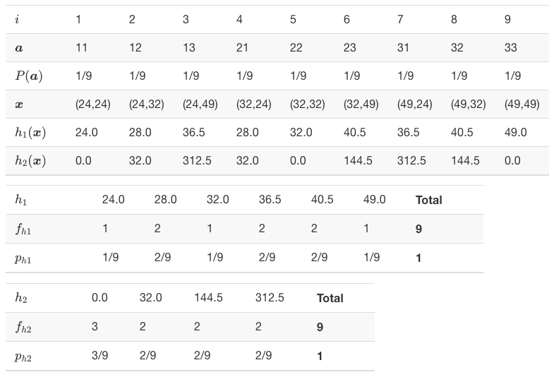
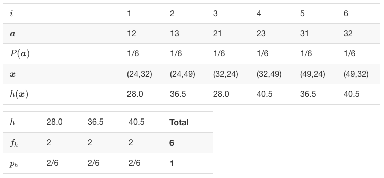

# Amostragem
```{definition}
*Amostragem* é o processo de obtenção de uma amostra.  $\\$
```
Inicia com o *plano amostral*, uma avaliação que leva em conta as medidas a serem avaliadas e os recursos disponíveis. Da mesma forma que os laboratórios retiram amostras de sangue para exames de saúde, cozinheiros experimentam parte da comida para provar os temperos e fábricas realizam testes destrutivos em parte da sua produção para avaliar a qualidade do que está sendo produzido. Será feita uma breve revisão dos principais conceitos de amostragem baseada em [@bolfarine2005elementos].
<!-- Adicionar Cochran -->
<!-- http://primo-pmtna01.hosted.exlibrisgroup.com/primo_library/libweb/action/search.do?vid=PUC01&fn=search&ct=search&initialSearch=true&onCampus=true&group=GUEST&search_scope=everything_scope&op=Search&ct=search&initialSearch=true&pcAvailabiltyMode=false&tab=default_tab&vl%28freeText0%29=cochran+sampling&scp.scps=scope%3A%28PUC01%29%2Cprimo_central_multiple_fe -->

## Definições básicas

### Unidade Elementar
```{definition}
A *unidade elementar*, *unidade populacional* ou simplesmente *elemento* é a entidade portadora das informações que pretende-se coletar. $\\$
```

A unidade elementar pode ser um objeto, animal ou pessoa. Em certos casos existe mais de uma maneira de definir a unidade elementar, onde se faz necessário o entendimento dos especialistas envolvidos. A unidade elementar é uma das definições mais importantes do campo científico, pois é base de toda a construção das hipóteses de pesquisa. 

```{example}
(Pesquisa eleitoral I) Em uma pesquisa eleitoral, classifica-se o eleitor como unidade elementar.
```

### Unidade Amostral
```{definition}
A *unidade amostral* é uma composição de uma ou mais unidades elementares. $\\$
```

```{example}
(Pesquisa eleitoral II) Em uma pesquisa eleitoral na rua, o eleitor é também unidade amostral. Caso as entrevistas sejam feitas de casa em casa, o domicílio passa a ser unidade amostral, i.e., um conjunto de unidades elementares (eleitores).
```

### Sistema de referências
Em relação às informações de um estudo, deve-se fazer inicialmente uma avaliação das bases de dados já disponíveis para então proceder com a avaliação da viabilidade de um levantamento de dados mais específico. Este levantamento envolve se montar um plano amostral, contratar, treinar e manter pessoas para a coleta, criar os protocolos de resposta bem como gerar e analisar os bancos de dados. Caso decida-se realizar tal levantamento, serão necessárias listas relacionando as unidades populacionais e amostrais. Na falta de tais listas, utilizam-se *sistemas de referências*, que são fontes que descrevem o universo a ser investigado. Podem ser informações razoavelmente atualizadas, como mapas, censos ou listas reunidas.

## Universo $\mathcal{U}$
```{definition}
*Universo* ou *população* é o conjunto de todas as unidades elementares de interesse. $\\$
```
Usualmente o universo possui tamanho $N$ elevado, até mesmo infinito, mas em alguns casos pode ser relativamente pequeno. É denotado formalmente por $$\mathcal{U} = \lbrace 1,2 \ldots, N \rbrace.$$

```{example}
(Pesquisa eleitoral III) Em 2018 o universo de eleitores do município de Porto Alegre compreendia 1,100,163 eleitores[^fonte], i.e., $N=1\,100\,163$. Formalmente $$\mathcal{U} = \lbrace 1, 2 \ldots, 1\,100\,163 \rbrace.$$
```

[^fonte]: Fonte: \texttt{http://www.tse.jus.br/eleicoes/estatisticas/estatisticas-eleitorais}.

```{definition}
*Elemento universal*, *elemento populacional* ou *unidade elementar* denota um elemento $i \in \mathcal{U}$.
```

```{definition}
*Característica(s) de interesse* denota(m) a variável ou o conjunto de $k$ variáveis associada(o) a cada elemento do universo, anotado por $\boldsymbol{X} = (\boldsymbol{x}_1, \boldsymbol{x}_2, \ldots, \boldsymbol{x}_N) = \left( \begin{bmatrix} x_{11} \\ x_{12} \\ \vdots \\ x_{1k} \end{bmatrix}, \begin{bmatrix} x_{21} \\ x_{22} \\ \vdots \\ x_{2k} \end{bmatrix}, \cdots , \begin{bmatrix} x_{N1} \\ x_{N2} \\ \vdots \\ x_{Nk} \end{bmatrix} \right) = \left( \begin{array}{cccc} x_{11} & x_{21} & \cdots & x_{N1} \\ x_{12} & x_{22} & \cdots & x_{N2} \\ \vdots & \vdots & \ddots & \vdots \\ x_{1k} & x_{2k} & \cdots & x_{Nk}  \end{array} \right).$ $\\$
```

```{example, universo}
Considere que no universo $\mathcal{U} = \lbrace 1,2,3 \rbrace$ de tamanho $N=3$ o sujeito 1 seja do sexo feminino com 24 anos de idade e 1.66m de altura, o sujeito 2 do sexo masculino com idade de 32 anos e 1.81m de altura, e o sujeito 3 do sexo masculino com 49 anos com altura de 1.73m. Assim, $$\boldsymbol{X} = (\boldsymbol{x}_1,\boldsymbol{x}_2,\boldsymbol{x}_3) = \left( \begin{bmatrix} 24 \\ 1.66 \\ F \end{bmatrix}, \begin{bmatrix} 32 \\ 1.81 \\ M \end{bmatrix}, \begin{bmatrix} 49 \\ 1.73 \\ M \end{bmatrix} \right) = \left( \begin{array}{ccc} 24 & 32 & 49 \\ 1.66 & 1.81 & 1.73 \\ M & F & M \end{array} \right).$$
```

### Parâmetros
```{definition}
*Parâmetro universal* ou *parâmetro populacional* denota uma função ou medida que depende de todas as características de interesse. $\\$
```

```{example, total-univ}
O parâmetro *total universal* é dado por
\begin{equation} 
\tau = \sum_{i=1}^N x_i.
(\#eq:total-univ)
\end{equation} 
```

```{example, media-univ}
O parâmetro *média universal* é dado por
\begin{equation} 
\mu = \frac{1}{N} \sum_{i=1}^N x_i = \frac{\tau}{N}.
(\#eq:media-univ)
\end{equation}
```

```{example, prop-univ}
Uma variável é chamada *dicotômica* quando assume apenas dois possíveis valores tais como sim/não, verdadeiro/falso, ligado/desligado, etc. A característica de interesse é chamada *sucesso* e a outra característica de *fracasso*. Por conveniência associa-se o sucesso ao valor $x=1$ e fracasso a $x=0$. Desta forma simboliza-se $\sum_{i=1}^N x_i$ como o total de sucessos observados no universo. Nesta situação o parâmetro *proporção universal* é dado por
\begin{equation} 
\pi = \frac{1}{N} \sum_{i=1}^N x_i.
(\#eq:prop-univ)
\end{equation} 
```

```{example, var-univ}
O parâmetro *variância universal* é dado pelas Equações \@ref(eq:var-univ1) e \@ref(eq:var-univ2).
```
<!-- \begin{equation}  -->
<!-- \sigma^2 = \frac{1}{N} \sum_{i=1}^N (x_i - \mu)^2 -->
<!-- (\#eq:var-univ1) -->
<!-- \end{equation} -->
<!-- \begin{equation}  -->
<!-- \sigma^2 = \frac{1}{N} \sum_{i=1}^N x{i}^2 - \mu^2. -->
<!-- (\#eq:var-univ2) -->
<!-- \end{equation}   -->

```{example, dp-univ}
O parâmetro *desvio padrão universal* é a raiz quadrada da variância universal, dado pela Equação \@ref(eq:dp-univ).
```
<!-- \begin{equation}  -->
<!-- \sigma = \sqrt{\sigma^2}. -->
<!-- (\#eq:dp-univ) -->
<!-- \end{equation}   -->

```{example, cov-univ}
O parâmetro *covariância universal* é dado por
\begin{equation} 
\sigma_{XY} = Cov[X,Y] = \frac{1}{N} \sum_{i=1}^N (x_i - \mu_X)(y_i - \mu_Y).
(\#eq:cov-univ)
\end{equation}    
```

```{example, cor-univ}
O parâmetro *correlaçao universal* é dado por
\begin{equation} 
\rho_{XY} = Cor[X,Y] = \frac{\sigma_{XY}}{\sigma_X \sigma_Y}.
(\#eq:cor-univ)
\end{equation}   
```

```{exercise}
Utilizando os dados do Exemplo \@ref(exm:universo), calcule os parâmetros dos Exemplos \@ref(exm:total-univ) a \@ref(exm:cor-univ). $\\$
```
```{exercise}
Mostre que as Equações \@ref(eq:var-univ1) e \@ref(eq:var-univ2) são equivalentes.
```


## Amostras
```{definition}
Considere o universo $\mathcal{U} = \lbrace 1, 2, \ldots, N \rbrace$. Uma *amostra* é qualquer sequência de $n$ unidades de $\mathcal{U}$, formalmente denotada por $$\boldsymbol{a} = (a_1,\ldots,a_n),$$ onde o $i$-ésimo compomente de $\boldsymbol{a}$ é tal que $a_i \in \mathcal{U}$. $\\$
```

```{example, amostra}
Seja $\mathcal{U} = \lbrace 1, 2, 3 \rbrace$. Os vetores $\boldsymbol{a}_A = (2,3)$, $\boldsymbol{a}_B = (3,3,1)$, $\boldsymbol{a}_C = (2)$, $\boldsymbol{a}_D = (2,2,3,3,1)$ são possíveis amostras de $\mathcal{U}$. $\\$
```

```{example}
No Exemplo \@ref(exm:amostra), note os tamanhos de amostra $n_A = n(\boldsymbol{a}_A) = 2$, $n_B = n(\boldsymbol{a}_B) = 3$, $n_C = n(\boldsymbol{a}_C) = 1$ e $n_D = n(\boldsymbol{a}_D) = 5$.  $\\$
```

```{definition}
Seja $\mathcal{A}(\mathcal{U})$ ou simplesmente $\mathcal{A}$ o conjunto de todas as amostras de $\mathcal{U}$, de qualquer tamanho, e $\mathcal{A}_{n}(\mathcal{U})$ ou simplesmente $\mathcal{A}_{n}$ a subclasse das as amostras de tamanho $n$.  $\\$
```

```{example, subclasses}
Se $\mathcal{U} = \lbrace 1, 2, 3 \rbrace$, $$\mathcal{A}(\mathcal{U}) = \lbrace (1),(2),(3),(1,1),(1,2),(1,3),(2,1),\ldots,(3,1,2,2,1),\ldots \rbrace,$$ 
$$\mathcal{A}_{1}(\mathcal{U}) = \lbrace (1),(2),(3) \rbrace, $$ $$\mathcal{A}_{2}(\mathcal{U}) = \lbrace (1,1),(1,2),(1,3),(2,1),(2,2),(2,3),(3,1),(3,2),(3,3) \rbrace. $$
  Simplificadamente $$\mathcal{A} = \lbrace 1,2,3,11,12,13,21,\ldots,31221,\ldots \rbrace,$$ 
$$\mathcal{A}_{1} = \lbrace 1,2,3 \rbrace, $$ $$\mathcal{A}_{2} = \lbrace 11,12,13,21,22,23,31,32,33 \rbrace. $$
```

```{example}
No exemplo anterior, note o número de elementos (cardinalidade) de cada conjunto: $$|\mathcal{U}|=3$$
$$|\mathcal{A}(\mathcal{U})| = \infty$$
$$|\mathcal{A}_{1}(\mathcal{U})| = 3^1 = 3$$
$$|\mathcal{A}_{2}(\mathcal{U})| = 3^2 = 9$$
$$\vdots$$
$$|\mathcal{A}_{n}(\mathcal{U})| = |\mathcal{U}|^n.$$
```

### Plano Amostral
```{definition}
Um *plano amostral (ordenado)* é uma função $P(\boldsymbol{a})$ definida em $\mathcal{A}(\mathcal{U})$ satisfazendo $$P(\boldsymbol{a}) \ge 0, \; \forall \boldsymbol{a} \in \mathcal{A}(\mathcal{U}),$$ tal que $$\sum_{\boldsymbol{a} \in \mathcal{A}} P(\boldsymbol{a}) =  1.$$ $\\$
```

```{example, planos}
Considere $\mathcal{U} = \lbrace 1, 2, 3 \rbrace$ e $\mathcal{A}(\mathcal{U})$ conforme Exemplo \@ref(exm:subclasses). É possivel criar infinitos planos amostrais, tais como:
```
- **Plano A $\cdot$ Amostragem Aleatória Simples *com* reposição (AASc)**
$$P(11)=P(12)=P(13)=1/9 \\ 
  P(21)=P(22)=P(23)=1/9 \\ 
  P(31)=P(32)=P(33)=1/9 \\ 
  P(\boldsymbol{a}) = 0, \; \forall \boldsymbol{a} \in \mathcal{A}(\mathcal{U}).$$
  
- **Plano B $\cdot$ Amostragem Aleatória Simples *sem* reposição (AASs)**
$$P(12)=P(13)=1/6 \\
  P(21)=P(23)=1/6 \\
  P(31)=P(32)=1/6 \\
  P(\boldsymbol{a}) = 0, \; \forall \boldsymbol{a} \in \mathcal{A}(\mathcal{U}).$$
  
- **Plano C $\cdot$ Combinações**
$$P(12)=P(13)=P(23)=1/3 \\
  P(\boldsymbol{a}) = 0, \; \forall \boldsymbol{a} \in \mathcal{A}(\mathcal{U}).$$

- **Plano D**
$$P(3)=9/27 \\
  P(12)=P(23)=3/27 \\
  P(111)=P(112)=P(113)=P(123)=1/27 \\
  P(221)=P(222)=P(223)=P(231)=1/27 \\
  P(331)=P(332)=P(333)=P(312)=1/27 \\
  P(\boldsymbol{a}) = 0, \; \forall \boldsymbol{a} \in \mathcal{A}(\mathcal{U}).$$

<!-- ```{exercise} -->
<!-- Verifique que as probabilidades associadas aos planos amostrais A e B do Exemplo \@ref(exm:planos) são 1/9 e 1/6, respectivamente. $\\$ -->
<!-- ``` -->

<!-- ```{definition} -->
<!-- Chama-se *dados da amostra* o vetor ou matriz das observações pertencentes à amostra $\boldsymbol{a}$, i.e.,  -->
<!-- $$\boldsymbol{d}_\boldsymbol{a} = \boldsymbol{y} = (\boldsymbol{y}_{1},\boldsymbol{y}_{2},\ldots,\boldsymbol{y}_{n}).$$ -->
<!-- ``` -->

```{example}
Considere a amostra $\boldsymbol{a} = (1,2)$ obtida do universo descrito Exemplo \@ref(exm:universo) a partir de algum plano amostral válido. Se o sujeito 1 tem 24 anos de idade e 1.66m de altura, e o sujeito 2 tem 32 anos de idade altura de 1.81m,
$$\boldsymbol{x} = (\boldsymbol{x}_1,\boldsymbol{x}_2) = \left( \begin{bmatrix} 24 \\ 1.66 \end{bmatrix}, \begin{bmatrix} 32 \\ 1.81 \end{bmatrix} \right) = \left( \begin{array}{cc} 24 & 32 \\ 1.66 & 1.81 \end{array} \right).$$
```

```{definition}
Uma *estatística* é uma função dos dados amostra $\boldsymbol{a}$ anotada por $h(\boldsymbol{x})$, i.e., qualquer medida numérica calculada a partir dos valores observados na amostra. $\\$
```

```{example, estatisticas}
Considere $\boldsymbol{x}$, a matriz dos dados da amostra $\boldsymbol{a} = (1,2)$. São exemplos de estatísticas:
$$h_1 = \frac{24+32}{2} = 28 \;\;\;\;\; \textrm{(média das idades)}$$
$$h_2 = \frac{1.66+1.81}{2} = 1.735 \;\;\;\;\; \textrm{(média das alturas)}$$
$$h_3 = 32-24 = 8 \;\;\;\;\; \textrm{(amplitude das idades)}$$
$$h_4 = \sqrt{24^2+32^2} = \sqrt{1600} = 40 \;\;\;\;\; \textrm{(norma das idades)}$$
```
```{exercise}
Calcule as estatísticas do Exemplo \@ref(exm:estatisticas) considerando as amostras $\boldsymbol{a} = (1,3)$ e $\boldsymbol{a} = (2,3)$.
```


### Distribuições amostrais
```{definition}
A *distribuição amostral* de uma estatística $h(\boldsymbol{x})$ segundo um plano amostral $\lambda$, é a distribuição de probabilidades $H(\boldsymbol{x})$ definida sobre $\mathcal{A}_\lambda$, com função de probabilidade $$p_h = P_\lambda(H(\boldsymbol{x})=h) = P(h) = \frac{f_h}{|\mathcal{A}_\lambda|}. $$ $\\$
```

```{example, aasc}
Considere a variável `idade` do Exemplo \@ref(exm:universo) e as estatísticas $h_1(\boldsymbol{x})=\frac{1}{n}\sum_{i=1}^n x_i$ e $h_2(\boldsymbol{x})=\frac{1}{n-1}\sum_{i=1}^n (x_i-h_1(\boldsymbol{x}))^2$ aplicadas sobre o plano amostral A do Exemplo \@ref(exm:planos). Note que $h_1(\boldsymbol{x})$ e $h_2(\boldsymbol{x})$ são respectivamente a média e a variância amostrais.   $\\$
```

- **Plano A $\cdot$ Amostragem Aleatória Simples *com* reposição (AASc)**

+-----------------------+-------+-------+-------+-------+-------+-------+-------+-------+-------+
| $i$                   | 1     | 2     | 3     | 4     | 5     | 6     | 7     | 8     | 9     |
+-----------------------+-------+-------+-------+-------+-------+-------+-------+-------+-------+
| $\boldsymbol{a}$      | 11    | 12    | 13    | 21    | 22    | 23    | 31    | 32    | 33    |
+-----------------------+-------+-------+-------+-------+-------+-------+-------+-------+-------+
| $P(\boldsymbol{a})$   | 1/9   | 1/9   | 1/9   | 1/9   | 1/9   | 1/9   | 1/9   | 1/9   | 1/9   |
+-----------------------+-------+-------+-------+-------+-------+-------+-------+-------+-------+
| $\boldsymbol{x}$      |(24,24)|(24,32)|(24,49)|(32,24)|(32,32)|(32,49)|(49,24)|(49,32)|(49,49)|
+-----------------------+-------+-------+-------+-------+-------+-------+-------+-------+-------+
| $h_1(\boldsymbol{x})$ | 24.0  | 28.0  | 36.5  | 28.0  | 32.0  | 40.5  | 36.5  | 40.5  | 49.0  |
+-----------------------+-------+-------+-------+-------+-------+-------+-------+-------+-------+
| $h_2(\boldsymbol{x})$ | 0.0   | 32.0  | 312.5 | 32.0  | 0.0   | 144.5 | 312.5 | 144.5 | 0.0   |
+-----------------------+-------+-------+-------+-------+-------+-------+-------+-------+-------+

+----------+------+------+------+------+------+------+---------+
| $h_1$    | 24.0 | 28.0 | 32.0 | 36.5 | 40.5 | 49.0 |**Total**|
+----------+------+------+------+------+------+------+---------+
| $f_{h1}$ | 1    | 2    | 1    | 2    | 2    | 1    | **9**   |
+----------+------+------+------+------+------+------+---------+
| $p_{h1}$ | 1/9  | 2/9  | 1/9  | 2/9  | 2/9  | 1/9  | **1**   |
+----------+------+------+------+------+------+------+---------+

+----------+------+------+------+------+---------+
| $h_2$    | 0.0  | 32.0 | 144.5| 312.5|**Total**|
+----------+------+------+------+------+---------+
| $f_{h2}$ | 3    | 2    | 2    | 2    | **9**   |
+----------+------+------+------+------+---------+
| $p_{h2}$ | 3/9  | 2/9  | 2/9  | 2/9  | **1**   |
+----------+------+------+------+------+---------+

<!--  -->

$\\$
```{example, aass}
Considere novamente a variável `idade` do Exemplo \@ref(exm:universo) e a estatística $h_1(\boldsymbol{x})=\frac{1}{n}\sum_{i=1}^n x_i$, agora aplicada sobre o plano amostral B do Exemplo \@ref(exm:planos). $\\$
```

- **Plano B $\cdot$ Amostragem Aleatória Simples *sem* reposição (AASs)**

+-----------------------+-------+-------+-------+-------+-------+-------+
| $i$                   | 1     | 2     | 3     | 4     | 5     | 6     |
+-----------------------+-------+-------+-------+-------+-------+-------+
| $\boldsymbol{a}$      | 12    | 13    | 21    | 23    | 31    | 32    |
+-----------------------+-------+-------+-------+-------+-------+-------+
| $P(\boldsymbol{a})$   | 1/6   | 1/6   | 1/6   | 1/6   | 1/6   | 1/6   |
+-----------------------+-------+-------+-------+-------+-------+-------+
| $\boldsymbol{x}$      |(24,32)|(24,49)|(32,24)|(32,49)|(49,24)|(49,32)|
+-----------------------+-------+-------+-------+-------+-------+-------+
| $h_1(\boldsymbol{x})$ | 28.0  | 36.5  | 28.0  | 40.5  | 36.5  | 40.5  |
+-----------------------+-------+-------+-------+-------+-------+-------+

+----------+------+------+------+---------+
| $h_1$    | 28.0 | 36.5 | 40.5 |**Total**|
+----------+------+------+------+---------+
| $f_{h1}$ | 2    | 2    | 2    | **6**   |
+----------+------+------+------+---------+
| $p_{h1}$ | 2/6  | 2/6  | 2/6  | **1**   |
+----------+------+------+------+---------+

<!--  -->

$\\$
```{example, comb}
Considere novamente a variável `idade` do Exemplo \@ref(exm:universo) e a estatística $h_1(\boldsymbol{x})=\frac{1}{n}\sum_{i=1}^n x_i$, agora aplicada sobre o plano amostral C do Exemplo \@ref(exm:planos). $\\$
```
- **Plano C $\cdot$ Combinações**

+-----------------------+-------+-------+-------+
| $i$                   | 1     | 2     | 3     |
+-----------------------+-------+-------+-------+
| $\boldsymbol{a}$      | 12    | 13    | 23    |
+-----------------------+-------+-------+-------+
| $P(\boldsymbol{a})$   | 1/3   | 1/3   | 1/3   |
+-----------------------+-------+-------+-------+
| $\boldsymbol{x}$      |(24,32)|(24,49)|(32,49)|
+-----------------------+-------+-------+-------+
| $h_1(\boldsymbol{x})$ | 28.0  | 36.5  | 40.5  |
+-----------------------+-------+-------+-------+

+----------+------+------+------+---------+
| $h_1$    | 28.0 | 36.5 | 40.5 |**Total**|
+----------+------+------+------+---------+
| $f_{h1}$ | 1    | 1    | 1    | **3**   |
+----------+------+------+------+---------+
| $p_{h1}$ | 1/3  | 1/3  | 1/3  | **1**   |
+----------+------+------+------+---------+

<!--  -->

$\\$
```{exercise}
Refaça os Exemplos \@ref(exm:aasc), \@ref(exm:aass) e \@ref(exm:comb) considerando a variável `altura`. Para os Exemplos \@ref(exm:aass) e \@ref(exm:comb), calcule também a estatística $h_2(\boldsymbol{x})=\frac{1}{n-1}\sum_{i=1}^n (x_i-h_1(\boldsymbol{x}))^2$. $\\$
```

```{example, aas-R}
A seguir são implementadas em R as resoluções dos Exemplos \@ref(exm:aasc) e \@ref(exm:aass).
```

```{r}
U <- 1:3                    # universo
(aasc <- expand.grid(U,U))  # AASc de tamanho n=2
(aasc <- cbind(aasc[,2],aasc[,1])) # trocando as colunas para melhor leitura
(aass <- aasc[-c(1,5,9),]) # AASs de tamanho n=2
x1 <- c(24,32,49)           # dados de idade
n <- ncol(aasc)
# AASc
(xc <- cbind(x1[aasc[,1]], x1[aasc[,2]])) # dados amostrais de idade com reposição
(mxc <- rowMeans(xc))       # estatística h1(x) aplicada na AASc
(tabc <- table(mxc))        # frequência amostral de h1(y) aplicada na AASc
MASS::fractions(prop.table(tabc)) # distribuição amostral de h1(x) aplicada na AASc
# vyc <- (rowMeans(xc^2)-mxc^2)*(n/(n-1))
# AASs
(xs <- cbind(x1[aass[,1]], x1[aass[,2]])) # dados amostrais de idade sem reposição
(mxs <- rowMeans(xs))       # estatística h(x) aplicada na AASs
(tabs <- table(mxs))        # frequência amostral de h(x) aplicada na AASs
MASS::fractions(prop.table(tabs)) # distribuição amostral de h(x) aplicada na AASs
```

```{example, aas-R-arr}
As resoluçãos dos Exemplos \@ref(exm:aass) e \@ref(exm:comb) podem ser implementadas no pacote [`arrangements`](https://cran.r-project.org/web/packages/arrangements/) do R. Note que são obtidas as amostras via AASs através da função `permutations` e as amostras por combinação, sem qualquer tipo de repetição, pela função `combinations`.
```

```{r}
library(arrangements)
x1 <- c(24,32,49)  # dados de idade
# AASs
npermutations(3,2) # número de AASs
(aass <- permutations(3,2)) # gerando as AASs
(maass <- matrix(x1[t(aass)], ncol=2, byrow = T))
rowMeans(maass)
mean(rowMeans(maass)) # plano amostral não viesado
# Combinações
ncombinations(3,2) # número de amostras via combinação
(comb <- combinations(3,2)) # gerando as amostras via combinação
(mcomb <- matrix(x1[t(comb)], ncol=2, byrow = T))
rowMeans(mcomb)
mean(rowMeans(mcomb)) # plano amostral não viesado
```

```{conjecture}
Generalize os Exemplos \@ref(exm:aas-R) e \@ref(exm:comb) para qualquer tamanho de amostra, parametrizando as opções com e sem reposição, bem como para combinações. Por fim, adicione um argumento que permita calcular qualquer estatística.
```

#### Teorema Central do Limite {-}

O *Teorema Central do Limite* (TCL) é um dos principais resultados da Probabilidade. Ele mostra que, sob certas condições razoavelmente alcançadas na prática, a soma ou média de uma sequência de variáveis aleatórias independentes e identicamente distribuídas (*iid*)[^iid] têm distribuição aproximadamente normal. Este resultado permite a resolução aproximada de problemas que envolvam muitos cálculos, usualmente impraticáveis dado o volume de operações necessárias.

[^iid]: Variáveis que apresentam mesma distribuição de probabilidade com os mesmos parâmetros. 

```{theorem, tcl}
(Teorema Central do Limite de Lindeberg-Lévy) Seja $X_{1}, X_{2}, \ldots, X_{n}$ uma sequência de variáveis aleatórias iid com $E(X_{i}) = \mu$ e $V(X_{i}) = \sigma^2$. Considerando $S=X_{1}+X_{2}+\ldots+X_{n}$, $M=S/n$ e se $n \longrightarrow \infty$, então
\begin{equation}
Z = \frac{S - n\mu}{\sigma \sqrt{n}} = \dfrac{M - \mu}{\sigma / \sqrt{n}} \xrightarrow{D} \mathcal{N}(0,1).
(\#eq:tcl)
\end{equation}
```

A *correção de continuidade* ocorre quando soma-se 0.5 no numerador da Equação \@ref(eq:tcl). [@james2010probabilidade] sugere o uso da expressão 'Teorema Central do Limite' no lugar de 'Teorema do Limite Central', pois central é o teorema, não o limite. A origem da expressão é atribuída ao matemático húngaro George Pólya, ao se referir a *der zentrale Grenzwertsatz*, i.e., o 'central' refere-se ao 'teorema do limite'.

#### Distribuição amostral da proporção {-}
A proporção é uma média no caso de a variável admitir apenas os valores 0 e 1, portanto o TCL se aplica diretamente a este tipo de estrutura.

```{example}
(Aproximação da binomial pela normal) Se considerarmos $n=420$ lançamentos de uma moeda com $p=0.5$, temos que a v.a. $X$: *número de caras* é tal que $X \sim \mathcal{B}(420,0.5)$. A probabilidade de obtermos até 200 caras pode ser aproximada pelo pelo TCL.  \[ Pr(X \le 200) \approx  Pr \left( Z < \dfrac{200-420\times 0.5}{\sqrt{420 \times 0.5 \times 0.5}} \right) = \Phi(-0.9759) \approx 0.164557. \]
Utilizando a correção de continuidade,  \[ Pr(X \le 200) \approx  Pr \left( Z < \dfrac{200+0.5-420\times 0.5}{\sqrt{420 \times 0.5 \times 0.5}} \right) = \Phi(-0.9271) \approx 0.176936. \]
Com um computador é possível calcular a probabilidade exata, perceba a proximidade dos resultados. \[ Pr(X \le 200) = \left[ {420 \choose 0} + {420 \choose 1} + \cdots + {420 \choose 200} \right] 0.5^{420} = 0.1769429. \]
```

```{r}
n <- 420
p <- 0.5
S <- 200
mS <- n*p  # 210
sS <- sqrt(n*p*(1-p))  # 10.24695
# Aproximação da binomial pela normal SEM correção de continuidade
(z <- (S-mS)/sS)
pnorm(z)
# Aproximação da binomial pela normal COM correção de continuidade
(zc <- (S+0.5-mS)/sS)
pnorm(zc)
# Probabilidade exata
pbinom(S,n,p)
```

#### Distribuição amostral da média {-}
Com base no Teorema Central do Limite sabe-se que a distribuição das médias amostrais de qualquer variável $X$ que satisfaça as condições do teorema converge para a distribuição normal. Considere que $X$ tem uma distribuição $\mathcal{D}$ qualquer, com média $\mu$ e desvio padrão $\sigma$, simbolizada por $$X \sim \mathcal{D}(\mu,\sigma).$$ Pelo TCL, a distribuição das médias amostrais de qualqer tamanho $n_0$ é tal que $$\bar{X}_{n_0} \sim \mathcal{N} \left( \mu,\frac{\sigma}{\sqrt{n_0}} \right).$$ A medida $\sigma/\sqrt{n_0}$ é conhecida como *erro padrão (da média)*. O TCL é um resultado assintótico[^assint], portanto quanto mais próxima $\mathcal{D}$ estiver de $\mathcal{N}$, mais rápida deve ser a convergência de $\bar{X}_{n_0}$ para a distribuição normal.

[^assint]: Um resultado assintótico é aquele que depende de uma ou mais variávies sendo observadas próximas a certos limites de referência.

```{example, qi}
Considere a variável aleatória $X$: *QI da população mundial*, admitida com distribuição normal de média $\mu=100$ e desvio padrão de $\sigma=15$, anotada por $X \sim \mathcal{N}(100,15)$.
```
```{r, fig.show=TRUE}
mu <- 100 # média de X
sigma <- 15  # desvio padrão de X
curve(dnorm(x, mean=mu, sd=sigma), from=mu-3*sigma, to=mu+3*sigma) # X ~ N(100,15)
n0 <- 25 # tamanho das amostras
n <- 200 # número de amostras
set.seed(1234) # fixando semente pseudo-aleatória para garantir replicação
a <- MASS::mvrnorm(n0, mu = rep(mu,n), Sigma = sigma^2*diag(n)) # amostras
ma <- colMeans(a) # médias das n amostras
hist(ma) # histograma das médias
mean(ma) # média das médias amostrais, próxima de mu
sd(ma) # desvio padrão das médias, próximo de sigma/raiz(n0)
sigma/sqrt(n0) # sigma/raiz(n0)
```
```{exercise}
Refaça o Exemplo \@ref(exm:qi) alterando os valores de `n0` e `n`, verificando o que ocorre no histograma, média e desvio padrão de `ma`. Atente para o fato de  que valores de `n` maiores que 1000 podem tornar o processo custoso computacionalmente.
```


### Amostra representativa
> Ouve-se frequentemente o argumento de que uma boa amostra é aquela que é representativa. Indagado sobre a definição de uma amostra representativa, a resposta mais comum é algo como: "aquela que é uma micro representação do universo". Mas para se ter certeza de que uma amostra seja uma micro representação do universo para uma dada característica de interesse, deve-se conhecer o comportamento dessa mesma característica da população. Então, o conhecimento da população seria tão grande que tonar-se-ia desnecessária a coleta da amostra.  
[@bolfarine2005elementos, p. 14] 

### Tipos de amostras
<!-- ![Tipos de amostras segundo [@bolfarine2005elementos] e [@jessen1978statistical].](img/criterio.png?style=centerme) -->
![Tipos de amostras segundo [@bolfarine2005elementos] e [@jessen1978statistical].](img/criterio.png)

Procedimentos probabilísticos objetivos são mais bem aceitos academicamente, ainda que na prática nem sempre possam ser executados. Quando isso ocorre, podem-se considerar procedimentos que sejam possíveis de serem executados.


## Principais técnicas de amostragem

### Amostragem Aleatória Simples
*Amostragem Aleatória Simples (AAS)* é o método mais básico de seleção de amostras, sendo referência para todos os demais planos amostrais. A partir de uma lista completa das $N$ unidades elementares da população seleciona-se cada unidade amostral com igual probabilidade, de tal forma que a cada sorteio os elementos tenham a mesma chance de serem escolhidos. A necessidade de uma lista completa da população para realizar uma AAS pode eventualmente ser um limitante na aplicação deste tipo de metodologia, pois na prática nem sempre é possível obter tal listagem. Os planos amostrais A e B discutidos nos Exemplos \@ref(exm:planos), \@ref(exm:aasc) e \@ref(exm:aass) são caracterizados como AAS. 

#### AAS sem reposição - AASs {-}
Caso a unidade sorteada seja retirada da população e seja realizado um novo sorteio, é dito que procedeu-se com uma AAS *restrita* ou *sem reposição*, indicado por AASs.

```{example, urna-aass}
(AASs) De uma urna com $N$ cartões numerados de $1$ a $N$ sorteia-se um ao acaso, com probabilidade $1/N$. O cartão sorteado é deixado de fora da urna e realiza-se um novo sorteio, onde cada um dos $N-1$ cartões restantes tem  probabilidade $1/(N-1)$ de ser retirado. Este procedimento é repetido até que se concluam todos os $n$ sorteios desejados. Este é um processo de AAS *sem* reposição. $\\$
```

```{exercise, urna-aass-N}
Defina as probabilidades de sorteio do Exemplo \@ref(exm:urna-aass) considerando $n=3$ sorteios. $\\$
```

```{exercise, urna-aass-10}
Calcule as probabilidades de sorteio do Exemplo \@ref(exm:urna-aass) considerando $n=3$ sorteios e $N=10$. $\\$
```

```{example, mega}
(Mega-Sena da Caixa Econômica Federal) No R pode-se sortear uma amostra sem reposição para tentar a sorte no jogo da Caixa Econômica Federal. Note que $N=60$, $n=6$.
```
```{r}
set.seed(1234) # Fixando a geração pseudo-aleatória
sort(sample(1:60, size = 6, replace = F)) # Apostando na Mega-Sena da CEF via AASs
```
```{exercise}
Leia a documentação das funções utilizadas no Exemplo \@ref(exm:mega) fazendo `?set.seed`,  
`?sort` e `?sample`.
```


#### AAS com reposição - AASc {-}
Caso a unidade sorteada tenha a chance de participar novamente da amostra, o procedimento é chamado AAS *irrestrita* ou *com reposição*, indicado por AASc. 
<!-- Note que sortear $n$ bolinhas simultaneamente equivale a fazer $n$ retiradas com reposição. -->

```{example, urna-aasc}
(AASc) De uma urna com $N$ cartões numerados de $1$ a $N$ sorteia-se um ao acaso, com probabilidade $1/N$. O cartão sorteado é recolocado na urna e realiza-se um novo sorteio. Este procedimento é repetido até que se concluam todos os $n$ sorteios desejados. Este é um processo de AAS *com* reposição. $\\$
```

```{exercise, urna-aasc-N}
Defina as probabilidades de sorteio do Exemplo \@ref(exm:urna-aasc) considerando $n=3$ sorteios. $\\$
```

```{exercise, urna-aasc-10}
Calcule as probabilidades de sorteio do Exemplo \@ref(exm:urna-aasc) considerando $n=3$ sorteios com $N=10$. $\\$
```

### Amostragem Sistemática
Considere uma população de $N$ unidades elementares numeradas de 1 a $N$. Para selecionar uma amostra de $n$ observações sorteia-se aleatoriamente uma das primeiras $k=N/n$ unidades, digamos $a$, com probabilidade $1/k$ selecionando sistematicamente as próximas observações a cada $k$ unidades. Matematicamente, $$a, a+k, a+2k, \ldots, a+(n-1)k.$$

```{example, as}
Seja uma população com $N=100$, da qual deseja-se retirar uma amostra sistemática de tamanho $n=5$. Neste caso $k=100/5=20$, então sortearmos aleatoriamente um número entre 1 e 20 com probabilidade $1/20$. Se o número sorteado for $a=4$, a amostra sistemática então é definida como $$4, 4+20, 4+2 \times 20, 4+3 \times 20, 4+4 \times 20 = 4,24,44,64,84.$$
```
```{r}
N <- 100 # Tamanho da população
n <- 5 # Tamanho da amostra
(k <- N/n) # Tamanho do salto
set.seed(1) # Fixando a geração pseudo-aleatória
(a <- sample(1:k, size = 1)) # Amostra de tamanho 1 com probabilidade 1/k
for(i in 1:n){print(a+(i-1)*k)} # Apresentando a amostra de tamanho n
```
```{exercise}
Considere o código do Exemplo \@ref(exm:as).  
(a) Rode o código repetidas vezes retirando a linha `set.seed(1)`. O que você observa?  
(b) Refaça o exercício considerando outros valores de $N$ e $n$, tais que $n<N$.
```


### Amostragem Estratificada
Segundo [@bolfarine2005elementos, p. 93],  

> Amostragem estratificada consiste na divisão de uma população em grupos (estratos) segundo alguma(s) característica(s) conhecida(s) na populaçãao sob estudo, e de cada um desses estratos são selecionadas amostras em proporções convenientes.

O objetivo deste tipo de amostragem é que o pesquisador possa se valer de estruturas pré-existentes de maneira a melhorar as inferências, reduzindo sua variabilidade.


<!-- ### Amostragem por conglomerados em um estágio -->

<!-- ### Amostragem por Cotas -->

 <!-- e [@tille2016sampling]. -->
 
## Cálculo do tamanho da amostra
O *cálculo do tamanho de amostra* é baseado em uma série de premissas assumidas pelo pesquisador. Os valores sugeridos pelos diversos métodos de cálculo de tamanho de amostra devem ser considerados apenas como uma referência, dada a arbitrariedade das medidas utilizadas em sua obtenção. Tempo e custo são dois limitantes que devem ser levados em conta, podendo se sobrepor aos cálculos de tamanho de amostra.  
A seguir serão apresentados casos bastante simples, mas suficientes para ilustrar os princípios utilizados. Para mais funcionalidades recomenda-se o pacote `pwr` [@champely2020pwr] do R e o software [G*Power](https://www.gpower.hhu.de) [@faul2007gpower], [@faul2009gpower]. Para uma abordagem mais teórica recomenda-se [@chow2007sample].

### Média
Uma forma de estimar o tamanho da amostra no caso da inferência para a media universal $\mu$ é considerar a margem de erro da Equação \@ref(eq:ic-media-sigma) e isolar $n$ na forma
\begin{equation}
n = \left \lceil{ \left( \frac{z \sigma}{\varepsilon} \right)^2 }\right \rceil.
(\#eq:n-media-sigma)
\end{equation}

O operador $\left \lceil{ x }\right \rceil$ indica a função *teto* de $x$, i.e., indica o primeiro inteiro acima de $x$.

```{exercise}
Obtenha o resultado da Equação \@ref(eq:n-media-sigma) a partir da margem de erro da Equação \@ref(eq:ic-media-sigma). $\\$
```

```{example, n-media-95}
(Tamanho da amostra para a média) Deseja-se obter o tamanho de amostra para estimar a média de altura dos alunos da PUCRS. Considera-se um intervalo de confiança de $1-\alpha = 95\%$, com margem de erro de $\varepsilon = 3$ cm. De estudos anteriores, admite-se $\sigma = 15$ cm. Considerando a Equação \@ref(eq:n-media-sigma), sabe-se da tabela da distribuição normal padrão que $z = 1.96$, assim
\begin{equation}
n = \left \lceil{ \left( \frac{1.96 \times 15}{3} \right)^2 }\right \rceil = \left \lceil{ 96.04 }\right \rceil = 97.
(\#eq:n-media-95)
\end{equation}
```

```{r}
# Equação (3.8)
n_m <- function(z,sigma,e) {
  exato <- (z*sigma/e)^2     
  teto <- ceiling(exato)
  return(list(exato=exato, 
              teto=teto))
}      
n_m(1.96,15,3)
n_m(1.96,15,3)$exato
n_m(1.96,15,3)$teto
```

### Proporção
Uma forma de estimar o tamanho da amostra no caso da inferência para a proporção universal $\pi$ é considerar a margem de erro da Equação \@ref(eq:ic-prop) e isolar $n$ na forma
\begin{equation}
n = \left \lceil{ \frac{z^2 p (1-p)}{\varepsilon^2} }\right \rceil.
(\#eq:n-prop)
\end{equation}

Em certos casos existe informação disponível sobre a proporção, mas quando não há qualquer conhecimento a respeito desta medida considera-se $p=\frac{1}{2}$, ponto no qual $p(1-p)$ atinge seu máximo.  

```{exercise}
Obtenha o resultado da Equação \@ref(eq:n-prop) a partir da margem de erro da Equação \@ref(eq:ic-prop). $\\$
```

```{exercise}
Verifique que $p(1-p)$ atinge seu máximo quando $p=\frac{1}{2}$. $\\$
```

```{example, n-prop-95}
(Tamanho da amostra para a proporção) Em uma pesquisa eleitoral deseja-se calcular o tamanho de amostra aproximado para que a margem de erro seja de $\varepsilon = 2\%$ com confiança de $1-\alpha = 95\%$. Considerando a Equação \@ref(eq:n-prop), sabe-se da tabela da distribuição normal padrão que $z = 1.96 \approx 2$, e que $p(1-p)$ atinge seu máximo quando $p=\frac{1}{2}$. Assim,
\begin{equation}
n \approx \left \lceil{ \frac{2^2 \times \frac{1}{2} \times (1-\frac{1}{2})}{\varepsilon^2} }\right \rceil = \left \lceil{ \frac{1}{\varepsilon^2} }\right \rceil
(\#eq:n-prop-95)
\end{equation}
 
Logo, um IC para a proporção com $\alpha = 5\%$ para uma margem de erro de $\varepsilon = 2\%$ pode ser calculado com um tamanho de amostra de aproximadamente \[ n \approx \left \lceil{ \frac{1}{0.02^2} }\right \rceil = 2500. \]
```

```{r}
# Equação (3.11)
n_p <- function(e) {
  exato <- 1/e^2
  teto <- ceiling(exato)
  return(list(exato=exato, 
              teto=teto))
}      
n_p(0.02)
n_p(0.02)$exato
n_p(0.02)$teto
```

```{exercise}
Teste a função `n_p` do Exemplo \@ref(exm:n-prop-95) com diferentes valores de margem de erro. Faça um gráfico para analisar a variação do tamanho da amostra à medida que $\varepsilon$ aumenta. $\\$
```

## Para saber mais
O material [Amostragem: Teoria e Prática Usando R](https://amostragemcomr.github.io/livro/index.html), gentilmente disponibilizado pelos professores Pedro Luis do Nascimento Silva, Zélia Magalhães Bianchini e Antonio José Ribeiro Dias, é uma fonte muito rica para informações adicionais sobre este tópico. Está disponível ainda o livro [Análise de Dados Amostrais Complexos](https://djalmapessoa.github.io/adac/), também do professor Pedro Silva em parceria com o professor Djalma Pessoa.   
O professor Pedro também compartilhou o [vídeo](https://www.youtube.com/watch?v=_s9b8fQ7uEA) e os [slides](https://drive.google.com/file/d/1cST0mA_nrYI2HZz9tgIAho4oHHYX42D4/view) da apresentação *Combinando amostras para aprimorar estimativas – aventuras na amostragem não probabilística*, apresentado em 18 de outubro de 2020 no *VII Encontro Baiano de Estatística*.