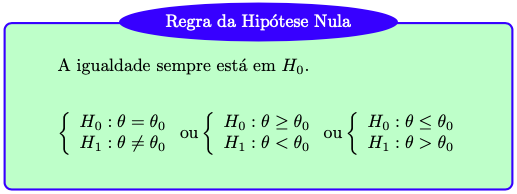
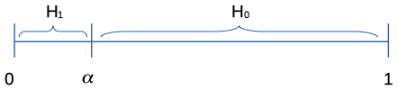

# Inferência Clássica {#inferencia-classica}
*Inferência* é o procedimento que visa atualizar a informação sobre parâmetros a partir dos dados amostrais. Para [@degroot2012probability, p. 378], 'inferência estatística é um procedimento que produz uma declaração probabilística a respeito de uma ou mais partes de um modelo estatístico'[^inf].  Conclusões obtidas a partir dos dados embasam a *lógica indutiva*, i.e., aquela que parte do caso particular para o caso geral e que se opõe à *lógica dedutiva* que vai do caso geral para o particular. O princípio indutivo se enquadra na noção de um decisor, a partir de uma amostra (caso particular), *inferir* sobre parâmetros universais/populacionais. 

[^inf]: '*A statistical inference is a procedure that produces a probabilistic statement about some or all parts of a statistical model.*'

[@berger1985statistical, p.16] e [@paulino2003estatistica, p. 6] indicam que os procedimentos baseados no *paradigma clássico* baseiam-se em alguns princípios, tais como máxima verossimilhança, não viés[^nv], variância mínima, mínimos quadrados, consistência, suficiência e eficiência. Os clássicos consideram que existe um parâmetro $\theta$ desconhecido para o qual não se atribui probabilidades. A amostra é obtida *aleatoriamente* de um universo de interesse, sendo uma das tantas - se não infinitas - possíveis amostras. [@berger1985statistical, p.26] aponta que tal princípio coloca os clássicos como *incondicionalistas*, pois pondera-se sobre todos os dados possíveis e não condicionado ao que foi observado.   

A abordagem clássica possui três tipos de estimação: *Pontual* (ou *por ponto*), por *Intervalo de Confiança* (IC/ICo) e por *Teste de Hipóteses* (TH), detalhadas a seguir.  

[^nv]: Definição \@ref(def:unbiased).


## Estimação Pontual
Na *estimação pontual* utiliza-se uma estatística, calculada a partir de um *estimador* como *estimativa* (*pontual*) de um certo parâmetro, conforme Definição \@ref(def:estimador) e \@ref(def:estimativa). Em outras palavras, é utilizado um único valor amostral (ponto) para estimar $\theta$, simbolizado por $\hat{\theta}$ e lido como *teta chapéu*.

```{definition, estimador}
Um *estimador* $\hat{\theta}(\boldsymbol{x}) \equiv \hat{\theta}$ é uma função que tem por objetivo inferir sobre um parâmetro $\theta(\boldsymbol{X}) \equiv \theta$. $\\$
```

```{definition, estimativa}
Uma *estimativa* é um particular valor obtido da aplicação dos dados amostrais em um estimador. $\\$
```

```{example, media-am}
A média amostral $\bar{x}$ é um estimador pontual para a média universal $\mu$ (Eq. \@ref(eq:media-univ)). É dado pela Equação \@ref(eq:media-am).
```

### Estimadores e suas propriedades
```{definition, unbiased}
Um estimador é dito *não viesado* ou *não viciado* segundo um plano amostral $\lambda$ se
\begin{equation} 
E_\lambda \left[ \hat{\theta} \right] = \theta.
(\#eq:unbiased)
\end{equation}
```

#### Média amostral $\bar{x}$ {-}
A média amostral do Exemplo \@ref(eq:media-am) é um estimador não viesado da média universal $\mu$ segundo o plano amostral AAS, com ou sem reposição. Isto ocorre pelo fato de a esperança ser linear, portanto a dependência entre as observações não interfere no resultado. $\\$
```{example, unbiased-media}
Sejam as variáveis aleatórias $X_1, X_2, \ldots, X_n$ independentes identicamente distribuídas (iid) com $E(X_i)=\mu$ e um plano amostral do tipo AAS, onde por simplicidade será considerada a equivalência $E_{AAS} \equiv E$.
\begin{align*}
E\left[\bar{x}\right] &= E\left[\frac{1}{n} \sum_{i=1}^{n} x_i \right] \\
                      &= \frac{1}{n} E\left[\sum_{i=1}^{n} x_i \right] \\
                      &= \frac{1}{n} \sum_{i=1}^{n} E\left[x_i \right] \\
                      &= \frac{1}{n} \sum_{i=1}^{n} \mu \\
                      &= \frac{1}{n} n\mu \\
E\left[\bar{x}\right] &= \mu.
(\#eq:unbiased-media)
\end{align*}
```

```{example, unbiased-media-aasc}
A média universal da variável `idade` do Exemplo \@ref(exm:universo) é dada por $$\mu = \frac{24+32+49}{3} = \frac{105}{3} = 35.$$
Do Exemplo \@ref(exm:aasc) pode-se verificar que a média (esperança) das médias amostrais considerando o plano AASc é igual a $\mu$, i.e., $$E\left[h(\boldsymbol{x})\right] = E\left[\bar{x}\right] = \frac{24.0+28.0+36.5+28.0+32.0+40.5+36.5+40.5+49.0}{9}=\frac{315}{9}=35.$$
```
```{r}
X <- c(24,32,49)
mean(X)
```
Do Exemplo \@ref(exm:aas-R) tem-se o vetor `mxc <- c(24.0,28.0,36.5,28.0,32.0,40.5,36.5,40.5,49.0)`.
```{r}
mean(mxc)
```

```{exercise}
Verifique no plano amostral AASs do Exemplo \@ref(exm:aass) que $E\left[\bar{x}\right] = \mu$. $\\$
```

#### Proporção amostral $p$ {-}
A *proporção amostral* é um estimador não viesado da proporção universal $\pi$ (Eq. \@ref(eq:prop-univ)) segundo o plano amostral AAS, com ou sem reposição. Pode-se definir este estimador por
\begin{align*}
p = \frac{\sum_{i=1}^n x_i}{n}
(\#eq:prop-am)
\end{align*}

```{example, prop-fum}
(Estimativa pontual da proporção) Suponha que deseja-se calcular a estimativa pontual para a 'proporção de fumantes da PUCRS', denotada por $\pi$. A característica de interesse, ou sucesso, é o entrevistado ser 'fumante', para o qual associa-se $x=1$; desta forma, o fracasso é o entrevistado ser 'não fumante', para o qual associa-se $x=0$.  Em uma amostra de $n = 125$ frequentadores da universidade, observaram-se $\sum_{i=1}^n x_i = 25$ fumantes. A estimativa pontual de $\pi$ é dada por \[ \hat{\pi} = \dfrac{25}{125} = 0.2 = 20\%. \]
```

#### Variância amostral $s^2$ {-}
A variância amostral é um estimador não viesado da variância universal $\sigma^2$ segundo o plano amostral AAS com reposição. $\\$
```{example, unbiased-var}
Sejam as variáveis aleatórias $X_1, X_2, \ldots, X_n$ independentes identicamente distribuídas (iid) com $E(X_i)=\mu$, $Var(X_i)=\sigma^2$, $E(X_{i}^2)=\sigma^2+\mu^2$ e um plano amostral do tipo AASc, onde por simplicidade será considerada a equivalência $E_{AASc} \equiv E$.
\begin{align*}
E\left[s^2\right] &= E\left[\frac{1}{n-1} \sum_{i=1}^{n} (x_{i}-\bar{y})^2 \right] \\
                  &= \frac{1}{n-1} E\left[\sum_{i=1}^{n} x_{i}^2 -2 \bar{x} \sum_{i=1}^{n} x_{i} + n\bar{x}^2 \right] \\
                  &= \frac{1}{n-1} \left[\sum_{i=1}^{n} E\left[x_{i}^2\right] - E\left[n\bar{x}^2\right] \right] \\
                  &= \frac{1}{n-1} \left[\sum_{i=1}^{n} E\left[x_{i}^2\right] - nE\left[\bar{x}^2\right] \right] \\
                  &= \frac{1}{n-1} \left[n\sigma^2 + n\mu^2 - \sigma^2 - n\mu^2\right] \\
                  &= \frac{(n-1)\sigma^2}{n-1} \\
E\left[s^2\right] &= \sigma^2
(\#eq:unbiased-media)
\end{align*}
```

<!-- ```{example, unbiased-var-aasc} -->
<!-- A variância universal da variável `idade` do Exemplo \@ref(exm:universo) é dada por $$\sigma^2 = \frac{24^2+32^2+49^2}{3} -  \left(\frac{24+32+49}{3} \left)^2 = \frac{4001}{3} - \left(35\left)^2 = \frac{326}{3} \approx 108.67..$$ -->
<!-- Do Exemplo \@ref(exm:aasc) pode-se verificar que a média (esperança) das variâncias amostrais considerando o plano AASc é igual a $\sigma^2$, i.e., $$E\left[s^2\right] = \frac{24.0+28.0+36.5+28.0+32.0+40.5+36.5+40.5+49.0}{9}=\frac{315}{9}=35.$$ -->
<!-- ``` -->
<!-- ```{r} -->
<!-- X <- c(24,32,49) -->
<!-- MASS::fractions(mean(X^2)-mean(X)^2) -->
<!-- MASS::fractions(mean(X)) -->
<!-- ``` -->
<!-- Do Exemplo \@ref(exm:aas-R) tem-se o vetor `mxc <- c(24.0,28.0,36.5,28.0,32.0,40.5,36.5,40.5,49.0)`. -->
<!-- ```{r} -->
<!-- mean(mxc) -->
<!-- ``` -->

```{exercise}
Verifique no plano amostral AASc do Exemplo \@ref(exm:aasc) se $E_{AASc}\left[s^2\right] = \sigma^2$. $\\$
```

```{exercise}
Verifique no plano amostral AASs do Exemplo \@ref(exm:aass) se $E_{AASs}\left[s^2\right] = \sigma^2$. $\\$
```


<!-- ```{r} -->
<!-- m_aass <- c(28.0,36.5,28.0,40.5,36.5,40.5) -->
<!-- mean(m_aass) -->
<!-- ``` -->

## (Estimação por) Intervalo de Confiança

### Média

#### $\sigma$ conhecido {-}
O IC para a média universal com $\sigma$ conhecido é dado pela expressão 
\begin{equation}
IC \left[ \mu, 1-\alpha \right] = \bar{x} \mp z \dfrac{\sigma}{\sqrt{n}} = \left[ \bar{x} - z \dfrac{\sigma}{\sqrt{n}}, \bar{x} + z \dfrac{\sigma}{\sqrt{n}} \right],
(\#eq:ic-media-sigma)
\end{equation}
onde $1-\alpha$ é a confiança do intervalo, $\bar{x}$ é a média amostral, $\sigma$ é o desvio padrão universal conhecido, $n$ é o tamanho da amostra e $z=z_{\frac{\alpha}{2}}$ é o quantil da distribuição normal padrão que acumula $\frac{\alpha}{2}$ de probabilidade.

```{example, ic-media-sigma}
(IC para $\mu$ com $\sigma$ conhecido) Considere uma amostra de $n=10$ mulheres, das quais observou-se a variável $X$: 'altura'. Suponha que $X \sim \mathcal{N}(\mu,0.05)$, i.e., a variável 'altura das mulheres' tem distribuição normal com média $\mu$ desconhecida e desvio padrão universal conhecido $\sigma = 0.05$. Da tabela da distribuição normal sabe-se que os quantis $\pm 1.96$ limitam uma área de aproximadamente $95\%$, portanto $z=1.96$. Se a média da amostra é $\bar{x}_{10} = 1.63$, o IC de  $1-\alpha=95\%$ é \[ IC \left[ \mu, 95\% \right] = 1.63 \mp 1.96 \dfrac{0.05}{\sqrt{10}} \approx 1.63 \mp 0.03 \approx \left[ 1.60, 1.66 \right]. \] A margem de erro é de aproximadamente $0.03$ ou 3 cm.
```

```{r}
n <- 10
m <- 1.63
sigma <- 0.05                   # 'sigma' universal
z <- abs(qnorm(0.025))          # |-1.959964|
(e <- z*sigma/sqrt(n))          # Margem de erro
(LImusig <- m - e)              # Limite Inferior
(LSmusig <- m + e)              # Limite Superior
# Princípio de relatório automático
cat('O IC 95% para a média é [', 
    round(LImusig,2), ',', 
    round(LSmusig,2), '].')
```

#### $\sigma$ desconhecido {-}
O IC para a média universal com $\sigma$ desconhecido é dado pela expressão 
\begin{eqnarray}
IC \left[ \mu, 1-\alpha \right] = \bar{x} \mp t \dfrac{s}{\sqrt{n}} = \left[ \bar{x} - t \dfrac{s}{\sqrt{n}}, \bar{x} + t \dfrac{s}{\sqrt{n}} \right],
(\#eq:ic-media-s)
\end{eqnarray}
onde $1-\alpha$ é a confiança do intervalo, $\bar{x}$ é a média amostral, $s$ é o desvio padrão amostral, $n$ é o tamanho da amostra e $t=t_{n-1, \frac{\alpha}{2}}$ é o quantil da distribuição $t$ com $n-1$ graus de liberdade que acumula $1-\frac{\alpha}{2}$ de probabilidade. Note a troca de $\sigma$ por $s$, implicando na penalidade de utilizar $t$ no lugar de $z$.

```{example, ic-media-s}
(IC para $\mu$ com $\sigma$ desconhecido) Assim como no Exemplo \@ref(exm:ic-media-sigma), considere uma amostra de $n=10$ mulheres das quais observou-se a variável $X$: 'altura'. Suponha que $X \sim \mathcal{N}(\mu,\sigma)$, i.e., a variável 'altura das mulheres' tem distribuição normal com média $\mu$ e desvio padrão universal $\sigma$, ambos desconhecidos. Da tabela da distribuição $t$ com $10-1=9$ graus de liberdade, sabe-se que os quantis $\pm 2.262$ limitam uma área de aproximadamente $95\%$, portanto $t=2.262$. Se da amostra calculou-se média de $\bar{x}_{10} = 1.63$ e desvio padrão de $s=0.05$, o IC de  $1-\alpha=95\%$ é \[ IC \left[ \mu, 95\% \right] = 1.63 \mp 2.262 \dfrac{0.05}{\sqrt{10}} \approx 1.63 \mp 0.04 \approx \left[ 1.59, 1.67 \right]. \] A margem de erro é de aproximadamente $0.04$ ou 4 cm, maior que a margem de erro $0.03$ quando assume-se $\sigma$ conhecido pois $z=1.96 < 2.262=t$.
```
 
```{r}
n <- 10
m <- 1.63
s <- 0.05                       # 's' amostral
t <- abs(qt(0.025, n-1))        # |-2.2621572|
(e <- t*s/sqrt(n))              # Margem de erro
(LImus <- m - e)                # Limite Inferior
(LSmus <- m + e)                # Limite Superior
# Princípio de relatório automático
cat('O IC 95% para a média é [', 
    round(LImus,2), ',', 
    round(LSmus,2), '].')
```


### Proporção
O IC para a proporção populacional $\pi$ é dado pela expressão
\begin{equation}
IC \left[ \pi, 1-\alpha \right] = p \mp z \sqrt{\dfrac{p(1-p)}{n}} = \left[ p - z \sqrt{\dfrac{p(1-p)}{n}}, p + z \sqrt{\dfrac{p(1-p)}{n}} \right]
(\#eq:ic-prop)
\end{equation}
    onde $1-\alpha$ é a confiança do intervalo, $p$ é a proporção amostral, $n$ é o tamanho da amostra e $z=z_{\frac{\alpha}{2}}$ é o quantil da distribuição normal padrão que acumula $\frac{\alpha}{2}$ de probabilidade.

```{example, ic-prop}
(IC para $\pi$) Considere novamente os dados do Exemplo \ref{exm:prop-fum}, onde deseja-se calcular o IC para a proporção de fumantes da PUCRS. Sabe-se que $\hat{\pi} = p = 25/125 = 0.2$, $n=125$ e $z=1.96$. O IC de  $1-\alpha=95\%$ é \[ IC \left[ \pi, 95\% \right] = 0.2 \mp 1.96 \sqrt{\dfrac{0.2 \left(  1-0.2 \right)  }{125}} \approx 0.2 \mp 0.07 = \left[ 0.13, 0.27 \right] = \left[ 13\%, 27\% \right]. \] A margem de erro é de aproximadamente $0.07 = 7\%$, Note a diferença de precisão entre a tabela, consultando a probabilidade 0.0250 correspondente a $z=-1.96$, e o valor calculado com a função `qnorm`.
```

```{r}
n <- 125
p <- 25/n
z <- abs(qnorm(0.025))          # |-1.959964|
(e <- z*sqrt(p*(1-p)/n))        # Margem de erro
(LIpi <- p - e)                 # Limite Inferior
(LSpi <- p + e)                 # Limite Superior
# Princípio de relatório automático
cat('O IC 95% para a proporção é [', 
    round(LIpi,2), ',', 
    round(LSpi,2), '].')
```

```{exercise}
Acesse o material [Estatística Clássica no RStudio](http://www.filipezabala.com/materiais/ecnrs.pdf) e resolva os exercícios extras 1 ao 9 das páginas 99 e 100. Observe o Apêndice B com as respostas dos exercícios, mas só após tentar resolvê-los.
```


## (Estimação por) Teste de Hipóteses
Seja um parâmetro $\theta$ pertencente a um *espaço paramétrico* $\Theta$, i.e., o conjunto de todos os possíveis valores de $\theta$. Considere uma partição tal que $\Theta = \Theta_0 \cup \Theta_1$ e $\Theta_0 \cap \Theta_1 = \emptyset$. Um *teste de hipóteses* é uma regra de decisão que permite decidir, à luz das informações disponíveis, se é mais verossímil admitir $\theta \in \Theta_0$ ou $\theta \in \Theta_1$. A hipótese que envolve $\Theta_0$ é chamada *hipótese nula*, e a que envolve $\Theta_1$ é a *hipótese alternativa*. Tais hipóteses podem ser escritas na estrutura de *Neyman-Pearson*, na forma

$$\left\{ 
    \begin{array}{l}
      H_0: \theta \in \Theta_0\\
      H_1: \theta \in \Theta_1 \\ \end{array} \right. .$$
      
      
Usualmente nos procedimentos de testes de hipóteses admite-se inicialmente que $H_0$ seja verdadeira, dito *sob $H_0$*. Por este motivo a hipótese nula sempre deve conter a igualdade, o que indicado no quadro abaixo. Note que não há uma 'regra da hipótese nula', a indicação está colocada desta forma apenas por motivos didáticos.

<center>

</center>

As definições do quadro acima implicam em três tipos de hipótese alternativa, conforme figura a seguir. A hipótese *bilateral* é a típica hipótese de equilíbrio, geralmente utilizada quando não há definição prévia sobre a direção da hipótese, tal como no caso de decidir se uma moeda deve ou não ser considerada equilibrada. A hipótese *unilateral inferior* é uma hipótese que indica um piso de referência, tal como no caso de decidir sobre a eficácia mínima de um tratamento (maior, melhor). A hipótese *unilateral superior* é uma hipótese que indica um teto de referência, tal como no caso de decidir sobre a uma ação dependente de uma taxa máxima de mortalidade (menor, melhor).

<center>

</center>

```{exercise, hipoteses}
Para cada item abaixo, indique as hipóteses sendo testadas.  
$\;$ **a.** A companhia de transporte afirma que, em média, o intervalo entre sucessivos ônibus de uma determinada linha é de 15 minutos. Uma associação de usuários de transportes coletivos acha que a pontualidade é muito importante, e deseja testar a afirmação da companhia.  
$\;$ **b.** Os amortecedores de automóveis que circulam em cidades duram pelo menos 100 mil quilômetros em média, segundo a informação de algumas oficinas especializadas. O proprietário de uma locadora de veículos deseja testar esta afirmação.  
$\;$ **c.** Um veterinário afirma ter obtido um ganho médio diário de pelo menos 3 litros de leite por vaca com uma nova composição de ração. Um pecuarista acredita que o ganho não é tão grande assim.  
$\;$ **d.** Algumas garrafas de cerveja declaram em seus rótulos conter 600mL. Os órgãos de fiscalização desejam avaliar se uma fábrica deve ou não ser autuada por engarrafar cervejas com uma quantidade menor que o indicado no rótulo.  
$\;$ **e.** O dado de um cassino parece estar viciado, saindo o valor 1 com uma frequência muito grande.  
$\;$ **f.** Um fabricante afirma que a sua vacina previne pelo menos 80\% dos casos de uma doença. Um grupo de médicos desconfia que a vacina não é tão eficiente assim.  $\\$
```

A partir da premissa de que $H_0$ é verdadeira, compara(m)-se o(s) valor(es) descrito(s) nesta hipótese com os dados da amostra através de uma medida chamada *estatística de teste* ou *quantidade pivotal*. Caso a estatística do teste indique uma pequena distância entre o(s) valor(es) de $H_0$ e a estatística, *admite-se* ou *não se rejeita* $H_0$; caso a distância seja grande, *rejeita-se* $H_0$. As distâncias que fazem admitir ou rejeitar $H_0$ são avaliadas em termos probabilísticos, indicadas nos gráficos acima respectivamente pelas regiões claras e escuras. A divisão destas regiões é dada por *valores críticos*, quantis das distribuições associadas às estatísticas de teste que serão detalhadas a seguir. 

<center>

</center>

É possível ainda considerar formas mais precisas de avaliar as distâncias probabilisticas das estatísticas de teste do que simplesmente indicando 'acima' ou 'abaixo' de um valor crítico. Pelo paradigma clássico, atribui-se uma medida que varia entre 0 e 1, chamada *p-value*, *valor-p* ou *nível descritivo amostral*. Este medida possui múltiplas definições e ainda é bastante discutida na literatura. Não é raro ser mal interpretada, portanto será considerada como um *grau de evidência em favor de $H_0$*. Rejeita-se $H_0$ se este grau de evidência for baixo, inferior a um valor de referência chamado *nível de significância* e representado por $\alpha$; caso contrário, admite-se ou não se rejeita $H_0$. Este valor de significância está associado à probabilidade de *erro do tipo I*, ou o caso em que erramos ao rejeitar uma hipótese $H_0$ verdadeira. Tal valor é *arbitrário*, ou seja, deve ser definido pelo dono do problema ao estipular o quanto admite de probabilidade máxima de erro do tipo I. Existem valores de significância típicos, usualmente 10\%, 5\%, 1\%, e 0.1\%. Devido a um exemplo dado por [@fisher1925statistical][^fisher], o valor de 5\% tornou-se uma referência para o valor de $\alpha$, ainda que existam propostas mais elaboradas e melhor embasadas na teoria Estatística. Destacam-se os trabalhos de [@gannon2019blending], [@pereira1999evidence] e [@pereira1993concept].

[^fisher]: *"The value for which P=.05, or 1 in 20, is 1.96 or nearly 2; it is  convenient to take this point as a limit in judging whether a deviation is to be considered significant or not. Deviations exceeding twice the standard deviation are thus formally regarded as significant."* Ronald Aylmer Fisher na primeira edição do seu livro *Statistical Methods For Research Workers*, de 1925.

#### Associação com intervalos de confiança {-}
Os testes de hipóteses possuem as mesmas características e propriedades dos seus respectivos intervalos de confiança. Desta forma, apresenta-se um breve exemplo abordando a equivalência entre os TH e os IC para a proporção universal $\pi$.

```{example, equ-th-ic}
(TH $\equiv$ IC) Suponha uma moeda com probabilidade de face cara $Pr(H)=\pi$. Em princípio não sabemos o valor de $\pi$, e pode ser interessante considerar duas configurações:
    
$$\left\{ 
    \begin{array}{l}
      H_0: \mbox{a moeda é equilibrada}\\
      H_1: \mbox{a moeda não é equilibrada}\\ \end{array} \right.
    \equiv \left\{ 
    \begin{array}{l}
      H_0: \pi = 0.5 \\
      H_1: \pi \ne 0.5 \\ \end{array} \right. .$$

Sob $H_{0}$ (i.e., supondo $H_{0}$ verdadeira), espera-se observar 'cara' em 50\% dos resultados, com alguma variação em torno de 50\%. Considerando a Equação \@ref(eq:ic-prop) pode-se obter a margem de erro esperada para esta oscilação em função do tamanho da amostra $n$ para, digamos, 95\% dos casos: \[ IC \left[ \pi, 95\% \right] = 0.5 \mp 1.96 \sqrt{\dfrac{0.5 \left(1-0.5\right)}{n}} = 0.5 \mp \dfrac{0.98}{\sqrt{n}}. \]

Assim, ao realizar $n=100$ lançamentos e observar uma frequência de caras no intervalo \[ IC \left[ \pi, 95\% \right]  = 0.5 \mp \dfrac{0.98}{\sqrt{100}} = \left[ 0.402,0.598 \right] = \left[ 40.2\%,59.8\% \right] \]

pode-se considerar a moeda equilibrada com $1-\alpha=95\%$ de confiança. Caso a frequência seja inferior a $40.2\%$ ou superior a $59.8\%$, há indícios de que a moeda seja desequilibrada, também com 95\% de confiança. Pela terminologia dos testes de hipóteses, não se rejeita $H_{0}$ com $\alpha=5\%$.  
Se $n=25$, \[ IC \left[ \pi, 95\% \right]  = 0.5 \mp \dfrac{0.98}{\sqrt{25}} = \left[ 0.304,0.696 \right] = \left[ 30.4\%,69.6\% \right] \] e obtém-se um intervalo maior se comparado a $n=100$, i.e., menos preciso para a mesma confiança de 95\%. Como exercício, use a função \texttt{ic} para definir outros valores para $n$ e teste este resultado em uma moeda.
```
 
```{r}
# IC95% sob H0: \pi=0.5
ic <- function(n){
  cat('[', 0.5-.98/sqrt(n), ',', 
           0.5+.98/sqrt(n), ']')  
}
ic(100)
ic(25)
```


### Testes Paramétricos Univariados

#### TESTE 1 - Teste $z$ para média de uma amostra {-}
<!-- p. 149 -->
**Hipótese avaliada**  
Uma amostra de $n$ sujeitos (ou objetos) vem de uma população de média $\mu$ igual a um valor especificado $\mu_0$?

**Suposições**  
S1. O desvio padrão universal $\sigma$ é conhecido;  
S2. A amostra foi selecionada aleatoriamente da população que representa;  
S3. A distribuição dos dados na população que a amostra representa é normal. Pelo Teorema Central do Limite, tal suposição torna-se menos importante à medida que o tamanho da amostra aumenta.

**Testes relacionados**  
TESTE 13 - Teste dos postos sinalizados de Wilcoxon para uma amostra  

**Estatística do teste**  
Sob $H_0: \mu = \mu_0$, $H_0: \mu \ge \mu_0$ ou $H_0: \mu \le \mu_0$,
\begin{equation}
z_{teste}=\frac{\bar{x}-\mu_0}{\sigma/\sqrt{n}} \sim \mathcal{N}(0,1).
(\#eq:z-teste-media-uni)
\end{equation}

**Valor-p**  
Sob $H_0: \mu = \mu_0$,
\begin{equation}
\text{Valor-p} = 2Pr(Z \le -|z_{teste}|).
(\#eq:z-teste-media-uni-p-bi)
\end{equation}

Sob $H_0: \mu \ge \mu_0$,
\begin{equation}
\text{Valor-p} = Pr(Z \le z_{teste}).
(\#eq:z-teste-media-uni-p-uni-inf)
\end{equation}

Sob $H_0: \mu \le \mu_0$,
\begin{equation}
\text{Valor-p} = Pr(Z \ge z_{teste}).
(\#eq:z-teste-media-uni-p-uni-sup)
\end{equation}

```{example, z-teste}
É desejado testar se a média de altura dos alunos da PUCRS pode ser considerada *maior* do que 167 cm. A hipótese é portanto unilateral superior na forma $H_0: \mu \le 167$ *vs* $H_1: \mu > 167$. Estudos anteriores indicam que a variável $X$: 'altura dos alunos da PUCRS' tem distribuição normal de média desconhecida (motivo da realização do teste de hipóteses para $\mu$) e desvio padrão $\sigma=14$, indicado por $X \sim \mathcal{N}(\mu,14)$. De uma amostra aleatória com $n=25$ pessoas obteve-se $\bar{x}_{25}=172$. Assim, sob $H_0$ a estatística do teste pode ser calculada da seguinte maneira:
$$z_{teste} = \frac{172-167}{14/\sqrt{25}} \approx 1.786 \approx 1.79.$$
Se utilizarmos $\alpha=0.05$ (unilateral superior), $z_{cr\acute{\imath}tico}=1.64$. Como a estatística de teste extrapola o valor crítico, i.e., $1.79 > 1.64$, rejeita-se $H_0$. $\\$  
*Decisão Estatística*: Rejeita-se $H_0$ com $\alpha=5\%$ pois $1.79 > 1.64$.  
*Conclusão Experimental*: A amostra sugere que a média de altura dos alunos da PUCRS deve ser maior do que 167 cm. $\\$
```

```{example, z-teste-pvalue}
No Exemplo \@ref(exm:z-teste) é possível calcular o valor p associado à estatística de teste $z_{teste} \approx 1.79$. Por ser um teste unilateral superior, basta obter a probabilidade de encontrar um valor tão ou mais extremo que $z_{teste}$ conforme Equação \@ref(eq:z-teste-media-uni-p-uni-inf). Pela tabela de normal padrão (com precisão inferior à do computador) $$\text{Valor-p} = Pr(Z \ge 1.79) = 1-Pr(Z<1.79) = 1-0.9633 = 0.0367.$$ Utilizando $\alpha=0.05$ unilateral decide-se novamente pela rejeição de $H_0$ uma vez que o valor p é inferior ao nível de significância, i.e., $0.0367 < 0.05$. A decisão realizada desta maneira deve sempre ser a mesma quando compara-se a estatística do teste com o(s) valor(es) crítico(s). $\\$  
*Decisão Estatística*: Rejeita-se $H_0$ com $\alpha=5\%$ pois $0.0367 < 0.05$.   
*Conclusão Experimental*: A amostra sugere que a média de altura dos alunos da PUCRS deve ser maior do que 167 cm. $\\$
```

```{example, z-teste-r}
Realizando os Exemplos \@ref(exm:z-teste) e \@ref(exm:z-teste-pvalue) no R.
```

```{r}
# Definindo os valores indicados no enunciado
mu0 <- 167
n <- 25
x_bar <- 172
sigma <- 14
(zt <- (x_bar-mu0)/(sigma/sqrt(n))) # estatística do teste, note a maior precisão
curve(dnorm(x), -3, 3) # gráfico da normal padrão
abline(v = qnorm(.95), col = 'red') # valor crítico de ≈1.64
1-pnorm(zt) # p-value mais preciso por conta de zt e pnorm
```


#### TESTE 2 - Teste $t$ para média de uma amostra {-}
<!-- p. 163 -->
**Hipótese avaliada**  
Uma amostra de $n$ sujeitos (ou objetos) vem de uma população de média $\mu$ igual a um valor especificado $\mu_0$?

**Suposições**  
S1. A amostra foi selecionada aleatoriamente da população que representa;  
S2. A distribuição dos dados na população que a amostra representa é normal. 
<!-- Pelo Teorema Central do Limite, tal suposição torna-se menos importante à medida que o tamanho da amostra aumenta. -->

**Testes relacionados**  
TESTE 14 - Teste dos postos sinalizados de Wilcoxon para uma amostra  

**Estatística do teste**  
Sob $H_0: \mu = \mu_0$, 
\begin{equation}
t_{teste}=\frac{\bar{x}-\mu_0}{s/\sqrt{n}} \sim \mathcal{t}(gl),
(\#eq:t-teste-media-uni)
\end{equation}

onde $gl=n-1$ indica os *graus de liberdade* que definem a distribuição $t$.  

**Valor-p**  
Sob $H_0: \mu = \mu_0$,
\begin{equation}
\text{Valor-p} = 2Pr(T \le -|t_{teste}|).
(\#eq:t-teste-media-uni-p-bi)
\end{equation}

Sob $H_0: \mu \ge \mu_0$,
\begin{equation}
\text{Valor-p} = Pr(T \le t_{teste}).
(\#eq:t-teste-media-uni-p-uni-inf)
\end{equation}

Sob $H_0: \mu \le \mu_0$,
\begin{equation}
\text{Valor-p} = Pr(T \ge t_{teste}).
(\#eq:t-teste-media-uni-p-uni-sup)
\end{equation}

```{example, t-teste}
É desejado testar se a média de altura dos alunos da PUCRS pode ser considerada *maior* do que 167 cm. A hipótese é portanto unilateral superior na forma $H_0: \mu \le 167$ *vs* $H_1: \mu > 167$. Estudos anteriores indicam que a variável $X$: 'altura dos alunos da PUCRS' tem distribuição normal de média e desvio padrão desconhecidos, indicado por $X \sim \mathcal{N}(\mu,\sigma)$. De uma amostra aleatória com $n=25$ pessoas obteve-se $\bar{x}_{25}=172$ e $s_{25}=14$. Assim, sob $H_0$ a estatística do teste pode ser calculada da seguinte maneira:
$$t_{teste} = \frac{172-167}{14/\sqrt{25}} \approx 1.786.$$
Se utilizarmos $\alpha=0.05$ (unilateral superior), $t_{cr\acute{\imath}tico}=1.711$, considerando $gl=24$ graus de liberdade. Como a estatística de teste extrapola o valor crítico, i.e., $1.786 > 1.711$, rejeita-se $H_0$. $\\$  
*Decisão Estatística*: Rejeita-se $H_0$ com $\alpha=5\%$ pois $1.786 > 1.711$.   
*Conclusão Experimental*: A amostra sugere que a média de altura dos alunos da PUCRS deve ser maior do que 167 cm. $\\$
```

```{example, t-teste-pvalue}
No Exemplo \@ref(exm:t-teste) é possível obter um intervalo para o valor p associado à estatística de teste $t_{teste} \approx 1.786$. Por ser um teste unilateral superior, deve-se obter a probabilidade de encontrar um valor tão ou mais extremo que $t_{teste}$ conforme Equação \@ref(eq:t-teste-media-uni-p-uni-inf). Pela tabela de $t$ com $gl=24$ graus de liberdade obtém-se $Pr(t>1.711) = 0.05$ e $Pr(t>2.064) = 0.025$. Dada a limitação de precisão da tabela $t$, pode-se apenas concluir que $0.025 < Pr(t>1.786) < 0.05$. Utilizando $\alpha=0.05$ unilateral decide-se novamente pela rejeição de $H_0$ uma vez que o valor p é inferior ao nível de significância, i.e., $Pr(t>1.786) < 0.05$. A decisão realizada desta maneira deve sempre ser a mesma quando compara-se a estatística do teste com o(s) valor(es) crítico(s). $\\$  
*Decisão Estatística*: Rejeita-se $H_0$ com $\alpha=5\%$ pois $Pr(t>1.786) < 0.05$.  
*Conclusão Experimental*: A amostra sugere que a média de altura dos alunos da PUCRS deve ser maior do que 167 cm. $\\$
```

```{example, t-teste-r}
Realizando os Exemplos \@ref(exm:t-teste) e \@ref(exm:t-teste-pvalue) no R.
```

```{r}
# Definindo os valores indicados no enunciado
mu0 <- 167
n <- 25
x_bar <- 172
s <- 14
(tt <- (x_bar-mu0)/(s/sqrt(n))) # estatística do teste, note a maior precisão
curve(dt(x, df = n-1), -3, 3) # gráfico da t com gl=25-1=24
abline(v = qt(.95, df = n-1), col = 'red') # valor crítico de ≈1.711
1-pt(tt, df = n-1) # p-value mais preciso por conta de tt e pt
```


#### TESTE 3 - Testes para proporção de uma amostra, binomial (exato) e normal (assintótico) {-}
<!-- Sheskin (2011, 5th) - Handbook of Parametric and Nonparametric Statistical Procedures, p. 309 -->
<!-- Hollander, Wolfe & Chicken (2014,3rd) - Nonparametric Statistical Methods, p. 11 -->
<!-- Kloke & McKean (2015) - Nonparametric Statistical Methods Using R, p.30 -->
**Hipótese avaliada**  
Em uma população composta de duas categorias, a proporção $\pi$ de observações em uma das categorias é igual a um valor específico $\pi_0$?  

**Suposições**  
S1. Cada observação pode ser classificada em *sucesso* ou *fracasso*;  
S2. Cada uma das $n$ observações (condicionalmente) independentes é selecionada aleatoriamente de uma população;  
S3. A probabilidade de sucesso $\pi$ se mantém constante a cada observação.  

**Estatística do teste (assintótico)**  
Sob $H_0: \pi = \pi_0$, 
\begin{equation}
z_{teste}=\frac{p-\pi_0}{\sqrt{\pi_0 (1-\pi_0)/n}} \sim \mathcal{N}(0,1).
(\#eq:z-teste-prop-uni)
\end{equation}

**Valor-p (assintótico)**  
Sob $H_0: \pi = \pi_0$, vide Equação \@ref(eq:z-teste-media-uni-p-bi).

Sob $H_0: \pi \ge \pi_0$, vide Equação \@ref(eq:z-teste-media-uni-p-uni-inf).

Sob $H_0: \pi \le \pi_0$, vide Equação \@ref(eq:z-teste-media-uni-p-uni-sup).

**Valor-p (exato)**  
Seja $X$ o número de sucessos em $n$ ensaios de Bernoulli. Sob $H_0: \pi = \pi_0$ ocorre que $X \sim \mathcal{B}(n,\pi_0)$, se $x>\frac{n}{2}$ e $I = \{ 0,1,\ldots,n-x, x,\ldots,n \}$,
\begin{equation}
\text{Valor-p} = Pr(n-x \ge X \ge x | \pi = \pi_0) = \sum_{i \in I} {n \choose i} \pi_{0}^i (1-\pi_0)^{n-i},
(\#eq:binom-prop-uni-sup-xmaior)
\end{equation}

se $x<\frac{n}{2}$ e $I = \{ 0,1,\ldots,x, n-x,\ldots,n \}$,
\begin{equation}
\text{Valor-p} = Pr(x \ge X \ge n-x | \pi = \pi_0) = \sum_{i \in I} {n \choose i} \pi_{0}^i (1-\pi_0)^{n-i},
(\#eq:binom-prop-uni-sup-xmenor)
\end{equation}

e $\text{Valor-p} = 1$ se $x=\frac{n}{2}$.

Sob $H_0: \pi \le \pi_0$,
\begin{equation}
\text{Valor-p} = Pr(X \ge x | \pi = \pi_0) = \sum_{i=x}^{n} {n \choose i} \pi_{0}^i (1-\pi_0)^{n-i}
(\#eq:binom-prop-uni-sup)
\end{equation}

Sob $H_0: \pi \ge \pi_0$,
\begin{equation}
\text{Valor-p} = Pr(X \le x | \pi = \pi_0) = \sum_{i=0}^{x} {n \choose i} \pi_{0}^i (1-\pi_0)^{n-i}
(\#eq:binom-prop-uni-inf)
\end{equation}

```{example, prop-uni-sup-assint}
Suponha que deseja-se testar $\pi$, a proporção de caras em uma moeda, na forma $H_0: \pi \le 0.5$ *vs*  $H_1 : \pi > 0.5$. Para isso a moeda é lançada $n=12$ vezes, onde se observam $x=9$ caras e $n-x=12-9=3$ coroas. Sabe-se que $p=\frac{9}{12}=\frac{3}{4}=0.75$. Considerando a abordagem assintótica, sob $H_0$ $$z_{teste}=\frac{0.75-0.5}{\sqrt{0.5 (1-0.5)/12}} \approx 1.73.$$ Se utilizarmos $\alpha=0.05$ (unilateral superior), $z_{cr\acute{\imath}tico}=1.64$. Como a estatística de teste extrapola o valor crítico, i.e., $1.73 > 1.64$, rejeita-se $H_0$. $\\$  
*Decisão Estatística*: Rejeita-se $H_0$ com $\alpha=5\%$ pois $1.73 > 1.64$.  
*Conclusão Experimental*: A amostra sugere que a proporção de caras da moeda deve ser considerada maior que 0.5. $\\$  
```

```{example, prop-uni-sup-assint-pvalue}
Considere novamente os dados do Exemplo \@ref(exm:prop-uni-sup-assint). Pela Equação \@ref(eq:z-teste-media-uni-p-uni-sup) utilizando a tabela de normal padrão (com precisão inferior à do computador), $$\text{Valor-p} = Pr(Z \ge 1.73) = 1-Pr(Z<1.73) = 1-0.9582 = 0.0418.$$ Utilizando $\alpha=0.05$ unilateral decide-se novamente pela rejeição de $H_0$ uma vez que o valor p é inferior ao nível de significância, i.e., $0.0418 < 0.05$. A decisão realizada desta maneira deve sempre ser a mesma quando compara-se a estatística do teste com o(s) valor(es) crítico(s). $\\$  
*Decisão Estatística*: Rejeita-se $H_0$ com $\alpha=5\%$ pois $0.0418 < 0.05$.   
*Conclusão Experimental*: A amostra sugere que a proporção de caras da moeda deve ser considerada maior que 0.5. $\\$
```

```{example, prop-teste-assint-r}
Realizando os Exemplos \@ref(exm:prop-uni-sup-assint) e \@ref(exm:prop-uni-sup-assint-pvalue) no R.
```

```{r}
n <- 12
x <- 9
(p <- x/n)
pi0 <- 0.5
(zt <- (p-pi0)/sqrt(pi0*(1-pi0)/n))
1-pnorm(zt) # p-value mais preciso por conta de zt e pnorm
# usando a função prop.test, sem a correção de Yates
prop.test(x, n, pi0, alternative = 'greater', correct = FALSE)
```

```{example, prop-uni-sup-exato}
Considere novamente os dados do Exemplo \@ref(exm:prop-uni-sup-assint). O teste exato pode ser realizado considerando que sob $H_0: \pi \le 0.5$, o número de caras (sucessos) $X$ tem distribuição binomial de parâmetros $n=12$ e $\pi=0.5$, i.e., $X \sim \mathcal{B}(12,0.5)$. Assim, o valor-p exato resulta em
\begin{equation}
Pr\left( X \geq 9 | \pi = 0.5 \right) = \left[ \binom {12}{9} + \binom {12}{10} + \binom {12}{11} + \binom {12}{12} \right] \times 0.5^{12} \approx 0.0730. \nonumber
\end{equation}
Note a diferença do valor exato em comparação ao assintótico.  
*Decisão Estatística*: não se rejeita $H_0$ com $\alpha=5\%$ pois $0.0730 > 0.05$.  
*Conclusão Experimental*: a amostra sugere que a proporção de caras da moeda pode ser considerada menor ou igual a 0.5. $\\$
```

```{example, prop-teste-exato-r}
Realizando o Exemplo \@ref(exm:prop-uni-sup-exato) no R.
```

```{r}
# manualmente
n <- 12
x <- 9
pi0 <- 0.5
p9 <- dbinom(9,n,pi0)
p10 <- dbinom(10,n,pi0)
p11 <- dbinom(11,n,pi0)
p12 <- dbinom(12,n,pi0)
p9+p10+p11+p12 # valor-p
# usando a função binom.test
binom.test(x, n, pi0, alternative = 'greater')
# usando a função prop.test (assintótico mas com correção de continuidade de Yates)
prop.test(x, n, pi0, alternative = 'greater')
```

```{exercise, prop-bi}
Refaça os Exemplos \@ref(exm:prop-uni-sup-assint), \@ref(exm:prop-uni-sup-assint-pvalue) e \@ref(exm:prop-uni-sup-exato) considerando $H_0: \pi = 0.6$ *vs*  $H_1 : \pi \ne 0.6$. $\\$
```

```{r, echo=FALSE, eval=FALSE}
# manualmente
n <- 12
x <- 9
pi0 <- 0.5
(p <- x/n)
(zt <- (p-pi0)/sqrt(pi0*(1-pi0)/n))
2*(1-pnorm(zt)) # p-value mais preciso por conta de zt e pnorm
p0 <- dbinom(0,n,pi0)
p1 <- dbinom(1,n,pi0)
p2 <- dbinom(2,n,pi0)
p3 <- dbinom(3,n,pi0)
p9 <- dbinom(9,n,pi0)
p10 <- dbinom(10,n,pi0)
p11 <- dbinom(11,n,pi0)
p12 <- dbinom(12,n,pi0)
p0+p1+p2+p3+p9+p10+p11+p12 # valor-p
# usando a função binom.test
binom.test(x, n, pi0, alternative = 'two.sided')
# usando a função prop.test
prop.test(x, n, pi0, alternative = 'two.sided', correct = F)
prop.test(x, n, pi0, alternative = 'two.sided', correct = T)
```

```{exercise, prop-hotel}
Uma rádio do estado anunciou que 90\% dos hotéis da Serra Gaúcha estariam lotados no final de semana do dia dos pais. A estação aconselhou os ouvintes a fazerem reserva antecipada para se hospedar na Serra nestes dias. No sábado à noite uma amostra de 58 hotéis revelou que 49 diziam 'sem vagas'. Qual é a sua reação à afirmação da rádio, depois de ver a evidência da amostra? Use 5\% de nível de significância. $\\$
```

```{r, echo=FALSE, eval=FALSE}
n <- 58
x <- 49
p <- x/n
pi0 <- .9
(zt <- (p-pi0)/sqrt(pi0*(1-pi0)/n))
1-pnorm(abs(zt))
```

```{exercise, prop-pecas}
Você é responsável por avaliar a qualidade de um grande lote de peças de segunda mão adquiridas pela sua empresa. O fabricante afirma haver no máximo 10\% de peças defeituosas, e você decide investigar. Para isso você retira uma amostra de 50 peças, das quais 9 são defeituosas. Qual a sua opinião sobre o lote adquirido, considerando níveis de significância de 1\%, 5\% e 10\%? Defina as hipóteses, apresentando a Decisão Estatística e a Conclusão Experimental. $\\$
```

```{r, echo=FALSE, eval=FALSE}
n <- 50
x <- 9
p <- x/n
pi0 <- .1
(zt <- (p-pi0)/sqrt(pi0*(1-pi0)/n))
1-pnorm(zt)
```

<!-- ```{exercise, prop-isolamento} -->
<!-- Um telejornal anuncia que '60\% das pessoas da cidade estão cumprindo isolamento social'. Você então resolve observar uma amostra de $n=10$ contatos seus em redes sociais, em diferentes  -->
<!-- ``` -->


#### TESTE 4 - Teste qui-quadrado para a variância populacional de uma amostra {-}
<!-- p. 211 -->

**Hipótese avaliada**  
Uma amostra de $n$ sujeitos (ou objetos) vem de uma população na qual a variância $\sigma^2$ é igual a um valor especificado $\sigma_0^2$?

**Suposições**  
S1. A amostra foi selecionada aleatoriamente da população que representa;  
S2. A distribuição dos dados na população que a amostra representa é normal. 

**Estatística do teste**  
Sob $H_0: \sigma^2 = \sigma_0^2$, 
\begin{equation}
\chi_{teste}^2=\frac{(n-1)s^2}{\sigma_0^2} \sim \mathcal{\chi}^2(gl),
(\#eq:qui-teste-var-uni)
\end{equation}

onde $gl=n-1$ indica os *graus de liberdade* que definem a distribuição $\chi^2$.  

**Valor-p**  
Sob $H_0: \sigma^2 = \sigma_0^2$,
\begin{equation}
\text{Valor-p} = 2Pr(\chi^2 \le \chi_{teste}^2).
(\#eq:qui-teste-var-uni-p-bi)
\end{equation}

Sob $H_0: \sigma^2 \ge \sigma_0^2$,
\begin{equation}
\text{Valor-p} = Pr(\chi^2 \le \chi_{teste}^2).
(\#eq:qui-teste-var-uni-p-uni-inf)
\end{equation}

Sob $H_0: \sigma^2 \le \sigma_0^2$,
\begin{equation}
\text{Valor-p} = Pr(\chi^2 \ge \chi_{teste}^2).
(\#eq:qui-teste-var-uni-p-uni-sup)
\end{equation}

```{example, qui-var}
Deseja-se testar se a variância de uma variável com distribuição normal pode ser considerada igual a 5, i.e., $H_0: \sigma^2 = 5$ *vs* $H_0: \sigma^2 \ne 5$. Para isso observa-se uma amostra de tamanho $n=41$, de onde se calcula uma variância amostral de $s^2 \approx 3.196876$. Sob $H_0$ $$\chi_{teste}^2=\frac{(41-1) \times 3.196876 }{5} \approx 25.58.$$ Considerando $\alpha=0.05$ (bilateral) e a tabela qui-quadrado com $gl=41-1=40$, $\chi_{cr\acute{\imath}tico1}^2=24.43$ e $\chi_{cr\acute{\imath}tico2}^2=59.34$. Como a estatística de teste não extrapola os valores críticos, i.e., $24.43 < 25.58 < 59.34$, não se rejeita $H_0$.  $\\$  
*Decisão Estatística*: Não se rejeita $H_0$ com $\alpha=0.05$ pois $24.43 < 25.58 < 59.34$.  
*Conclusão Experimental*: A amostra sugere que a variância da referida variável pode ser considerada igual a 5. $\\$
```

<!-- ```{example, qui-var-pvalue} -->
<!-- No Exemplo \@ref(exm:qui-var-teste) é possível obter um intervalo para o valor p associado à estatística de teste $\chi_{teste} \approx 25.58$. Por ser um teste bilateral, deve-se obter a probabilidade de encontrar um valor tão ou mais extremo que $t_{teste}$ conforme Equação \@ref(eq:t-teste-media-uni-p-uni-inf). Pela tabela de $t$ com $gl=24$ graus de liberdade obtém-se $Pr(t>1.711) = 0.05$ e $Pr(t>2.064) = 0.025$. Dada a limitação de precisão da tabela $t$, pode-se apenas concluir que $0.025 < Pr(t>1.786) < 0.05$. Utilizando $\alpha=0.05$ unilateral decide-se novamente pela rejeição de $H_0$ uma vez que o valor p é inferior ao nível de significância, i.e., $Pr(t>1.786) < 0.05$. A decisão realizada desta maneira deve sempre ser a mesma quando compara-se a estatística do teste com o(s) valor(es) crítico(s). $\\$   -->
<!-- *Decisão Estatística*: Rejeita-se $H_0$ com $\alpha=5\%$ pois $Pr(t>1.786) < 0.05$.   -->
<!-- *Conclusão Experimental*: A amostra sugere que a média de altura dos alunos da PUCRS deve ser maior do que 167 cm. $\\$ -->
<!-- ``` -->

```{example, qui-var-r}
Realizando o Exemplo \@ref(exm:qui-var) no R.
```

```{r}
# Definindo os valores indicados no enunciado
sigma2_0 <- 5
n <- 41
set.seed(123); x <- rnorm(n, mean = 0, sd = 2)
(s2 <- var(x))
(quit <- ((n-1)*s2)/sigma2_0) # estatística do teste, note a maior precisão
curve(dchisq(x, df = n-1), 0, 80) # gráfico da qui^2 com gl=41-1=40
(qui_cr1 <- qchisq(.025, df = n-1)) # valor crítico 1
(qui_cr2 <- qchisq(.975, df = n-1)) # valor crítico 2
abline(v = c(qui_cr1, qui_cr2), col = 'red') # valores críticos
2*pchisq(quit, df = n-1) # p-value bilateral, H1: sigma^2 ≠ 5, Eq. (3.24)
pchisq(quit, df = n-1) # p-value unilateral inferior, H1: sigma^2 < 5, Eq. (3.25)
1-pchisq(quit, df = n-1) # p-value unilateral superior, H1: sigma^2 > 5, Eq. (3.26)

# Via pacote DescTools
library(DescTools)
VarTest(x, sigma.squared = sigma2_0, alternative = 'two.sided')
VarTest(x, sigma.squared = sigma2_0, alternative = 'less')
VarTest(x, sigma.squared = sigma2_0, alternative = 'greater')
```
```{exercise}
Suponha que o comprimento de peças em uma fábrica, simbolizado por $X$, tenha distribuição normal de média e variância desconhecidas, anotado por $X \sim \mathcal{N}(\mu,\sigma)$. A especificação indica média de 140cm, e desvio padrão de 7cm. Se em uma amostra de 64 peças foi observada uma média de $\bar{x}=138$cm e um desvio padrão de $s=12$cm, realize os testes de hipóteses apropriados para avaliar se as especificações estão sendo cumpridas. $\\$
```

```{r, echo=FALSE, eval=FALSE}
n <- 16
m <- 138
s <- 12
mu0 <- 140
sigma0 <- 7
(tt <- (m-mu0)/sqrt(s/n))
1-pt(abs(tt),n-1)
(quit <- ((n-1)*s^2)/sigma0^2)
1-pchisq(quit,n-1)
```

#### TESTE 5 - Teste qui-quadrado de aderência de uma amostra {-}
<!-- Sheskin (2011, 5th) - Handbook of Parametric and Nonparametric Statistical Procedures, p. 277 -->
<!-- Kloke & McKean (2015) - Nonparametric Statistical Methods Using R, p. 34 -->
<!-- Hollander, Wolfe & Chicken (2014,3rd) - Nonparametric Statistical Methods, p. 29 -->
**Hipótese avaliada**  
No universo representado por uma amostra, há diferença entre as frequências esperadas e observadas?

**Suposições**  
S1. Os dados avaliados consistem em uma amostra aleatória de $n$ observações (condicionalmente) independentes;  
S2. Os dados representam frequências de $k$ categorias mutuamente exclusivas.  

**Estatística do teste**  
Sob $H_0: \pi_1=\pi_1^0, \pi_2=\pi_2^0, \ldots, \pi_k=\pi_k^0$, 
\begin{equation}
\chi_{teste}^2 = \sum_{i=1}^{k} \frac{(O_{i}-E_{i})^2}{E_{i}} \sim \chi^2(gl),
(\#eq:qui-teste-ader-uni)
\end{equation}

onde $E_{i}=n\pi_i^0$, $k$ é o número de categorias e $gl=k-1$ indica os *graus de liberdade* que definem a distribuição $\chi^2$. 

<!-- Com a correção de Yates, -->

<!-- \begin{equation} -->
<!-- \chi_{Yates}^2 = \sum_{i=1}^{k} \frac{(|O_{i}-E_{i}| - 0.5)^2}{E_{i}} \sim \chi^2(k-1). -->
<!-- (\#eq:qui-teste-ader-uni-yates) -->
<!-- \end{equation} -->

  
**Valor-p**  
Sob $H_0: \pi_1=\pi_1^0, \pi_2=\pi_2^0, \ldots, \pi_k=\pi_k^0$, 
\begin{equation}
\text{Valor-p} = Pr(\chi^2 \ge \chi_{teste}^2).
(\#eq:qui-teste-ader-uni-pvalue)
\end{equation}
  
```{example, qui-ader1}
(Adaptado de [@sheskin2011handbook, p.278] - Teste qui-quadrado de aderência balanceado) Um dado é lançado 120 vezes, a fim de determinar se pode ou não ser considerado equilibrado. Os valores observados estão apresentados conforme tabela abaixo, e $E_i=120 \times \frac{1}{6}=20, i \in \{1,2,3,4,5,6\}$.

| Face ($i$) |  1 |  2 |  3 |  4 |  5 |  6 |
|:----------:|:--:|:--:|:--:|:--:|:--:|:--:|
| $O_{i}$    | 20 | 14 | 18 | 17 | 22 | 29 |
| $E_{i}$    | 20 | 20 | 20 | 20 | 20 | 20 |

Sob $H_0: \pi_1=\frac{1}{6}, \pi_2=\frac{1}{6}, \pi_3=\frac{1}{6}, \pi_4=\frac{1}{6}, \pi_5=\frac{1}{6}, \pi_6=\frac{1}{6}$, $$\chi_{teste}^2 = \frac{(20-20)^2}{20} + \frac{(14-20)^2}{20} + \frac{(18-20)^2}{20} + \frac{(17-20)^2}{20} + \frac{(22-20)^2}{20} + \frac{(29-20)^2}{20} = 6.7.$$ Considerando $\alpha=0.05$ (unilateral superior, que é sempre o caso deste teste) e a tabela qui-quadrado com $gl=6-1=5$, $\chi_{cr\acute{\imath}tico}^2=11.07$. Como a estatística de teste não extrapola os valores críticos, i.e., $6.7 < 11.07$, não se rejeita $H_0$. Considerando a Equação \@ref(eq:qui-teste-ader-uni-pvalue) e a função `pchisq`, $$\text{Valor-p} = Pr(\chi^2 \ge 6.7) \approx 0.2439.$$
*Decisão Estatística*: Não se rejeita $H_0$ com $\alpha=0.05$ pois $6.7 < 11.07$ ou $0.2439 > 0.05$.  
*Conclusão Experimental*: A amostra sugere que o dado deve ser equilibrado. $\\$
```

```{r}
curve(dchisq(x, df=5), 0, 20) # gráfico da qui^2 com gl=6-1=5
(qui_cr <- qchisq(.95, df=5)) # valor crítico
abline(v = qui_cr, col='red') # valor crítico no gráfico
o <- c(20,14,18,17,22,29)     # Observados
n <- sum(o)                   # Tamanho da amostra
p <- rep(1/6,6)               # Distribuição uniforme (dado equilibriado)
e <- n*p                      # Valores esperados se o dado for equilibrado
k <- length(o)                # Número de categorias
(qui <- sum((o-e)^2/e))       # Equação (3.25)
1-pchisq(qui,k-1)             # p-value
chisq.test(o)                 # Pela função 'chisq.test'
```

```{example, qui-ader2}
(Teste qui-quadrado de aderência desbalanceado) Gregor Mendel conduziu experimentos sobre hereditariedade em ervilhas. Em suma, as ervilhas podiam ser redondas (R) ou enrugadas (E), amarelas (A) ou verdes (V). Portanto, existem quatro combinações possíveis: RA, RV, EA, EV. Se sua teoria estivesse correta, as ervilhas seriam observadas na proporção de 9:3:3:1. Se o resultado do experimento produziu os seguintes dados observados, pode-se avaliar se há indícios da proporção considerada[^fisher2].

[^fisher2]: Ainda que [@fisher1936has] tenha posto dúvida sobre o trabalho de Mendel ao criar a noção do *Paradoxo Mendeliano*, ou 'bom demais para ser verdade'. Tal consideração tem bases eugenistas e incondicionalistas, calcada sob uma ótica ultrapassada assumida por Fisher e seus mentores, Karl Pearson e Francis Galton e já desmentida por acadêmicos como [@novitski2004fisher] e [@hartl2007mud].

| $i$ |RA (1)|RV (2)|EA (3)|EV (4)|**$n$**|
|:---:|:----:|:----:|:----:|:----:|:-----:|
|$O_i$| 315  | 108  | 101  | 32   |**556**|
|$E_i$|312.75|104.25|104.25|34.75 |**556**|  

Sob $H_0: \pi_1=\frac{9}{16}, \pi_2=\frac{3}{16}, \pi_3=\frac{3}{16}, \pi_4=\frac{1}{16}$, $$\chi_{teste}^2 = \frac{(315-312.75)^2}{312.75} + \frac{(108-104.25)^2}{104.25} + \frac{(101-104.25)^2}{104.25} + \frac{(32-34.75)^2}{34.75} \approx 0.47.$$ Considerando $\alpha=0.05$ (unilateral superior, que é sempre o caso deste teste) e a tabela qui-quadrado com $gl=4-1=3$, $\chi_{cr\acute{\imath}tico}^2=7.81$. Como a estatística de teste não extrapola os valores críticos, i.e., $0.47 < 7.81$, não se rejeita $H_0$. Considerando a Equação \@ref(eq:qui-teste-ader-uni-pvalue) e a função `pchisq`, $$\text{Valor-p} = Pr(\chi^2 \ge 0.47) \approx 0.9254.$$
*Decisão Estatística*: Não se rejeita $H_0$ com $\alpha=0.05$ pois $0.47 < 7.81$ ou $0.9254 > 0.05$.  
*Conclusão Experimental*: A amostra sugere que a proporção das ervilhas deve ser 9:3:3:1. $\\$
```

```{r}
o <- c(315,108,101,32)      # Observados
(n <- sum(o))               # Tamanho da amostra
(k <- length(o))            # Número de categorias
p <- c(9/16,3/16,3/16,1/16) # Proporção 9:3:3:1
(e <- n*p)                  # Valores esperados se a prop. for 9:3:3:1
(qui <- sum((o-e)^2/e))     # Estatística do teste
1-pchisq(qui,k-1)           # Valor p
chisq.test(o,p=p)           # Pela função 'chisq.test'
```

### Testes Paramétricos Bivariados

#### TESTE 6 - Teste F (de Hartley) de igualdade de variâncias {-}
<!-- p. 454 -->
**Hipótese avaliada**  
A variância do universo 1 é igual à variância do universo 2.

**Suposições**  
S1. Os tamanhos de amostra $n1$ e $n2$ são similares.

**Estatística do teste**  
Sob $H_0: \sigma_1=\sigma_2$, 
\begin{equation}
F_{max}=\frac{s_{max}^2}{s_{min}^2} \sim \mathcal{F}(n_{max}-1,n_{min}-1),
(\#eq:f-teste-var-bi)
\end{equation}

onde $s_{max}^2$ e $s_{min}^2$ são respectivamente a maior e menor variância amostral, e $n_{max}$ e $n_{min}$ correspondem respectivamente ao tamanho de amostra associado à amostra de maior e menor variância.

**Valor-p**  
Sob $H_0: \sigma_1=\sigma_2$,
\begin{equation}
\text{Valor-p} = 2Pr(F \ge F_{max}).
(\#eq:f-teste-var-bi-p-bi)
\end{equation}

Sob $H_0: \sigma_1 \ge \sigma_2$,
\begin{equation}
\text{Valor-p} = Pr(F \ge F_{max}).
(\#eq:f-teste-var-bi-p-uni-inf)
\end{equation}

Sob $H_0: \sigma_1 \le \sigma_2$,
\begin{equation}
\text{Valor-p} = Pr(F < F_{max}).
(\#eq:f-teste-var-bi-p-uni-sup)
\end{equation}

```{r}
x <- 1:10
y <- c(7:20)
nx <- length(x)
ny <- length(y)
(Fmax <- var(y)/var(x))
2*(1-pf(Fmax,ny-1,nx-1)) # H_0: σ_1 = σ_2
1-pf(Fmax,ny-1,nx-1) # H_0: σ_1 ≥ σ_2
pf(Fmax,ny-1,nx-1) # H_0: σ_1 ≤ σ_2
# Utilizando a função var.test
var.test(x,y) # H_0: σ_1 = σ_2
var.test(x,y, alternative = 'less') # H_0: σ_1 ≥ σ_2
var.test(x,y, alternative = 'greater') # H_0: σ_1 ≤ σ_2
```


#### TESTE 7 - Teste $z$ para médias de duas amostras independentes {-}
<!-- p. 470 -->
**Hipótese avaliada**  
Duas amostras independentes representam duas populações com valores médios diferentes?

**Suposições**  
S1. Cada amostra foi selecionada aleatoriamente da população que representa;  
S2. A distribuição dos dados na população subjacente de cada amostra é normal;  
S3. (*Homogeneidade de variâncias*) A variância da população representada pela amostra 1 é igual à variância da população representada pela amostra 2 ($\sigma_1^2=\sigma_2^2$).  

**Testes relacionados**  
TESTE 16 - Teste dos postos de Mann-Whitney para duas amostras independentes  

**Estatística do teste**  
Sob $H_0: \mu_1-\mu_2 = \Delta_0$, 
\begin{equation}
z_{teste} = \frac{(\bar{x}_1-\bar{x}_2) - \Delta_0}{\sqrt{\frac{\sigma_1^2}{n_1}+\frac{\sigma_2^2}{n_2}}} \sim \mathcal{N}(0,1),
(\#eq:z-teste-media-bi)
\end{equation}

onde $n_1$ e $n_2$ são os tamanhos das amostras, $\bar{x}_1$ e $\bar{x}_2$ representam as médias amostrais e $\sigma_1^2$ e $\sigma_2^2$ são as variâncias universais dos universos 1 e 2.

**Valor-p**  
Sob $H_0: \mu_1-\mu_2 = \Delta_0$,
\begin{equation}
\text{Valor-p} = 2Pr(Z \le -|z_{teste}|).
(\#eq:z-teste-media-bi-p-bi)
\end{equation}

Sob $H_0: \mu_1-\mu_2 \ge \Delta_0$,
\begin{equation}
\text{Valor-p} = Pr(Z \le z_{teste}).
(\#eq:z-teste-media-bi-p-uni-inf)
\end{equation}

Sob $H_0: \mu_1-\mu_2 \le \Delta_0$,
\begin{equation}
\text{Valor-p} = Pr(Z \ge z_{teste}).
(\#eq:z-teste-media-bi-p-uni-sup)
\end{equation}

```{example, z-duas-medias-indep}

```

```{r}
x <- 1:10
y <- c(7:20)
nx <- length(x)
ny <- length(y)
mx <- mean(x)
my <- mean(y)
sigmax2 <- var(x)*(nx-1)/nx
sigmay2 <- var(y)*(ny-1)/ny
(zt <- (mx-my)/sqrt(sigmax2/nx+sigmay2/ny))
2*pnorm(-abs(zt)) # H_0: µ_1-µ_2 = 0
pnorm(zt)         # H_0: µ_1-µ_2 ≥ 0
1-pnorm(zt)       # H_0: µ_1-µ_2 ≤ 0
```


#### TESTE 8 - Teste $t$ para médias de duas amostras independentes {-}
<!-- p. 447 -->
**Hipótese avaliada**  
Duas amostras independentes representam duas populações com valores médios diferentes?

**Suposições**  
S1. Cada amostra foi selecionada aleatoriamente da população que representa;  
S2. A distribuição dos dados na população subjacente de cada amostra é normal.  

**Testes relacionados**  
TESTE 16 - Teste dos postos de Mann-Whitney para amostras independentes  

**Estatística do teste**  
Sob $H_0: \mu_1-\mu_2 = \Delta_0$ e $\sigma_1 = \sigma_2$, 
\begin{equation}
t_{teste} = \frac{(\bar{x}_1-\bar{x}_2) - \Delta_0}{\sqrt{\left[ \frac{(n_1-1)s_1^2 + (n_2-1)s_2^2}{n_1+n_2-2} \right] \left[ \frac{1}{n_1}+\frac{1}{n_2} \right]}} \sim \mathcal{t}(gl).
(\#eq:t-teste-media-bi-vars-iguais)
\end{equation}

Sob $H_0: \mu_1-\mu_2 = \Delta_0$ e $\sigma_1 \ne \sigma_2$, 
\begin{equation}
t_{teste} = \frac{(\bar{x}_1-\bar{x}_2) - \Delta_0}{\sqrt{\frac{s_1^2}{n_1} + \frac{s_2^2}{n_2}}} \sim \mathcal{t}(gl),
(\#eq:t-teste-media-bi-vars-dif)
\end{equation}

onde $n_1$ e $n_2$ são os tamanhos das amostras, $\bar{x}_1$ e $\bar{x}_2$ representam as médias amostrais e $s_1^2$ e $s_2^2$ são as variâncias amostrais dos universos 1 e 2. Se as variâncias forem admitidas iguais ($\sigma_1 = \sigma_2$), os graus de liberdade são calculados utilizando a expressão $$gl = n_1 + n_2-2.$$ No caso de as variâncias serem admitidas diferentes ($\sigma_1 \ne \sigma_2$), calculam-se os graus de liberdade com a abordagem de Welch, dados por $$gl = \frac{\left( \frac{s_1^2}{n_1} + \frac{s_2^2}{n_2} \right)^2}{ \frac{(s_1^2/n_1)^2}{n_1-1} + \frac{(s_2^2/n_2)^2}{n_2-1}}.$$

**Valor-p**  
Sob $H_0: \mu_1-\mu_2 = \Delta_0$,
\begin{equation}
\text{Valor-p} = 2Pr(t \le -|t_{teste}|).
(\#eq:t-teste-media-bi-p-bi)
\end{equation}

Sob $H_0: \mu_1-\mu_2 \ge \Delta_0$,
\begin{equation}
\text{Valor-p} = Pr(t \le t_{teste}).
(\#eq:t-teste-media-bi-p-uni-inf)
\end{equation}

Sob $H_0: \mu_1-\mu_2 \le \Delta_0$,
\begin{equation}
\text{Valor-p} = Pr(t \ge t_{teste}).
(\#eq:t-teste-media-bi-p-uni-sup)
\end{equation}

```{example, t-duas-medias-indep}
```

```{r}
x <- 1:10
y <- c(7:20)
nx <- length(x)
ny <- length(y)
mx <- mean(x)
my <- mean(y)
sx2 <- var(x)
sy2 <- var(y)
sp2 <- ((nx-1)*sx2 + (ny-1)*sy2)/(nx+ny-2)
# dando uma olhada nas variâncias
var.test(x,y)
# estatística do teste para variâncias iguais
(tt_igual <- (mx-my)/sqrt(sp2*(1/nx+1/ny)))
# estatística do teste para variâncias diferentes
(tt_welch <- (mx-my)/sqrt(sx2/nx+sy2/ny)) 
# graus de liberdade para variâncias iguais
(gl_igual <- nx+ny-2) 
# graus de liberdade para variâncias diferentes
(gl_welch <- (sx2/nx+sy2/ny)^2/((sx2/nx)^2/(nx-1) + (sy2/ny)^2/(ny-1))) 
# H_0: µ_1-µ_2 = 0, variâncias iguais
2*pt(-abs(tt_igual), gl_igual) 
# H_0: µ_1-µ_2 ≥ 0, variâncias iguais
pt(tt_igual, gl_igual)         
# H_0: µ_1-µ_2 ≤ 0, variâncias iguais
1-pt(tt_igual, gl_igual)       
# H_0: µ_1-µ_2 = 0, variâncias diferentes
2*pt(-abs(tt_welch), gl_welch) 
# H_0: µ_1-µ_2 ≥ 0, variâncias diferentes
pt(tt_welch, gl_welch)         
# H_0: µ_1-µ_2 ≤ 0, variâncias diferentes
1-pt(tt_welch, gl_welch)       
# via t.test (facilita uma barbaridade!)
# H_0: µ_1-µ_2 = 0, σ_1 = σ_2
t.test(1:10, y = c(7:20), var.equal = T)                          
# H_0: µ_1-µ_2 ≥ 0, σ_1 = σ_2
t.test(1:10, y = c(7:20), var.equal = T, alternative = 'less')    
# H_0: µ_1-µ_2 ≤ 0, σ_1 = σ_2
t.test(1:10, y = c(7:20), var.equal = T, alternative = 'greater') 
# H_0: µ_1-µ_2 = 0, σ_1 ≠ σ_2
t.test(1:10, y = c(7:20), var.equal = F)                          
# H_0: µ_1-µ_2 ≥ 0, σ_1 ≠ σ_2  
t.test(1:10, y = c(7:20), var.equal = F, alternative = 'less')    
# H_0: µ_1-µ_2 ≤ 0, σ_1 ≠ σ_2
t.test(1:10, y = c(7:20), var.equal = F, alternative = 'greater') 
```


<!-- #### Teste $z$ para médias de duas amostras dependentes -->
<!-- p. 785 -->
<!-- **Hipótese avaliada**   -->

<!-- **Suposições**   -->

<!-- **Estatística do teste**   -->

<!-- **Valor-p**   -->

<!-- ```{example, z-duas-medias-dep} -->
<!-- ``` -->

<!-- ```{r} -->
<!-- ``` -->


#### TESTE 9 - Teste $t$ para médias de duas amostras dependentes/pareadas {-}
<!-- p. 763 -->
**Hipótese avaliada**  
Duas amostras dependentes representam duas populações com médias diferentes?

**Suposições**  
S1. Cada amostra foi selecionada aleatoriamente da população que representa;  
S2. A distribuição dos dados na população subjacente de cada amostra é normal;  
S3. (*Homogeneidade de variâncias*) A variância da população representada pela amostra 1 é igual à variância da população representada pela amostra 2 ($\sigma_1^2=\sigma_2^2$).  

**Testes relacionados**  
TESTE 17 - Teste dos postos de Wilcoxon para amostras dependentes/pareadas.  

**Estatística do teste**  
Sob $H_0: \mu_1-\mu_2 = \Delta_0$, 
\begin{equation}
t_{teste} = \frac{\bar{D}-\Delta_0}{s_{\bar{D}}/\sqrt{n}} \sim \mathcal{t}(gl),
(\#eq:t-teste-medias-dep)
\end{equation}

onde $$\bar{D} = \frac{\sum D}{n},$$ $D=x_1-x_2$ e 
\begin{equation}
s_{\bar{D}} = \sqrt{\left( \frac{\sum D^2}{n} - \bar{D}^2 \right) \left( \frac{n}{n-1} \right)}.
(\#eq:sD-medias-dep)
\end{equation}

**Valor-p**  
Sob $H_0: \mu_1-\mu_2 = \Delta_0$,
\begin{equation}
\text{Valor-p} = 2Pr(t \le -|t_{teste}|).
(\#eq:t-teste-medias-dep-p-bi)
\end{equation}

Sob $H_0: \mu_1-\mu_2 \ge \Delta_0$,
\begin{equation}
\text{Valor-p} = Pr(t \le t_{teste}).
(\#eq:t-teste-medias-dep-p-uni-inf)
\end{equation}

Sob $H_0: \mu_1-\mu_2 \le \Delta_0$,
\begin{equation}
\text{Valor-p} = Pr(t \ge t_{teste}).
(\#eq:t-teste-medias-dep-p-uni-sup)
\end{equation}

```{example, t-medias-dep}
Adaptado de [@sheskin2011handbook, p. 764].
```

```{r}
# dados
x1 <- c(9,2,1,4,6,4,7,8,5,1)
x2 <- c(8,2,3,2,3,0,4,5,4,0)
# validando suposições
shapiro.test(x1)  # S2, normalidade
shapiro.test(x2)  # S2, normalidade
g <- as.factor(rep(1:2, each = length(x1))) # grupos 1 e 2
car::leveneTest(c(x1,x2),g) # S3, homogeneidade de variâncias
# realizando o teste
D <- x1-x2
n <- length(D)
(mD <- mean(D))
(sD <- sd(D))
(tt <- mD/(sD/sqrt(n)))
gl <- n-1
2*(1-pt(tt, gl))
# via t.test (facilita uma barbaridade!)
t.test(x1, x2, paired = T)
```
```{exercise}
Faça o Exemplo \@ref(exm:t-medias-dep) considerando $H_0: \mu_1-\mu_2 \ge 0$ e $H_0: \mu_1-\mu_2 \ge 0$.
```


<!-- #### Teste $z$ para proporções de duas amostras independentes -->
<!-- p. 655 -->
<!-- **Hipótese avaliada**   -->

<!-- **Suposições**   -->

<!-- **Estatística do teste**   -->
<!-- onde $n_1$ e $n_2$ são os tamanhos das amostras retiradas de dois universos, $X_1$ e $X_2$ representam o número de observações pertencentes aos universos 1 e 2, $p_1 = \dfrac{X_1}{n_1}$, $p_2 = \dfrac{X_2}{n_2}$ e $\bar{p} = \dfrac{X_1 + X_2}{n_1 + n_2}$. -->
<!-- **Valor-p**   -->

<!-- ```{example, z-duas-prop-indep} -->
<!-- ``` -->

<!-- ```{r} -->
<!-- ``` -->

<!-- ```{r} -->
<!-- smokers  <- c( 83, 90, 129, 70 ) -->
<!-- patients <- c( 86, 93, 136, 82 ) -->
<!-- prop.test(smokers, patients) -->
<!-- ``` -->


<!-- #### TESTE 13 - Teste binomial para proporções de duas amostras dependentes -->
<!-- p. 823 --> 
<!-- **Hipótese avaliada**   -->
<!-- Duas amostras independentes representam duas populações com diferentes proporções?   -->

<!-- **Suposições**   -->
<!-- S1. A amostra de n sujeitos foi selecionada aleatoriamente da população   -->
<!-- S2. O formato dos dados é tal que dentro de cada par de pontuações as duas pontuações podem ser ordenadas por classificação   -->

<!-- $\pi+$: Proporção de indivíduos que obtêm uma diferença com sinal positivo (ou seja, uma pontuação mais alta na condição 1 do que na condição 2) é igual a 0,5.) -->

<!-- **Valor-p (exato)**   -->
<!-- Seja $X$ o número de sucessos em $n$ ensaios de Bernoulli. Sob $H_0: \pi+ = \pi_0$ ocorre que $X \sim \mathcal{B}(n,\pi_0)$, se $x>\frac{n}{2}$ e $I = \{ 0,1,\ldots,n-x, x,\ldots,n \}$, -->
<!-- \begin{equation} -->
<!-- \text{Valor-p} = Pr(n-x \ge X \ge x | \pi+ = \pi_0) = \sum_{i \in I} {n \choose i} \pi_{0}^i (1-\pi+_0)^{n-i}, -->
<!-- (\#eq:binom-prop-uni-sup-xmaior) -->
<!-- \end{equation} -->

<!-- se $x<\frac{n}{2}$ e $I = \{ 0,1,\ldots,x, n-x,\ldots,n \}$, -->
<!-- \begin{equation} -->
<!-- \text{Valor-p} = Pr(x \ge X \ge n-x | \pi+ = \pi_0) = \sum_{i \in I} {n \choose i} \pi_{0}^i (1-\pi_0)^{n-i}, -->
<!-- (\#eq:binom-prop-uni-sup-xmenor) -->
<!-- \end{equation} -->

<!-- e $\text{Valor-p} = 1$ se $x=\frac{n}{2}$. -->

<!-- Sob $H_0: \pi+ \le \pi_0$, -->
<!-- \begin{equation} -->
<!-- \text{Valor-p} = Pr(X \ge x | \pi = \pi_0) = \sum_{i=x}^{n} {n \choose i} \pi_{0}^i (1-\pi_0)^{n-i} -->
<!-- (\#eq:binom-prop-uni-sup) -->
<!-- \end{equation} -->

<!-- Sob $H_0: \pi+ \ge \pi_0$, -->
<!-- \begin{equation} -->
<!-- \text{Valor-p} = Pr(X \le x | \pi = \pi_0) = \sum_{i=0}^{x} {n \choose i} \pi_{0}^i (1-\pi_0)^{n-i} -->
<!-- (\#eq:binom-prop-uni-inf) -->
<!-- \end{equation} -->

<!-- **Valor-p (assintótico)**   -->
<!-- Sob $H_0: \pi+ = \pi_0$, vide Equação \@ref(eq:z-teste-media-uni-p-bi). -->

<!-- Sob $H_0: \pi+ \ge \pi_0$, vide Equação \@ref(eq:z-teste-media-uni-p-uni-inf). -->

<!-- Sob $H_0: \pi+ \le \pi_0$, vide Equação \@ref(eq:z-teste-media-uni-p-uni-sup). -->

<!-- **Estatística do teste (assintótico)**   -->
<!-- Sob $H_0: \pi+ = \pi_0$,  -->
<!-- \begin{equation} -->
<!-- z_{teste}=\frac{p-\pi_0}{\sqrt{\pi_0 (1-\pi_0)/n}} \sim \mathcal{N}(0,1). -->
<!-- (\#eq:z-teste-prop-uni) -->
<!-- \end{equation} -->


<!-- **Valor-p**   -->

<!-- ```{example, binom-duas-prop-dep} -->
<!-- ``` -->

<!-- ```{r} -->
<!-- ``` -->

<!-- ```{r} -->
<!-- binom.test(c(682, 243), p = 3/4) -->
<!-- ``` -->


#### TESTE 10 - Testes qui-quadrado para tabelas $l \times c$ {-}
<!-- p. 637 -->
Estes testes são extensões do teste qui-quadrado de aderência de uma amostra (TESTE 5).  

**Hipótese avaliada (geral)**  
Na(s) população(ões) representada(s) pela(s) amostra(s) em uma tabela de contingência, as frequências de células observadas são diferentes das frequências esperadas?  

**Hipóteses avaliadas (homogeneidade)**  
As $l$ amostras são ou não homogêneas com relação à proporção de observações em cada uma das $c$ categorias? (ou)  
Se os dados forem homogêneos, a proporção de observações na $j$-ésima categoria será igual em todas as $l$ populações?

**Hipótese avaliada (independência)**  
As duas dimensões/variáveis são independentes uma da outra?  

**Suposições**  
S1. Os dados avaliados representam uma amostra aleatória composta por $n$ observações independentes;  
S2. Os dados de frequência são categóricos para $l \times c$ categorias mutuamente exclusivas;  
S3. A frequência esperada de cada célula da tabela de contingência é de pelo menos 5;  
S4. **(Homogeneidade)** As somas das linhas e colunas (somas marginais) **são** predeterminadas/fixas.  
S4. **(Independência)** As somas das linhas e colunas (somas marginais) **não são** predeterminadas/fixas.  

**Testes relacionados**
No caso de $l>2$ ou $c>2$ pode-se considerar uma análise *post hoc*[^posthoc] para o teste qui-quadrado de Pearson para dados de contagem, proposta por [@beasley1995multiple], disponível no pacote `chisq.posthoc.test` [@ebbert2019chisq].  

[^posthoc]: A análise *post hoc* é aplicada quando uma hipótese de múltiplas igualdades é rejeitada, admitindo-se que 'há pelo menos dois grupos distintos'. Neste caso, fica a pergunta: quais grupos são distintos e em que grau? A terminologia é baseada na expressão latina que significa 'depois disto'.  

**Estatística do teste (sem correção de Yates)**  
Sob $H_0: O_{ij}=E_{ij}$ para todas as células ou $H_0: \pi_{ij}=(\pi_{i\cdot})(\pi_{\cdot j})$ para todas as $l \times c$ células, 
\begin{equation}
\chi_{teste}^2 = \sum_{i=1}^{l} \sum_{j=1}^{c} \frac{(O_{ij}-E_{ij})^2}{E_{ij}} \sim \chi^2(gl),
(\#eq:qui-teste-qui-bi)
\end{equation}
onde
\begin{equation}
E_{ij}=\frac{(O_{i \cdot})(O_{\cdot j})}{n}.
(\#eq:valor-esperado)
\end{equation}
$k$ é o número de categorias e $gl=(l-1)(c-1)$ indica os *graus de liberdade* que definem a distribuição $\chi^2$.  

**Estatística do teste (com correção de Yates)**  
Sob $H_0: O_{ij}=E_{ij}$ para todas as células ou $H_0: \pi_{ij}=(\pi_{i\cdot})(\pi_{\cdot j})$ para todas as $l \times c$ células, 
\begin{equation}
\chi_{teste}^2 = \sum_{i=1}^{l} \sum_{j=1}^{c} \frac{(|O_{ij}-E_{ij}|-0.5)^2}{E_{ij}} \sim \chi^2(gl),
(\#eq:qui-teste-qui-bi-yates)
\end{equation}

**Estatística do teste simplificada para tabelas $2 \times 2$ (sem correção de Yates)**  
Sob $H_0: O_{ij}=E_{ij}$ para todas as células ou $H_0: \pi_{ij}=(\pi_{i\cdot})(\pi_{\cdot j})$ para todas as $l \times c$ células, 
\begin{equation}
\chi_{teste}^2 = \frac{n(ad-bc)^2}{(a+b)(c+d)(a+c)(b+d)},
(\#eq:qui-teste-qui-bi-simpl)
\end{equation}
onde $a$, $b$, $c$ e $d$ são as quantidades conforme tabela a seguir.  

|             | Coluna 1  | Coluna 2  | Total |
|-------------|:---------:|:---------:|:-----:|
| **Linha 1** |    $a$    |     $b$   |**a+b**|
| **Linha 2** |    $c$    |     $d$   |**c+d**|
| **Total**   | **$a+c$** | **$b+d$** | **n** |

**Estatística do teste simplificada para tabelas $2 \times 2$ (com correção de Yates)**  
Sob $H_0: O_{ij}=E_{ij}$ para todas as células ou $H_0: \pi_{ij}=(\pi_{i\cdot})(\pi_{\cdot j})$ para todas as $l \times c$ células, 
\begin{equation}
\chi_{teste}^2 = \frac{n(|ad-bc|-0.5n)^2}{(a+b)(c+d)(a+c)(b+d)}.
(\#eq:qui-teste-qui-bi-simpl-yates)
\end{equation}

```{example, altruismo}
(Adaptado de [@sheskin2011handbook, 639], teste de homogeneidade) Um pesquisador realiza um estudo para avaliar o efeito do ruído no comportamento altruísta. Cada um dos 200 sujeitos que participam do experimento é atribuído aleatoriamente a uma de duas condições experimentais. Os indivíduos em ambas as condições realizam um teste de uma hora, que é ostensivamente uma medida de inteligência. Durante o teste, os 100 indivíduos do Grupo 1 são expostos a um ruído alto e contínuo, que, segundo eles, é devido a um gerador com defeito. Os 100 sujeitos do Grupo 2 não são expostos a nenhum ruído durante o teste. Após a conclusão desta etapa do experimento, cada sujeito, ao deixar a sala, é confrontado por um homem de meia-idade cujo braço está em uma tipóia e que trabalha no experimentado. O homem pergunta ao sujeito se estaria disposto a ajudá-lo a carregar um pacote pesado para o carro. O número de sujeitos em cada grupo que ajudam o homem é registrado. Trinta dos 100 sujeitos que foram expostos ao ruído optaram por ajudar o homem, enquanto sessenta dos 100 sujeitos que não foram expostos ao ruído optaram por ajudar o homem. Os dados indicam que o comportamento altruísta é influenciado pelo ruído?
  
|             | Ajudou | Não ajudou | Total |
|-------------|:------:|:----------:|:-----:|
| Barulho     |   30   |      70    |**100**|
| Sem barulho |   60   |      40    |**100**|
| **Total**   | **90** |   **110**  |**200**|
  
```


```{r}
dados <- matrix(c(30,60,70,40), nrow=2)
chisq.test(dados, correct = F)
chisq.test(dados, correct = T)
```


```{example, intro-extro-politic}
(Adaptado de [@sheskin2011handbook, 640], teste de independência) Um pesquisador deseja testar se existe relação entre a dimensão da personalidade de introversão-extroversão e afiliação política. Duzentas pessoas são recrutadas para participar do estudo. Todos os sujeitos passam por um teste de personalidade com base no qual cada sujeito é classificado como introvertido ou extrovertido. Pede-se para cada sujeito indicar se ele ou ela é um democrata ou um republicano conforme tabela a seguir. Os dados indicam que existe uma relação significativa entre a afiliação política e se alguém é introvertido ou não extrovertido?
  
|              | Democrata | Republicano | Total |
|--------------|:---------:|:-----------:|:-----:|
| Introvertido |     30    |      70     |**100**|
| Extrovertido |     60    |      40     |**100**|
| **Total**    |  **90**   |  **110**    |**200**|
  
```

```{r}
dados <- matrix(c(30,60,70,40), nrow=2)
chisq.test(dados, correct = F)
chisq.test(dados)
```

```{exercise, exercicio-teste-qui-quadrado}
Faça os cálculos dos Exemplos \@ref(exm:altruismo) e \@ref(exm:intro-extro-politic) utilizando todas as variações de estatísticas de teste.
```

#### TESTE 11 - Teste exato de Fisher para tabelas $2 \times 2$ {-}
<!-- p. 649 -->
Este teste pode ser pensado como a versão exata (não assintótica) para o teste qui-quadrado de homogeneidade do TESTE 10 .  

**Hipótese avaliada (geral)**  
Na(s) população(ões) representada(s) pela(s) amostra(s) em uma tabela de contingência, as frequências de células observadas são diferentes das frequências esperadas?  

**Hipóteses avaliadas (homogeneidade)**  
As $l$ amostras são ou não homogêneas com relação à proporção de observações em cada uma das $c$ categorias? (ou)  
Se os dados forem homogêneos, a proporção de observações na $j$-ésima categoria será igual em todas as $l$ populações?

**Suposições**  
S1. Os dados avaliados representam uma amostra aleatória composta por $n$ observações independentes;  
S2. Os dados de frequência são categóricos para $l \times c$ categorias mutuamente exclusivas;  
S3. As somas das linhas e colunas (somas marginais) **são** predeterminadas/fixas.  

**Valor-p para tabelas $2 \times 2$**  
Sob $H_0: O_{ij}=E_{ij}$ para todas as células ou $H_0: \pi_{ij}=(\pi_{i\cdot})(\pi_{\cdot j})$ para todas as $l \times c$ células, 
\begin{equation}
P = \frac{(a+c)!(b+d)!(a+b)!(c+d)!}{n!a!b!c!d!},
(\#eq:qui-teste-exato-fisher)
\end{equation}
onde $a$, $b$, $c$ e $d$ são as quantidades conforme tabela a seguir.  

|             | Coluna 1  | Coluna 2  | Total |
|-------------|:---------:|:---------:|:-----:|
| **Linha 1** |    $a$    |     $b$   |**a+b**|
| **Linha 2** |    $c$    |     $d$   |**c+d**|
| **Total**   | **$a+c$** | **$b+d$** | **n** |

```{example, teste-exato-fisher}
Pode-se resolver o Exemplo \@ref(exm:altruismo) através do teste exato de Fisher.
```

```{r}
dados <- matrix(c(30,60,70,40), nrow=2)
fisher.test(dados)
```
```{exercise, exercicio-teste-exato-fisher}
Faça os cálculos do Exemplo \@ref(exm:teste-exato-fisher).
```


### Testes Paramétricos Multivariados

#### TESTE 12 - Análise de Variância (ANOVA) de um fator entre sujeitos {-}
<!-- p. 885 -->
**Hipótese avaliada**  
Em um conjunto de $k \ge 2$ grupos independentes, há pelo menos dois com médias distintas?  

**Suposições**  
S1. Cada amostra foi selecionada aleatoriamente da população que representa;  
S2. A distribuição dos dados na população subjacente da qual cada uma das amostras é derivada é normal;  
S3. (*Homogeneidade de variâncias*) A variância da população representada pelas $k$ amostras são iguais entre si. ($\sigma_1^2=\sigma_2^2=\cdots=\sigma_k^2$).  

**Testes relacionados**  
TESTE 19 - Teste de Kruskal-Wallis de um fator entre sujeitos  

**Estatística do teste**  
Sob $H_0: \mu_1=\mu_2=\cdots=\mu_k$, 
\begin{equation}
F_{teste} = \frac{MQ_{EG}}{MQ_{IG}} \sim \mathcal{F}(gl_{EG},gl_{IG}),
(\#eq:anova-1fat-entre-suj)
\end{equation}

onde $MQ_{EG}$ é a média quadrática entre grupos dada por
\begin{equation}
MQ_{EG} = \frac{SQ_{EG}}{gl_{EG}},
(\#eq:mq-entre)
\end{equation}

onde $SQ_{EG}$ é a soma de quadrados entre grupos dada por
\begin{equation}
SQ_{EG} = \sum_{j=1}^k \left[ \frac{(\sum x_j)^2}{n_j} \right] - \frac{(\sum x_T)^2}{n},
(\#eq:sq-entre)
\end{equation}

$MQ_{IG}$ é a média quadrática intra grupos dada por
\begin{equation}
MQ_{IG} = \frac{SQ_{IG}}{gl_{IG}},
(\#eq:mq-intra)
\end{equation}

onde $SQ_{IG}$ é a soma de quadrados intra grupos dada por
\begin{equation}
SQ_{IG} = \sum_{j=1}^k \left[ \sum x_{j}^2 - \frac{(\sum x_j)^2}{n_j} \right],
(\#eq:sq-intra)
\end{equation}

$gl_{EG}=k-1$ são os graus de liberdade entre grupos, $gl_{IG}=n-k$ são os graus de liberdade intra grupos. Sabe-se também que
onde $SQ_{IG}$ é a soma de quadrados intra grupos dada por
\begin{equation}
SQ_{T} = SQ_{EG} + SQ_{IG} = \sum x_{T}^2 - \frac{(\sum x_T)^2}{n}.
(\#eq:sq-t)
\end{equation}


```{example, anova-entre-suj}
(Adaptado de [@sheskin2011handbook, 886]) Um psicólogo realiza um estudo para determinar se o ruído pode ou não inibir o aprendizado. Cada um de 15 sujeitos é atribuído aleatoriamente a um dos três grupos. Cada sujeito tem 20 minutos para memorizar uma lista de 10 sílabas sem sentido, que ela diz que será testada no dia seguinte. Os cinco sujeitos atribuídos ao Grupo 1, a condição sem ruído, estudam a lista de sílabas sem sentido enquanto estão em uma sala silenciosa. Os cinco sujeitos designados para o Grupo 2, a condição de ruído moderado, estudam a lista de sílabas sem sentido enquanto ouvem música clássica. Os cinco sujeitos designados para o Grupo 3, a condição de ruído extremo, estudam a lista de sílabas sem sentido enquanto ouvem música rock. O número de sílabas sem sentido lembradas corretamente pelos 15 sujeitos segue: Grupo 1: 8,10,9,10,9; Grupo 2: 7,8,5,8,5; Grupo 3: 4,8,7,5,7. Os dados indicam que o ruído influenciou o desempenho dos sujeitos?
```
```{r}
# dados
x <- c(8,10,9,10,9, 7,8,5,8,5, 4,8,7,5,7)
g <- as.factor(rep(1:3, each = 5))
(k <- length(unique(g))) # número de grupos
boxplot(x ~ g)
# validando suposições, veja ?by
by(x,g,shapiro.test)  # S2, normalidade
car::leveneTest(x,g)  # S3, homogeneidade de variâncias
# cálculos
(soma <- by(x,g,sum))     # soma por grupo
(media <- by(x,g,mean))   # média por grupo
(soma2 <- by(x^2,g,sum))  # soma ao quadrado por grupo
(n <- by(x,g,length))     # tamanho da amostra por grupo
(somaT <- sum(soma))      # soma total
(soma2T <- sum(soma2))    # soma ao quadrado total
(nT <- sum(n))            # tamanho total da amostra
(sqt <- soma2T - somaT^2/nT) # SQ_T pela Eq. (3.50)
(sqeg <- sum(soma^2/n) - somaT^2/nT) # SQ_{EG} pela Eq. (3.47)
(sqig <- sum(soma2 - soma^2/n)) # SQ_{IG} pela Eq. (3.49)
sqt - sqeg # SQ_{IG} pela Eq. (3.50)
(gleg <- k-1) # gl_{EG}
(glig <- nT-k) # gl_{IG}
(mqeg <- sqeg/gleg) # MQ_{EG} pela Eq. (3.46)
(mqig <- sqig/glig) # MQ_{IG} pela Eq. (3.48)
(Ft <- mqeg/mqig) # estatística do teste pela Eq. (3.45)
2*df(Ft,gleg,glig)
# pela função aov
summary(anova1 <- aov(x ~ g))
par(mfrow=c(2,2))
plot(anova1, which=1:4)
# pela função anova
anova(lm(x ~ g))
# pela função car::Anova
car::Anova(lm(x ~ g))
# pela função lm
summary(lm(x ~ g))
# Post-hoc
stats::TukeyHSD(anova1)
rstatix::tukey_hsd(anova1)
```
```{exercise, anova-hot-dog}
(Adaptado de [@degroot2012probability, p. 754]) Moore e McCabe (1999) descrevem dados coletados em *Consumer Reports* (junho de 1986, pp. 364-67). Os dados incluem (entre outras coisas) calorias conteúdo de 63 marcas de salsichas de cachorros-quentes conforme tabela a seguir. A salsichas vêm em quatro variedades: carne bovina, carne (?), aves e especialidades. É interessante saber se, e em que medida, as diferentes variedades diferem em seus conteúdos calóricos. Realize o procedimento de análise de variância e post hoc, indicando se há diferença significativa entre os grupos.  

**Carne bovina** 186, 181, 176, 149, 184, 190, 158, 139, 175, 148, 152, 111, 141, 153, 190, 157, 131, 149, 135, 132  
**Carne** 173, 191, 182, 190, 172, 147, 146, 139, 175, 136, 179, 153,107, 195, 135, 140, 138  
**Aves** 129, 132, 102, 106, 94, 102, 87, 99, 107, 113, 135, 142, 86, 143, 152, 146, 144  
**Especialidades** 155, 170, 114, 191, 162, 146, 140, 187, 180
```
```{r}
# Dica
g <- as.factor(rep(1:4, times=c(20,17,17,9)))
```


<!-- #### Análise de Variância (ANOVA) de um fator intra sujeitos -->
<!-- p. 1043 -->

<!-- #### Análise de Variância (ANOVA) de fatorial entre sujeitos??? -->
<!-- p. 1139 -->


### Testes Não Paramétricos Univariados

#### TESTE 13 - Teste dos postos sinalizados de Wilcoxon para uma amostra {-}
<!-- p. 245 -->

**Hipótese avaliada**  
Uma amostra de $n$ sujeitos (ou objetos) vem de uma população em que a mediana $\theta$ é igual a um valor especificado?

**Suposições**  
S1. Cada amostra foi selecionada aleatoriamente da população que representa;  
S2. As pontuações originais obtidas para cada um dos sujeitos/objetos são quantitativas;  
S3. A distribuição da população subjacente é simétrica.  

**Testes relacionados**  
TESTE 1 - Teste $z$ para média de uma amostra  
TESTE 2 - Teste $t$ para média de uma amostra  

Para testar a simetria foi considerada a função `symmetry_test` do pacote `symmetry`. Segundo [@milosevic2018comparison, p. 4], entre os testes originalmente destinados a testar simetria em torno de uma média desconhecida, o mais famoso é o teste clássico $\sqrt{b_1}$, baseado no coeficiente de assimetria da amostra, com estatística de teste $\sqrt{b_1} = m_3/s^3$ onde $m_3$ é o terceiro momento central da amostra conforme numerador da Eq. \@ref(eq:ass1) e $s$ é o desvio padrão amostral conforme Eq. \@ref(eq:dp-am).

```{r}
# dados
set.seed(456); z <- rnorm(100) # N(0,1)
# verificando suposição S3 (simetria)
library(symmetry)
set.seed(111); symmetry_test(z, 'B1')  # √b1
# teste de Wilcoxon
wilcox.test(z, mu = 0) # mediana 0
wilcox.test(z, mu = 1) # mediana 1
```


#### TESTE 14 - Teste de aderência de Shapiro-Wilk para uma amostra {-}

**Hipótese avaliada**  
Os dados têm distribuição normal?  

**Suposições**  
S1. Cada amostra foi selecionada aleatoriamente da população que representa;  
S2. A escala de mensuração é quantitativa.

```{r}
set.seed(8765); z <- rnorm(100, mean = 5, sd = 3)
shapiro.test(z)
set.seed(7654); u <- runif(100, min = 4, max = 6)
shapiro.test(u)
```


<!-- #### TESTE 19 - Teste de aderência de Kolmogorov-Smirnov para uma amostra {-} -->
<!-- p. 261 -->

<!-- ```{r} -->
<!-- set.seed(8765); ks.test(z <- rnorm(100, mean = 5, sd = 3), 'pnorm',  -->
<!--                         mean = mean(z), sd = sd(z)) -->
<!-- set.seed(7654); ks.test(u <- runif(100, min = 4, max = 6), 'pnorm',  -->
<!--                         mean(u), sd(u)) -->
<!-- ``` -->


### Testes Não Paramétricos Bivariados

#### TESTE 15 - Teste de Kolmogorov-Smirnov para duas amostras independentes {-}
<!-- p. 595 -->
**Hipótese avaliada**  
Duas amostras independentes representam duas populações distintas?  

**Suposições**  
S1. Cada amostra foi selecionada aleatoriamente da população que representa;  
S2. A escala de mensuração é pelo menos ordinal.  

```{r}
# veja ?ks.test
set.seed(99); x <- rnorm(50)
set.seed(88); y <- runif(30)
ks.test(x, y)
set.seed(77); z <- runif(30)
ks.test(x, z)
ks.test(y, z)
```


#### TESTE 16 - Teste dos postos de Mann-Whitney para amostras independentes {-}
<!-- p. 531 -->
**Hipótese avaliada**  
Duas amostras independentes representam duas populações com medianas diferentes?  

**Suposições**  
S1. Cada amostra foi selecionada aleatoriamente da população que representa;  
S2. As duas amostras são independentes entre si;  
S3. Os dados são ordinais ou quantitativos;  
S4. As distribuições de onde as amostras foram retiradas possuem mesma forma.

**Testes relacionados**  
TESTE 7 - Teste $z$ para médias de duas amostras independentes  
TESTE 8 - Teste $t$ para médias de duas amostras independentes  

```{example, mw1}
(Adaptado de [@sheskin2011handbook, 532]) Para avaliar a eficácia de um novo medicamento antidepressivo, dez pacientes com depressão clínica são aleatoriamente designados para um dos dois grupos. Cinco pacientes são atribuídos ao Grupo 1, onde é administrado o antidepressivo por um período de seis meses. Os outros cinco pacientes são atribuídos ao Grupo 2, que recebe um placebo durante o mesmo período de seis meses. Suponha que, antes de introduzir os tratamentos experimentais, o experimentador confirmou que o nível de depressão nos dois grupos era igual. Após seis meses, todos os dez sujeitos são avaliados por um psiquiatra (que é cego em relação à condição experimental do sujeito) quanto ao nível de depressão. As classificações de depressão do psiquiatra para os cinco sujeitos em cada grupo seguem (quanto mais alta a classificação, mais deprimido é o sujeito): Grupo 1: 11, 1,0, 2, 0; Grupo 2: 11, 11, 5, 8, 4. Os dados indicam que o antidepressivo é eficaz?

$$\left\{ 
    \begin{array}{l}
      H_0: \theta_1 \ge \theta_2 \equiv \theta_1 - \theta_2 \ge 0 \; \text{(tratamento igual ou menos eficaz que o placebo)} \\
      H_1: \theta_1 < \theta_2 \equiv \theta_1 - \theta_2 < 0 \; \text{(tratamento mais eficaz que o placebo)} \\ \end{array} \right. $$
```

```{r}
x <- c(11,1,0,2,0)
y <- c(11,11,5,8,4)
median(x); median(y)
# avaliando S4
ks.test(x,y)
wilcox.test(x, y, alternative  = 'less')
```


#### TESTE 17 - Teste dos postos de Wilcoxon para amostras dependentes/pareadas {-}
<!-- p. 809 -->
**Hipótese avaliada**  
Duas amostras dependentes representam duas populações distintas?  

**Suposições**  
S1. Cada amostra foi selecionada aleatoriamente da população que representa;  
S2. As pontuações originais obtidas para cada um dos sujeitos/objetos são quantitativas;  
S3. A distribuição dos escores de diferença nas populações representadas pelas duas amostras é simétrica em relação à mediana da população de escores de diferença.

**Testes relacionados**  
TESTE 9 - Teste $t$ para médias de duas amostras dependentes/pareadas. 

Assim como no *teste dos postos sinalizados de Wilcoxon para uma amostra* (TESTE 14), para testar a simetria foi considerada a estatística $\sqrt{b_1}$ da função `symmetry::symmetry_test`.

```{r}
# dados
x <- c(1.83,  0.50,  1.62,  2.48, 1.68, 1.88, 1.55, 3.06, 1.30)
y <- c(0.878, 0.647, 0.598, 2.05, 1.06, 1.29, 1.06, 3.14, 1.29)
median(x-y)
# verificando suposição S3 (simetria da diferença em relação à mediana)
set.seed(111); symmetry::symmetry_test(x-y, 'B1', mu = median(x-y))  # √b1
# teste de Wilcoxon para amostras pareadas
wilcox.test(x, y, paired = TRUE, alternative = 'greater')
```


#### TESTE 18 - Teste de McNemar para amostras dependentes/pareadas {-}
<!-- p. 835 -->
**Hipótese avaliada**  
Duas amostras dependentes representam duas populações distintas?  

**Suposições**  
S1. Cada amostra foi selecionada aleatoriamente da população que representa;  
S2. As variáveis são binárias e categóricas (ordinais ou nominais);  
S3. Cada um dos $n$ sujeitos (ou $n$ pares de sujeitos combinados) contribui com duas pontuações na variável dependente.  

**Estatística do teste**  
Sob $H_0:\pi_{12}=\pi_{21}$,
\begin{equation} 
\chi_{teste}^2 = \frac{(n_{12}-n_{21})^2}{n_{12}+n_{21}} \sim \chi^2(1)
(\#eq:mcnemar)
\end{equation}
onde $n_{12}$ indica o número de elementos da linha 1, coluna 2 da tabela e $n_{21}$ indica o número de elementos da linha 2, coluna e $\chi^2(1)$ indica a distribuição qui-quadrado com 1 grau de liberdade. 

**Estatística do teste com correção de continuidade**  
Sob $H_0:\pi_{12}=\pi_{21}$,
\begin{equation} 
\chi_{teste}^2 = \frac{(|n_{12}-n_{21}|-1)^2}{n_{12}+n_{21}} \sim \chi^2(1)
(\#eq:mcnemar-corr)
\end{equation}

**Valor-p**  
Sob $H_0: \pi_{12}=\pi_{21}$,
\begin{equation}
\text{Valor-p} = Pr(\chi^2 \ge \chi_{teste}^2).
(\#eq:mcnemar-bi)
\end{equation}

<!-- Sob $H_0: \sigma^2 \ge \sigma_0^2$, -->
<!-- \begin{equation} -->
<!-- \text{Valor-p} = Pr(\chi^2 \le \chi_{teste}^2). -->
<!-- (\#eq:qui-teste-var-uni-p-uni-inf) -->
<!-- \end{equation} -->

<!-- Sob $H_0: \sigma^2 \le \sigma_0^2$, -->
<!-- \begin{equation} -->
<!-- \text{Valor-p} = Pr(\chi^2 \ge \chi_{teste}^2). -->
<!-- (\#eq:qui-teste-var-uni-p-uni-sup) -->
<!-- \end{equation} -->

```{example, presidential}
(Exemplo da documentação de `mcnemar.test`) A aprovação do desempenho do Presidente no cargo foi realizado em duas pesquisas, com um mês de intervalo, para uma amostra aleatória de 1.600 americanos em idade de votar. Os dados indicam uma mudança de percepção em relação às duas pesquisas?
```
```{r}
# dados
dat <- matrix(c(794, 86, 150, 570), nrow = 2,
              dimnames = list('1ª pesquisa' = c('Aprova', 'Desaprova'),
                              ' 2ª pesquisa' = c('Aprova', 'Desaprova')))
dat
# usando a estatística do teste sem correção
(qui <- (dat[1,2]-dat[2,1])^2/(dat[1,2]+dat[2,1]))
# valor-p
1-pchisq(qui,1)
# teste via mcnemar.test
mcnemar.test(dat, correct = F)
# usando a estatística do teste com correção
(qui.c <- (abs(dat[1,2]-dat[2,1])-1)^2/(dat[1,2]+dat[2,1]))
# valor-p
1-pchisq(qui.c,1)
# teste via mcnemar.test
mcnemar.test(dat, correct = T)
```

<!-- (Adaptado de [@sheskin2011handbook, 837])  -->
```{exercise, tv-animal}
Um pesquisador conduz um estudo para investigar se uma série semanal de televisão altamente crítica quanto ao uso de animais em pesquisas médicas influencia a opinião pública. Cem sujeitos selecionados aleatoriamente são avaliados por um teste para determinar sua atitude em relação ao uso de animais em pesquisas médicas. Com base em suas respostas, os sujeitos são então categorizados como pró-pesquisa com animais ou anti-pesquisa com animais. Após o pré-teste, todos os sujeitos são orientados a assistir à série de televisão (com duração de dois meses). Na conclusão da série, a atitude de cada sujeito em relação à pesquisa animal é reavaliada. Os resultados do estudo estão resumidos na tabela a seguir. Os dados indicam que uma mudança de atitude em relação à pesquisa com animais ocorreu depois que os participantes assistiram à série de televisão?  
Resolva utilizando as estatísticas com e sem correção de continuidade, realizando os cálculos e também aplicando a função `mcnemar.test`. 

|             | Pós-teste |       |         |
|:------------|:---------:|:-----:|:-------:|
|**Pré-teste**| **Anti**  |**Pró**|**Total**|
|**Anti**     |     10    |  13   | **23**  |
|**Pró**      |     41    |  36   | **77**  |
|**Total**    |   **51**  |**49** | **100** |
  
```


<!-- ```{r} -->
<!-- # dados -->
<!-- dados <- matrix(c(10,41,13,36), nrow = 2, -->
<!--                 dimnames = list('Pré-teste' = c('Anti', 'Pró'), -->
<!--                                 'Pós-teste' = c('Anti', 'Pró'))) -->
<!-- dados -->
<!-- mcnemar.test(dados) -->
<!-- ``` -->


### Testes Não Paramétricos Multivariados

#### TESTE 19 - Teste de Kruskal-Wallis de um fator entre sujeitos {-}
<!-- p. 1001 -->

**Hipótese avaliada**  
Em um conjunto de $k \ge 2$ grupos independentes, há pelo menos dois com medianas distintas?  

**Suposições**  
S1. Cada amostra foi selecionada aleatoriamente da população que representa;  
S2. As $k$ amostras são independentes umas das outras;  
S3. A variável dependente (que é subsequentemente classificada) é uma variável aleatória contínua.  
S4. As distribuições subjacentes das quais as amostras são derivadas possuem a mesma forma, não obrigatoriamente normais.  

**Testes relacionados**  
TESTE 12 - Análise de Variância (ANOVA) de um fator entre sujeitos  


```{example, kw-entre-suj}
Pode-se resolver o Exemplo \@ref(exm:anova-entre-suj) através do teste de Kruskal-Wallis.
```
```{r}
# dados
x <- c(8,10,9,10,9, 7,8,5,8,5, 4,8,7,5,7)
g <- as.factor(rep(1:3, each = 5))
(k <- length(unique(g))) # número de grupos
boxplot(x ~ g)
# validando suposição S4 via TESTE 19 - teste K-S para duas amostras independentes
ks.test(x[1:5], x[6:10])
ks.test(x[1:5], x[11:15])
ks.test(x[6:10], x[11:15])
# aplicando o teste de Kruskal-Wallis
kruskal.test(x,g)
# comparando com a ANOVA
summary(aov(x ~ g))
```

```{exercise, kw-hot-dog}
Refaça o exercício \@ref(exr:anova-hot-dog) aplicando o teste de Kruskal-Wallis.
```


## Exercícios
1.	O diâmetro nominal de uma amostra de 20 peças, cujos resultados estão em cm foram:  

| 41 | 50 | 52 | 49 | 49 | 54 | 50 | 47 | 52 | 49 |
|:--:|:--:|:--:|:--:|:--:|:--:|:--:|:--:|:--:|:--:|
| 50 | 52 | 50 | 47 | 49 | 51 | 46 | 50 | 49 | 50 |  

**\texttt{(a)}** Suponha inicialmente que o diâmetro populacional possui variância de $\sigma^2=2$ cm$^2$. Teste a hipótese de que a média seja diferente de 50cm com $\alpha=0.05$.  
**\texttt{(b)}** Faça o mesmo teste para a média, mas agora desconhecendo a variância, novamente com $\alpha=0.05$.   

2. Um processo deveria produzir mesas com 0.85m de altura. O engenheiro desconfia que as mesas que estão sendo produzidas são menores que o especificado. Uma amostra de 8 mesas foi coletada e indicou média 0.847m. Sabendo que o desvio padrão é $\sigma=0.01$m, obtenha o valor-p e teste a hipótese do engenheiro usando um nível de significância de 3\%.  

3. As condições de mortalidade de uma região são tais que a proporção de nascidos que sobrevivem até 60 anos é de 0.6. Testar essa hipótese ao nível de 5\% se em 1000 nascimentos amostrados aleatoriamente, verificou-se 530 sobreviventes até 60 anos.  

4. A experiência tem comprovado que mais de 40% dos estudantes são reprovados em uma prova de certa matéria. Se 45 de 90 estudantes amostrados fossem reprovados, o que se pode concluir a respeito desta afirmação. Obtenha o valor-p e teste esta hipótese ao nível de significância de 4\%.  

5. Funcionários de uma grande firma de contabilidade alegam que seu salário médio anual é menor que o de seu concorrente que é de R\$ 45,000, sabe-se também que o desvio padrão de ambas as empresas são iguais a R\$ 5,200. Uma amostra de 30 contadores da empresa gera um salário médio de R\$ 43,500. Teste a alegação dos empregados ao nível de significância de 1\%.  

6. Certo fabricante de parafusos anuncia que 90\% do seu produto não apresenta qualquer tipo de defeito. Um comprador acredita que a percentagem de parafusos perfeitos é diferente da anunciada pelo fabricante. Para verificar tal hipótese, examinou 400 parafusos, verificando que 344 eram perfeitos. Com $\alpha=2\%$, realize o teste correspondente. 

7. Certa organização médica afirma que um novo medicamento é de qualidade superior ao até então existente, que é 80% eficaz na cura de determinada doença. Examinada uma amostra de 300 pessoas que sofriam da doença, constatou-se que 249 ficaram curadas com o novo medicamento. Obtenha o valor-p e teste a afirmação da organização ao nível de significância de 5\%.  

8. Como responsável pelas compras em um mercado, suponha que você tome uma amostra aleatória de 32 latas de um certo produto. O peso líquido encontrado foi de 15.95g e o desvio padrão de 0.15g. Foi afirmado que o peso médio desse produto é 16.0g. Pode-se considerar essa afirmação verdadeira ao nível de significância de 5\%? Usando a tabela $t$, o valor-p estaria entre quais valores? E usando o software, qual o valor mais preciso?  

9. Uma certa agência bancária afirma que o tempo médio de espera na fila é de 15 minutos. Entretanto, os clientes estão revoltados com a demora no atendimento e dizem que a afirmação não é verdadeira, ou seja, o tempo de espera é superior a 15 min. Para poder argumentar contra o banco, os clientes realizam uma amostra com 200 pessoas, anotando o tempo até o atendimento. O resultado foi um tempo médio de espera de 19 min e variância de 49 min$^2$. Ao nível de significância de 5\%, quem tem razão?  

10. A empresa XYZ possui o seguinte critério para aceitar ou rejeitar um lote de matéria prima (aço). Se o nível de pureza do aço for superior a 90.0 o lote é aceito, caso contrário é rejeitado. Um lote chega à empresa e cinco amostras são analisadas. Os níveis de pureza encontrados estão apresentados a seguir. O lote deve ser aceito, utilizando nível de significância de 1\%? Formule as hipóteses da forma que achar mais adequada.  

| 89.8 | 89.0 | 92.2 | 92.5 | 93.0 |
|:----:|------|------|------|------|


11. Um estudo do tempo médio de adaptação dos funcionários está  sendo realizado num grande complexo industrial. Supõe-se que os homens tenham um tempo de adaptação menor do que as mulheres. Sabendo que numa amostra de 31 homens o tempo médio de adaptação foi de 3.2 anos e o desvio padrão de 1.3 ano. Numa amostra de 41 mulheres o tempo médio de adaptação foi de 3.7 anos e desvio de 0.8 ano.  

**\texttt{(a)}** É possível obter o p-valor exato?  
**\texttt{(b)}** Teste essa hipótese com $\alpha=0.05$.  

12. Um estudo está sendo realiza com com 121 crianças de escolas da rede pública e 121 crianças da rede particular. O estudo consiste da realização de um jogo onde é anotado o tempo de realização até a obtenção da resposta correta. Nas crianças da rede pública o tempo médio foi de 12 minutos, com um desvio padrão de 8 minutos. Na rede particular o tempo médio foi de 13 minutos, com um desvio de 5 minutos. Teste ao nível de significância de 5\% se há diferença entre os tempos de realização do jogo entre alunos da rede pública e particular.  

13. A empresa Chips está oferecendo a suas melhores equipes de vendas, prêmios em forma de viagens. A empresa quer saber se realmente os prêmios estão incentivando seus vendedores. Segue amostra de 8 equipes de vendas com o volume de vendas em ABR e MAI (considere que os meses de abril e maio são historicamente semelhantes).  

| Equipe                    |   A  |   B  |   C  |   D  |   E  |  F  |   G  |  H  |
|---------------------------|:----:|:----:|:----:|:----:|:----:|:---:|:----:|:---:|
| Abril (antes da promoção) | 15.7 | 18.8 | 19.7 | 16.8 | 59.1 | 2.7 | 45.1 | 3.1 |
| Maio (após a promoção)    | 17.0 | 18.7 | 21.5 | 17.6 | 65.2 | 2.5 | 47.2 | 3.7 |

Verifique se a campanha publicitária pode ser considerada eficiente ao nível de 1\%. Qual o valor-p?  

14. Por determinação do Governo Federal, as indústrias refinadoras de Sal devem misturar 1mg (0.001g) de iodo para cada grama de sal. Suspeita-se que a marca SALMOURA DOS PAMPAS não esteja cumprindo a especificação. Na amostra abaixo foram observados os resultados (em mg). Qual sua decisão com $\alpha=0.05$?  

| 1.2 | 1.1 | 1.01 | 0.9 | 0.8 |
|:---:|:---:|:----:|:---:|:---:|  
						

15. As lojas GASTÃO e PRAQUETÁ pertencem a um mesmo grupo. Suspeita-se que o nível de satisfação médio dos clientes seja diferente de uma loja para outra. Os dados a seguir são baseados numa pesquisa feita por telefone que utilizou uma escala de 0 (pior avaliação) até 100 (melhor avaliação). Compare o nível de satisfação das lojas utilizando um nível de significância de 5\%.  

|      GASTÃO      |     PRAQUETÁ     |
|:----------------:|:----------------:|
|      $n=180$     |      $n=160$     |
| $\bar{x}_G=85.0$ | $\bar{x}_P=77.0$ |
|    $s_G=18.0$    |     $s_P=15.0$    |


16. A frequência crítica de oscilação (fco) é a frequência mais alta (em ciclos/s) na qual uma pessoa pode detectar a oscilação em uma fonte de luz oscilante. Em frequências acima de fco, a fonte de luz parece ser contínua, embora na verdade esteja oscilante. Uma investigação realizada para verificar se a fco média real depende da cor da íris, gerou os dados abaixo. Investigue as diferenças entre as cores em relação à fco média, com $\alpha=5\%$.

| Cor           | Dados                                                                                                         |
|:-------------:|:-----------:|:-----------:|:-----------:|:-----------:|:-----------:|:-----------:|:-----------:|:-----------:|
|     Marrom    |     26.8    |     27.9    |     23.7    |     25.0    |     26.3    |     24.8    |     24.5    |     25.7    |
|     Verde     |     26.4    |     24.2    |     28.0    |     26.9    |     29.1    |             |             |             |
|     Azul      |     25.7    |     27.2    |     29.9    |     28.5    |     29.4    |     28.3    |             |             |

